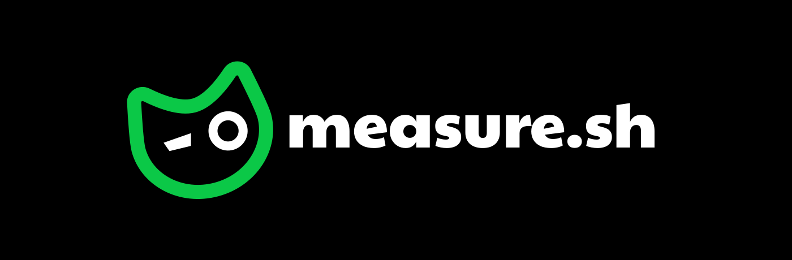
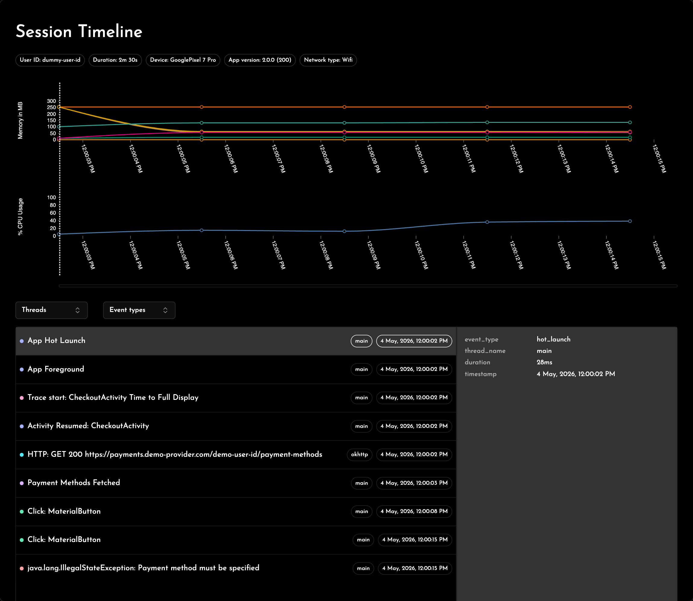
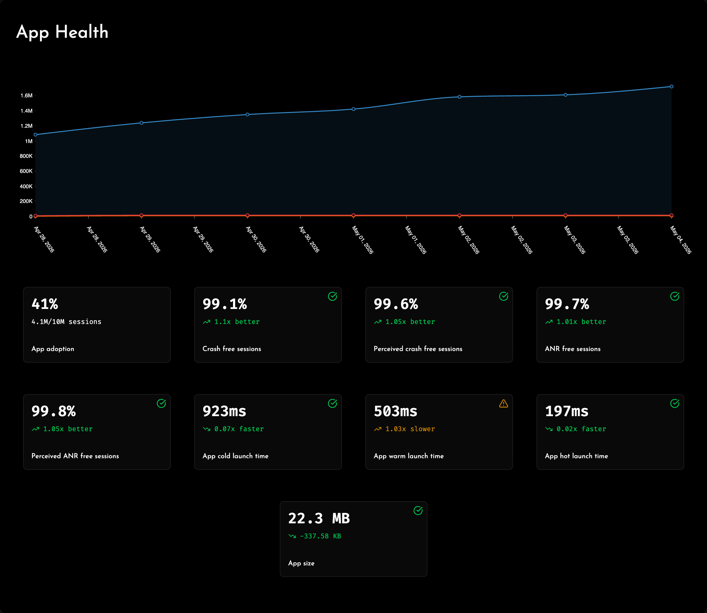
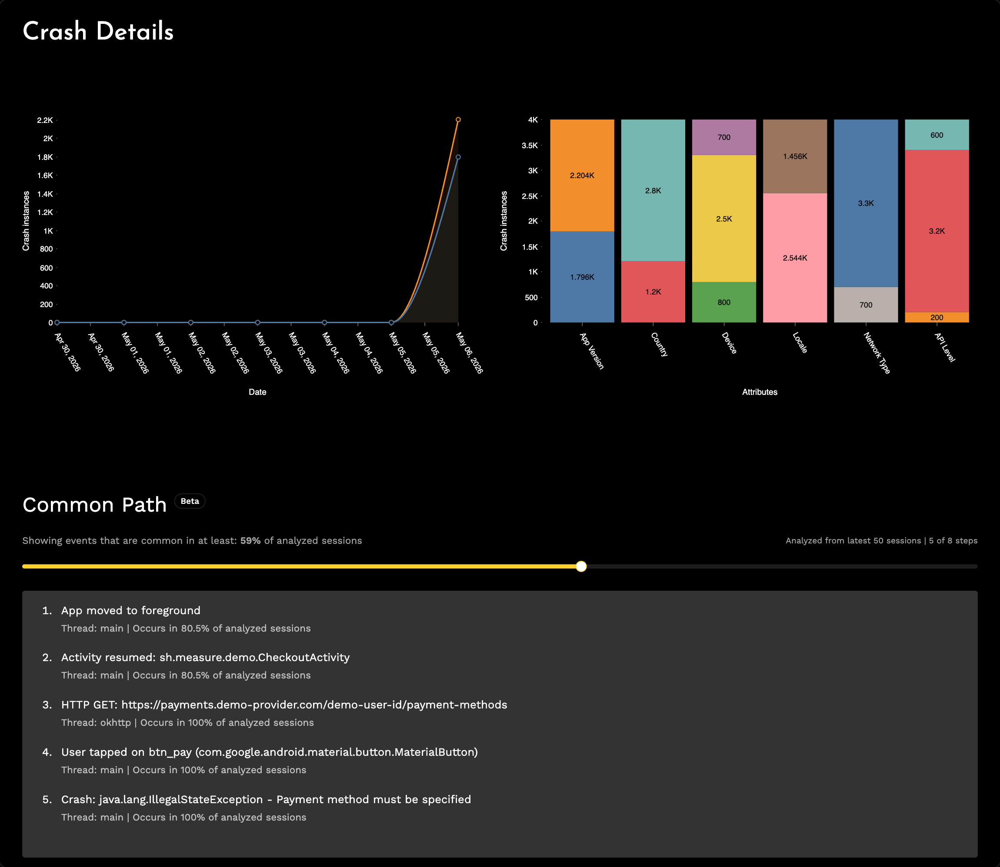
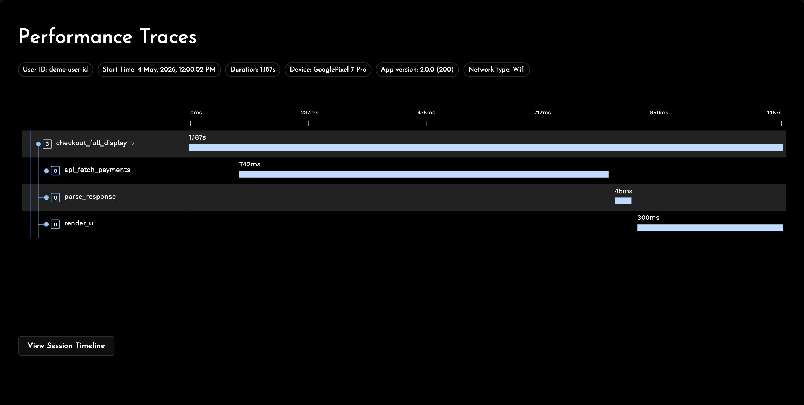
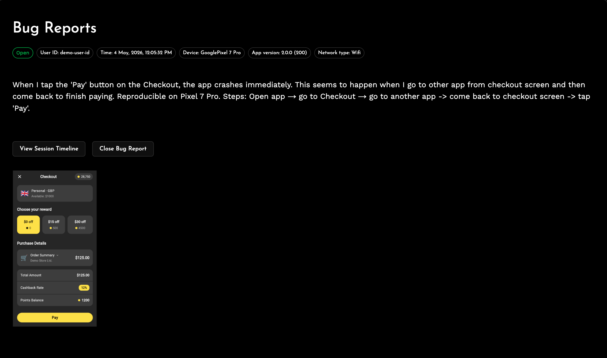
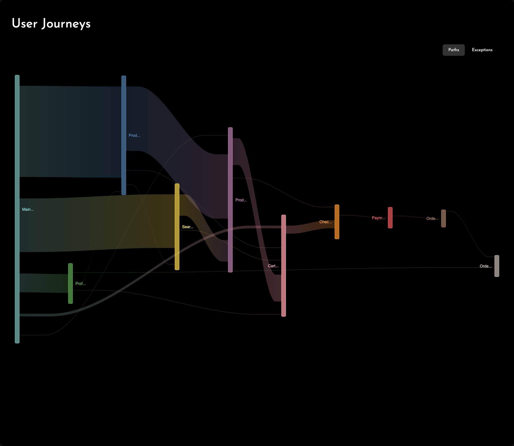
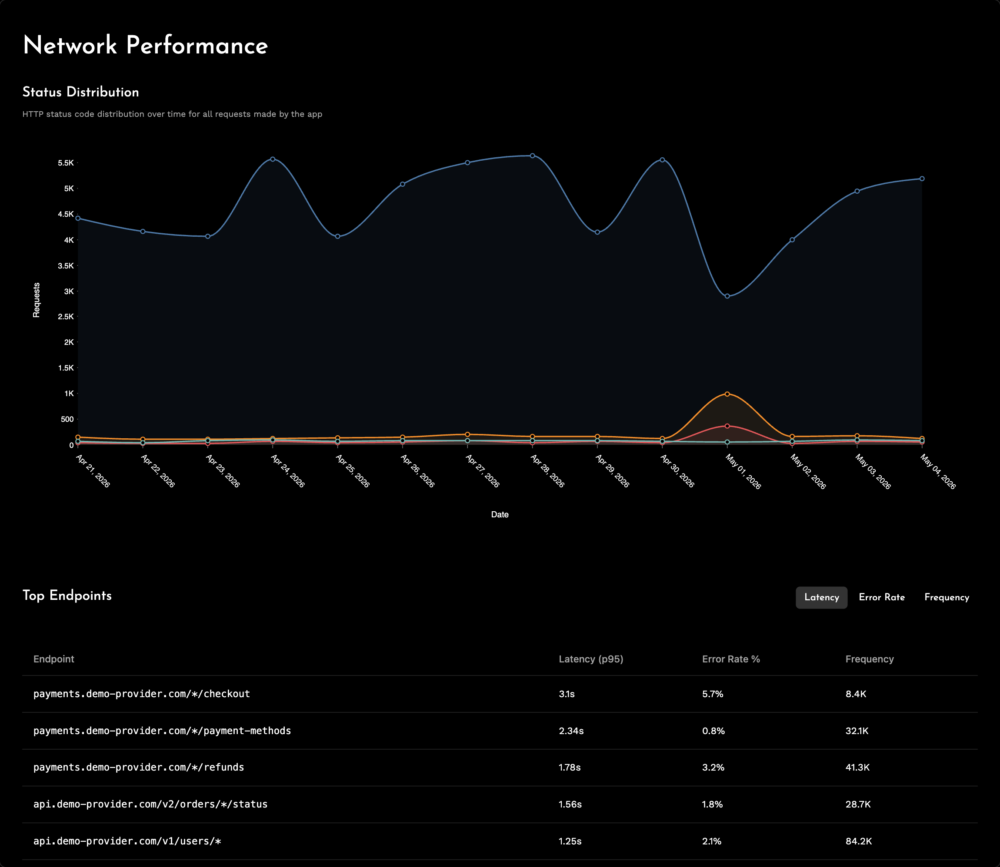
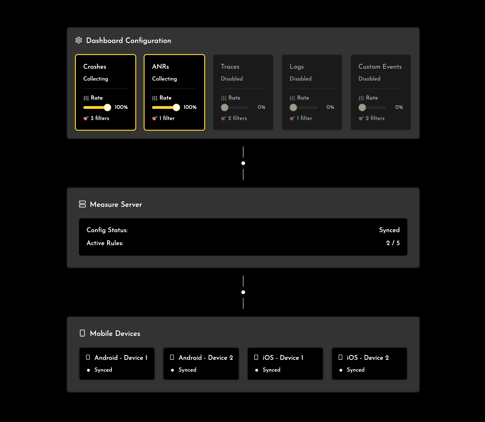

  

  
  
  

## Mobile apps break, get to the root cause faster

Complete Mobile App Monitoring platform with Crash Reporting 💥, ANR Tracking ⏳, Bug Reporting 🐞, Performance Tracing ⚡️, Logging 🪵 and more!

100% open source alternative to Firebase Crashlytics.

## Quick start

Sign up to [Measure Cloud](https://measure.sh) or [self host](https://measure.sh/docs/hosting) on your own servers (best for small apps and hobby projects). Once you've logged in, check out our [SDK integration](https://measure.sh/docs/sdk-integration-guide) docs.

## Features

### Session Timelines 🎥

Debug issues easily with [session timelines](https://measure.sh/product/session-timelines). Get the complete context with automatic tracking for clicks, navigations, http calls and more.

### App Health 📈

Monitor important metrics to stay on top of [app health](https://measure.sh/product/app-health). Quickly see deltas to make sure you're moving in the right direction.

### Crashes 💥 and ANRs ⏳

Automatically track [Crashes and ANRs](https://measure.sh/product/crashes-and-anrs). Dive deeper with screenshots, filters and detailed stacktraces.

### Performance Traces ⚡️

Analyze [app performance](https://measure.sh/product/performance-traces) with traces and spans. Break down complex issues and intelligently smoothen out bottlenecks.

### Bug Reports 🐞

Capture [bug reports](https://measure.sh/product/bug-reports) with a device shake or SDK call. Get full history of user actions leading to the bug.

### User Journeys 👣

Understand how [users move](https://measure.sh/product/user-journeys) through your app. Easily visualise screens most affected by issues.

### Network Performance 📡

Monitor and improve [network performance](https://measure.sh/product/user-journeys) across your app. Identify the slowest and most error-prone endoints for targeted improvements.

### Adaptive Capture 💰

[Dynamically adjust](https://measure.sh/product/adaptive-capture) data collection parameters without needing to roll out app updates. Turn up data collection during a new release and turn it down to save on storage and costs when things are running smoothly.

## Mission

We aim to build the best tool for monitoring mobile apps in production. 

Building performant mobile apps is hard. Monitoring and debugging them in production is harder. Developers need to use a variety of different tools to debug issues, measure performance and analyse user behavior which leads to critical time being wasted during production incidents. 

We aim to build a tool that helps developers stop flying blind during production issues and get to the root cause faster.

We operate in public as much as possible and we aim to be community focused and driven by feedback from real developers building in the trenches.

We would love for you to contribute to Measure by opening issues, sending PRs, ⭐ the repo  and recommending us to your fellow developers!

## Important Docs

1. [**SDK Integration Guide**](https://measure.sh/docs/sdk-integration-guide) - Integrate Android or iOS SDK and start measuring in no time
2. [**Explore Features**](https://measure.sh/docs/features/feature-session-timelines) - Learn about the features available in Measure and how to use them
3. [**Contribution Guide**](https://measure.sh/docs/CONTRIBUTING) - Contribute to Measure

## Platforms

Currently, we support Android, iOS and Flutter. React Native SDK is coming soon.

## Roadmap

Check out what's being worked on and what's in the pipeline in our [Roadmap](https://github.com/orgs/measure-sh/projects/5/views/1)

## Open Source License

Measure is fully open source and is available under the [Apache 2.0 license](./LICENSE)

## Maintainers

- [@anupcowkur](https://github.com/anupcowkur)
- [@detj](https://github.com/detj)
- [@abhaysood](https://github.com/abhaysood)
- [@adwinross](https://github.com/adwinross)
- [@gandharva](https://github.com/gandharva)

## Contributors

Measure would not be possible without our amazing contributors! ❤️

<!-- ALL-CONTRIBUTORS-LIST:START - Do not remove or modify this section -->
<!-- prettier-ignore-start -->
<!-- markdownlint-disable -->
<table>
  <tbody>
    <tr>
      <td align="center" valign="top" width="14.28%"><a href="https://measure.sh/"> <b>Anup Cowkur</b></a> <a href="https://github.com/measure-sh/measure/commits?author=anupcowkur" title="Code">💻</a> <a href="#maintenance-anupcowkur" title="Maintenance">🚧</a> <a href="https://github.com/measure-sh/measure/pulls?q=is%3Apr+reviewed-by%3Aanupcowkur" title="Reviewed Pull Requests">👀</a> <a href="https://github.com/measure-sh/measure/commits?author=anupcowkur" title="Documentation">📖</a> <a href="#security-anupcowkur" title="Security">🛡️</a></td>
      <td align="center" valign="top" width="14.28%"><a href="https://github.com/abhaysood"> <b>Abhay Sood</b></a> <a href="https://github.com/measure-sh/measure/commits?author=abhaysood" title="Code">💻</a> <a href="#maintenance-abhaysood" title="Maintenance">🚧</a> <a href="https://github.com/measure-sh/measure/pulls?q=is%3Apr+reviewed-by%3Aabhaysood" title="Reviewed Pull Requests">👀</a> <a href="https://github.com/measure-sh/measure/commits?author=abhaysood" title="Documentation">📖</a></td>
      <td align="center" valign="top" width="14.28%"><a href="https://measure.sh"> <b>Debjeet Biswas</b></a> <a href="https://github.com/measure-sh/measure/commits?author=detj" title="Code">💻</a> <a href="#maintenance-detj" title="Maintenance">🚧</a> <a href="https://github.com/measure-sh/measure/pulls?q=is%3Apr+reviewed-by%3Adetj" title="Reviewed Pull Requests">👀</a> <a href="https://github.com/measure-sh/measure/commits?author=detj" title="Documentation">📖</a> <a href="#security-detj" title="Security">🛡️</a></td>
      <td align="center" valign="top" width="14.28%"><a href="https://github.com/adwinross"> <b>Adwin Ronald Ross</b></a> <a href="https://github.com/measure-sh/measure/commits?author=adwinross" title="Code">💻</a> <a href="#maintenance-adwinross" title="Maintenance">🚧</a> <a href="https://github.com/measure-sh/measure/pulls?q=is%3Apr+reviewed-by%3Aadwinross" title="Reviewed Pull Requests">👀</a> <a href="https://github.com/measure-sh/measure/commits?author=adwinross" title="Documentation">📖</a></td>
      <td align="center" valign="top" width="14.28%"><a href="https://www.measure.sh/"> <b>gandharva kumar</b></a> <a href="https://github.com/measure-sh/measure/pulls?q=is%3Apr+reviewed-by%3Agandharva" title="Reviewed Pull Requests">👀</a> <a href="https://github.com/measure-sh/measure/commits?author=gandharva" title="Documentation">📖</a></td>
      <td align="center" valign="top" width="14.28%"><a href="https://github.com/vunder"> <b>Aleksei Starchikov</b></a> <a href="https://github.com/measure-sh/measure/commits?author=vunder" title="Code">💻</a></td>
      <td align="center" valign="top" width="14.28%"><a href="https://amitsamant.in"> <b>Amit Samant</b></a> <a href="https://github.com/measure-sh/measure/commits?author=DominatorVbN" title="Code">💻</a> <a href="https://github.com/measure-sh/measure/commits?author=DominatorVbN" title="Documentation">📖</a></td>
    </tr>
    <tr>
      <td align="center" valign="top" width="14.28%"><a href="https://github.com/hoermannpaul"> <b>Paul Hörmann</b></a> <a href="https://github.com/measure-sh/measure/commits?author=hoermannpaul" title="Code">💻</a></td>
      <td align="center" valign="top" width="14.28%"><a href="https://www.linkedin.com/in/shabinder/"> <b>Shabinder Singh</b></a> <a href="https://github.com/measure-sh/measure/commits?author=Shabinder" title="Code">💻</a> <a href="https://github.com/measure-sh/measure/commits?author=Shabinder" title="Documentation">📖</a></td>
      <td align="center" valign="top" width="14.28%"><a href="https://github.com/kamalnayan04"> <b>Kamal Nayan</b></a> <a href="https://github.com/measure-sh/measure/commits?author=kamalnayan04" title="Code">💻</a></td>
      <td align="center" valign="top" width="14.28%"><a href="https://abhaypro.com/"> <b>Abhay kumar</b></a> <a href="#security-abhayclasher" title="Security">🛡️</a></td>
      <td align="center" valign="top" width="14.28%"><a href="https://medium.com/@developersancho"> <b>Mr.Sanchez</b></a> <a href="#ideas-developersancho" title="Ideas, Planning, & Feedback">🤔</a></td>
      <td align="center" valign="top" width="14.28%"><a href="https://github.com/fahmisdk6"> <b>fahmisdk6</b></a> <a href="https://github.com/measure-sh/measure/issues?q=author%3Afahmisdk6" title="Bug reports">🐛</a> <a href="#ideas-fahmisdk6" title="Ideas, Planning, & Feedback">🤔</a></td>
      <td align="center" valign="top" width="14.28%"><a href="https://github.com/gyan-kukufm"> <b>gyan-kukufm</b></a> <a href="https://github.com/measure-sh/measure/issues?q=author%3Agyan-kukufm" title="Bug reports">🐛</a></td>
    </tr>
    <tr>
      <td align="center" valign="top" width="14.28%"><a href="https://github.com/naftaly"> <b>Alex Cohen</b></a> <a href="#ideas-naftaly" title="Ideas, Planning, & Feedback">🤔</a></td>
      <td align="center" valign="top" width="14.28%"><a href="https://github.com/ritikjainx"> <b>Ritik Jain</b></a> <a href="#ideas-ritikjainx" title="Ideas, Planning, & Feedback">🤔</a></td>
      <td align="center" valign="top" width="14.28%"><a href="https://github.com/suhaibkazi"> <b>Suhaib</b></a> <a href="https://github.com/measure-sh/measure/issues?q=author%3Asuhaibkazi" title="Bug reports">🐛</a></td>
      <td align="center" valign="top" width="14.28%"><a href="https://github.com/jose-a-rodrigues-alb"> <b>José Rodrigues</b></a> <a href="#ideas-jose-a-rodrigues-alb" title="Ideas, Planning, & Feedback">🤔</a></td>
      <td align="center" valign="top" width="14.28%"><a href="https://github.com/prudhvir3ddy"> <b>prudhvi reddy</b></a> <a href="#ideas-prudhvir3ddy" title="Ideas, Planning, & Feedback">🤔</a></td>
      <td align="center" valign="top" width="14.28%"><a href="https://github.com/alphaleadership"> <b>alphaleadership</b></a> <a href="#ideas-alphaleadership" title="Ideas, Planning, & Feedback">🤔</a></td>
      <td align="center" valign="top" width="14.28%"><a href="https://github.com/Stavrenas"> <b>Stavros Malakoudis</b></a> <a href="#ideas-Stavrenas" title="Ideas, Planning, & Feedback">🤔</a></td>
    </tr>
    <tr>
      <td align="center" valign="top" width="14.28%"><a href="https://github.com/arunsudharsan"> <b>Arun sudharsan</b></a> <a href="#ideas-arunsudharsan" title="Ideas, Planning, & Feedback">🤔</a></td>
      <td align="center" valign="top" width="14.28%"><a href="https://www.linkedin.com/in/abhishekkumariiitdelhi"> <b>Abhishek </b></a> <a href="#ideas-abhiMishka" title="Ideas, Planning, & Feedback">🤔</a></td>
      <td align="center" valign="top" width="14.28%"><a href="https://github.com/adnan-rapido"> <b>adnan-rapido</b></a> <a href="#ideas-adnan-rapido" title="Ideas, Planning, & Feedback">🤔</a></td>
      <td align="center" valign="top" width="14.28%"><a href="https://github.com/asheesh-verma"> <b>Asheesh Verma</b></a> <a href="https://github.com/measure-sh/measure/issues?q=author%3Aasheesh-verma" title="Bug reports">🐛</a></td>
      <td align="center" valign="top" width="14.28%"><a href="https://github.com/bhanup212"> <b>Bhanupro</b></a> <a href="https://github.com/measure-sh/measure/pulls?q=is%3Apr+reviewed-by%3Abhanup212" title="Reviewed Pull Requests">👀</a></td>
      <td align="center" valign="top" width="14.28%"><a href="https://github.com/Cmalakoudis"> <b>Charalampos Malakoudis</b></a> <a href="https://github.com/measure-sh/measure/issues?q=author%3ACmalakoudis" title="Bug reports">🐛</a> <a href="#ideas-Cmalakoudis" title="Ideas, Planning, & Feedback">🤔</a></td>
      <td align="center" valign="top" width="14.28%"><a href="https://github.com/Joaquin144"> <b>Vibhu</b></a> <a href="https://github.com/measure-sh/measure/pulls?q=is%3Apr+reviewed-by%3AJoaquin144" title="Reviewed Pull Requests">👀</a></td>
    </tr>
    <tr>
      <td align="center" valign="top" width="14.28%"><a href="https://github.com/Pranathi-pellakuru"> <b>Pranathi-pellakuru</b></a> <a href="#ideas-Pranathi-pellakuru" title="Ideas, Planning, & Feedback">🤔</a></td>
    </tr>
  </tbody>
</table>

<!-- markdownlint-restore -->
<!-- prettier-ignore-end -->

<!-- ALL-CONTRIBUTORS-LIST:END -->

## Discord

Come say hi on our [Discord](https://discord.gg/f6zGkBCt42)
