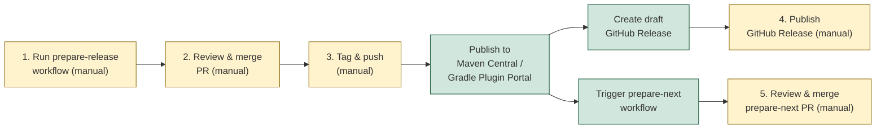

# Release Checklist



## Measure SDK

1. Go to GitHub Actions and run the **Prepare Android Release** workflow with the desired version and next SNAPSHOT version.
2. Review and merge the automatically created PR.
3. Tag the merge commit and push:
   ```bash
   git tag android-vX.Y.Z
   git push origin android-vX.Y.Z
   ```
4. The tag push triggers the release workflow which:
   - Publishes to Maven Central
   - Creates a draft GitHub Release with auto-generated changelog
   - Triggers the prepare-next workflow automatically
5. Go to Releases, review the draft, and publish it.
6. Review and merge the prepare-next PR.

## Measure Gradle Plugin

1. Go to GitHub Actions and run the **Prepare Android Gradle Plugin Release** workflow with the desired version and next SNAPSHOT version.
2. Review and merge the automatically created PR.
3. Tag the merge commit and push:
   ```bash
   git tag android-gradle-plugin-vX.Y.Z
   git push origin android-gradle-plugin-vX.Y.Z
   ```
4. The tag push triggers the release workflow which:
   - Publishes to Gradle Plugin Portal
   - Creates a draft GitHub Release with auto-generated changelog
   - Triggers the prepare-next workflow automatically
5. Go to Releases, review the draft, and publish it.
6. Review and merge the prepare-next PR.
