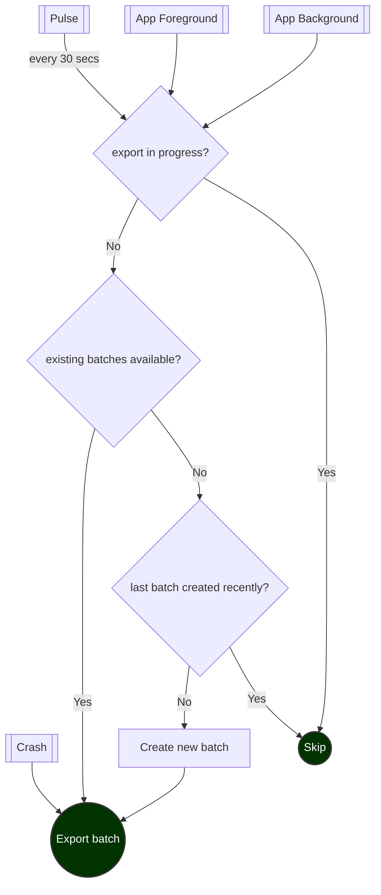

# Internal Documentation

* [Storage](#storage)
* [Batching & export](#batching--export)
    * [Periodic batching and export](#periodic-batching-and-export)
    * [Exceptions and ANRs export](#exceptions-and-anrs-export)
* [Thread management](#thread-management)
* [Testing](#testing)

# Storage

Measure primarily uses **SQLite database** to store events. However, it also uses the file system to
store certain large events, like exceptions, attachments, etc to
avoid [TransactionTooLargeException](https://developer.android.com/reference/android/os/TransactionTooLargeException).

SQLite database is configured with the following settings:

* [journal_mode](https://sqlite.org/pragma.html#pragma_journal_mode): WAL
* [foreign_keys](https://sqlite.org/pragma.html#pragma_foreign_keys): ON

Batches of events and spans are inserted in database either every 3 seconds or if either the spans or events buffer reaches 30.
At time of a crash, events and spans are immediately persisted to the db.

# Batching & export

Events are sent to the server in batches at regular intervals (30s) while the app is in foreground and when the app 
goes to background.

* [Periodic batching and export](#periodic-batching-and-export)
* [Exceptions and ANRs export](#exceptions-and-anrs-export)

## Periodic batching and export

Measure creates and sends one batch at a time to the server at a regular interval of 30 seconds.
Batching is done to reduce the number of network calls and battery consumption while
also ensuring that the events are sent to the server without too much delay.

Only **one** batch of events is sent to the server at a time to reduce memory usage and optimize batch size.

The following algorithm is used to periodically batch and send events to the server:



Following considerations were in mind when designing the algorithm:

**In best case scenario** events (or batches of events) must be sent to server as soon as they are
created (within a few seconds). Best case scenario is possible when:

* Server is responding quickly.
* The client has a healthy network connection.

In such cases, batches should be created periodically and sent to the server as soon as a batch
is created.

In worse case scenarios the following must be ensured:

* No data is lost due to flaky network.
* Allow `/events` API to be idempotent using a batch ID. An event must always be part of the
  same batch during retries.
* Do not overwhelm the server with too many requests when there are lots of un-synced batches (eg.
  when network comes back).
* Maintain low memory footprint when exporting (do not enqueue many requests in parallel as the
  memory isn't fully cleared until the request is complete).
* Each batch must have a maximum of 50 events (configurable) and the maximum total attachments size
  for the batch must not exceed 3MB (configurable).

## Exceptions and ANRs export

All events except for exceptions and ANRs are sent to the server in batches, periodically, as shown
above. Exceptions and ANRs however, are attempted to be sent as soon as they occur. This is done to
ensure that clients can be notified of issues as soon as possible.

# Thread management

The SDK uses `ExecutorServiceRegistry` as a single source of truth to provide executors for various
tasks. This makes it easy to manage the lifecycle of executors and also to provide a single point to
tune the number of threads used for various tasks.

The following executors are used:

1. IO Executor: Used for all long running operations like writing to the database, reading from the database,
   writing to the file system, etc.
2. Export Executor: Used for exporting events to the server over the network.
3. Default Executor: Used for short running tasks that need to be run in background like processing
   events, etc.

All executors are configured to be single-threaded and internally use a scheduled executor service
with unbounded queue, which can be tuned in the future.

# Testing

The SDK is tested using both unit tests and integration tests. Certain unit tests which require
Android framework classes are run using Robolectric. The integration tests are run using Espresso
and UI Automator.

To run unit tests, use the following command:

```shell
./gradlew :measure:test
```

To run integration tests (requires a device), use the following command:

```shell
./gradlew :measure:connectedAndroidTest
```

The _Measure gradle plugin_ also contains both unit tests and functional tests. The functional tests
are run using
the [testkit by autonomous apps](https://github.com/autonomousapps/dependency-analysis-gradle-plugin/tree/main/testkit)
and use JUnit5 for testing as it provides an easy way to run parameterized tests.

TO run the unit tests, use the following command:

```shell
./gradlew :measure-gradle-plugin:test
```

To run the functional tests, use the following command:

```shell
./gradlew :measure-gradle-plugin:functionalTest
```
