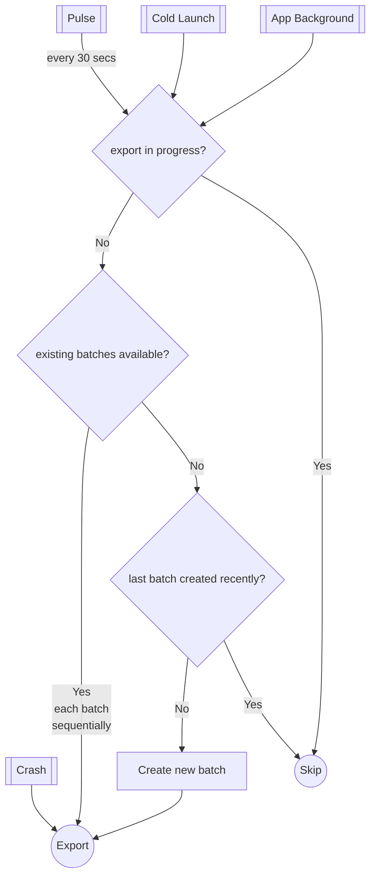

# Internal Documentation

* [Storage](#storage)
* [Batching & export](#batching--export)
    * [Periodic batching and export](#periodic-batching-and-export)
    * [Exceptions and ANRs export](#exceptions-and-anrs-export)
* [Thread management](#thread-management)
* [Configuration](#configuration)

# Storage

Measure primarily uses **SQLite database** to store events. However, it also uses the file system to
store parts of large events, like exceptions, attachments, etc. Deciding which events are directly
stored in the database and which are stored in the file system is based on the size of the event.
Even though SQLite can store large blobs, due to the cursor window size limit on Android, it can
lead to
a [TransactionTooLargeException](https://developer.android.com/reference/android/os/TransactionTooLargeException)
if a query exceeds the limit, and it makes working with large blobs cumbersome.

Sqlite database is configured with the following settings:

* [journal_mode](https://sqlite.org/pragma.html#pragma_journal_mode): WAL
* [foreign_keys](https://sqlite.org/pragma.html#pragma_foreign_keys): ON

Events are written to the database & file storage (if needed) as soon as they are received by
the `Event Processor`. This can be improved in future by adding a queue which batches the inserts.

# Batching & export

Measure exports events to the server in batches. All events for sessions that contain a crash are
exported. All non-crashed sessions are exported by default, a sampling rate can be applied to
non-crashed sessions to reduce the number of sessions exported. See [README](../README.md) for 
more details about configuring sampling rate.

* [Periodic batching and export](#periodic-batching-and-export)
* [Exceptions and ANRs export](#exceptions-and-anrs-export)

## Periodic batching and export

Measure creates and sends one batch at a time to the server at a regular interval of 30 seconds.
Batching is done to reduce the number of network calls and to reduce the battery consumption while
also ensuring that the events are sent to the server without too much delay.

The following algorithm is used to periodically batch and send events to the server:

Following considerations were in mind when designing the algorithm:

**In best case scenario** events (or batches of events) must be sent to server as soon as they are
created (within a few seconds). Best case scenario is possible when:

* Server is responding quickly.
* The client has a healthy network connection.

In such cases, batches should be created periodically and sent to the server as soon as a batch
is created.

In worse case scenarios the following must be ensured:

* No data is lost due to flaky network.
* Allow `/events` API to be idempotent using a batch ID. An event must always be part of the
  same batch during retries.
* Do not overwhelm the server with too many requests when there are lots of un-synced batches (eg.
  when network comes back).
* Maintain low memory footprint when exporting (do not enqueue many requests in parallel as the
  memory isn't fully cleared until the request is complete).
* Each batch must have a maximum of 50 events (configurable) and the maximum total attachments size
  for the batch must not exceed 3MB (configurable).

## Exceptions and ANRs export

All events except for exceptions and ANRs are sent to the server in batches, periodically, as shown
above. Exceptions
and ANRs however, are sent to the server immediately as soon as they are received. This is done to
ensure that clients
can be notified of issues as soon as possible.

# Thread management

The SDK uses `ExecutorServiceRegistry` as a single source of truth to provide executors for various
tasks. This makes it easy to manage the lifecycle of executors and also to provide a single point to
tune the number of threads used for various tasks.

The following executors are used:
1. IO Executor: Used for all long running operations like writing to the database, reading from the database,
   writing to the file system, etc.
2. Export Executor: Used for exporting events to the server over the network.
3. Default Executor: Used for short running tasks that need to be run in background like processing 
events, etc.

All executors are configured to be single-threaded and internally use a scheduled executor service 
with unbounded queue, which can be tuned in the future.

# Configuration

The SDK is configured using the `MeasureConfig` object. The client can pass in a custom config at
the time of initialization. These configurations can help in enabling/disabling features, preventing
sensitive information from being sent or modifying the behavior of the SDK.

Any configuration change made to `MeasureConfig` is a public API change and must also result in
updating the documentation.

## Applying configs

Configs which modify events, like removing fields or decision to drop events are all centralized in
the `EventTransformer` which makes it easy to keep these modifications in one place instead of
scattering them throughout the codebase.

However, some configs modify the behavior of collection itself, like `screenshotMaskColor`which
changes
the color of the mask applied to the screenshot. These configs are applied at the time of collection
itself.

## Remote config

Although not implemented yet, the config is expected to be modified from the dashboard, and the
changes should be reflected in the SDK. Config received from the server is also expected to be
persisted and used for subsequent initializations. Once implemented, the config passed in during
initialization will be overridden by the config received from the server. During initialization, the
the persisted config will be used over the config passed in during initialization.
