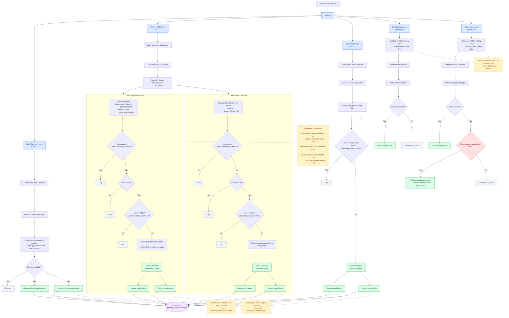

# Alerts Lifecycle

```mermaid
flowchart TD
    Start[alerts service startup] --> Cron[initCron]

    Cron --> J1[Daily Summary cron
        0 6 * * *]
    Cron --> J2[Crash + ANR cron
        0 * * * *]
    Cron --> J3[Bug Report cron
        */15 * * * *]
    Cron --> J4[Email sender cron
        @every 5m]
    Cron --> J5[Slack sender cron
        @every 5m]

    %% -----------------------------------------------------------------
    %% Generation flows
    %% -----------------------------------------------------------------

    J2 --> LoadTeamsCA[Load teams from Postgres]
    LoadTeamsCA --> LoadAppsCA[For each team, load apps]
    LoadAppsCA --> SessionCount[Query 1h distinct session_count
        from events]
    SessionCount --> CrashPath
    SessionCount --> AnrPath

    subgraph CrashPath [Crash Spike Detection]
        direction TB
        C1[Query exception fingerprints in last 1h
            type=exception, handled=false,
            group by fingerprint]
        C1 --> C2{In cooldown?
            alerts.created_at within 7d}
        C2 -- Yes --> CSkip1[Skip]
        C2 -- No --> C3{count >= 100?}
        C3 -- No --> CSkip2[Skip]
        C3 -- Yes --> C4{rate >= 0.5%?
            count/session_count * 100}
        C4 -- No --> CSkip3[Skip]
        C4 -- Yes --> C5[Fetch group metadata from
            unhandled_exception_groups]
        C5 --> C6[Insert alerts row
            type=crash_spike]
        C6 --> C7[Queue email alerts]
        C6 --> C8[Queue slack alerts]
    end

    subgraph AnrPath [ANR Spike Detection]
        direction TB
        A1[Query ANR fingerprints in last 1h
            type=anr,
            group by fingerprint]
        A1 --> A2{In cooldown?
            alerts.created_at within 7d}
        A2 -- Yes --> ASkip1[Skip]
        A2 -- No --> A3{count >= 100?}
        A3 -- No --> ASkip2[Skip]
        A3 -- Yes --> A4{rate >= 0.5%?
            count/session_count * 100}
        A4 -- No --> ASkip3[Skip]
        A4 -- Yes --> A5[Fetch group metadata from
            anr_groups]
        A5 --> A6[Insert alerts row
            type=anr_spike]
        A6 --> A7[Queue email alerts]
        A6 --> A8[Queue slack alerts]
    end

    J3 --> LoadTeamsBug[Load teams from Postgres]
    LoadTeamsBug --> LoadAppsBug[For each team, load apps]
    LoadAppsBug --> B1[Query bug_reports in last 15m]
    B1 --> B2{Alert already exists?
        same team+app+event_id+type}
    B2 -- Yes --> BSkip[Skip]
    B2 -- No --> B3[Insert alerts row
        type=bug_report]
    B3 --> B4[Queue email alerts]
    B3 --> B5[Queue slack alerts]

    J1 --> LoadTeamsDaily[Load teams from Postgres]
    LoadTeamsDaily --> LoadAppsDaily[For each team, load apps]
    LoadAppsDaily --> D1[Compute daily summary metrics
        from app_metrics and bug_reports]
    D1 --> D2{Metrics available?}
    D2 -- No --> DSkip[Skip app]
    D2 -- Yes --> D3[Queue daily summary email]
    D2 -- Yes --> D4[Queue daily summary slack]

    %% -----------------------------------------------------------------
    %% Queue + delivery flows
    %% -----------------------------------------------------------------

    C7 --> Queue[(pending_alert_messages)]
    C8 --> Queue
    A7 --> Queue
    A8 --> Queue
    B4 --> Queue
    B5 --> Queue
    D3 --> Queue
    D4 --> Queue

    J4 --> E1[Load up to 250 pending rows
        channel=email oldest-first]
    E1 --> E2[Unmarshal EmailInfo]
    E2 --> E3[Send email via SMTP]
    E3 --> E4{Send succeeded?}
    E4 -- Yes --> E5[Delete pending row]
    E4 -- No --> E6[Keep row, log error]

    J5 --> S1[Load up to 250 pending rows
        channel=slack oldest-first]
    S1 --> S2[Unmarshal Slack payload]
    S2 --> S3[POST chat.postMessage]
    S3 --> S4{Slack success?}
    S4 -- Yes --> S5[Delete pending row]
    S4 -- No --> S6{Recoverable channel/auth
        error?}
    S6 -- Yes --> S7[Delete pending row and
        remove channel from team_slack]
    S6 -- No --> S8[Keep row, log error]

    %% -----------------------------------------------------------------
    %% Annotations
    %% -----------------------------------------------------------------

    N1["Constants in alerts.go:
        crashOrAnrSpikeTimePeriod = 1h
        bugReportTimePeriod = 15m
        minCrashOrAnrCountThreshold = 100
        crashOrAnrSpikeThreshold = 0.5%
        cooldownPeriodForEntity = 7d"]
    CrashPath -.- N1
    AnrPath -.- N1
    B1 -.- N1

    N2["Email queue fanout is per team member
        via email.QueueEmailForTeam"]
    C7 -.- N2
    A7 -.- N2
    B4 -.- N2
    D3 -.- N2

    N3["Slack queue fanout is per configured
        channel in team_slack.channel_ids"]
    C8 -.- N3
    A8 -.- N3
    B5 -.- N3
    D4 -.- N3

    N4["Workers process max 250 rows/run and
        sleep 1s between sends"]
    E1 -.- N4
    S1 -.- N4

    %% Styling
    classDef cron fill:#dbeafe,stroke:#2563eb,color:#1e40af
    classDef queue fill:#f3e8ff,stroke:#9333ea,color:#581c87
    classDef action fill:#dcfce7,stroke:#16a34a,color:#166534
    classDef skip fill:#f1f5f9,stroke:#94a3b8,color:#475569
    classDef block fill:#fee2e2,stroke:#dc2626,color:#991b1b
    classDef note fill:#fef3c7,stroke:#d97706,color:#92400e,stroke-dasharray:5 5

    class J1,J2,J3,J4,J5,Cron cron
    class Queue queue
    class C6,C7,C8,A6,A7,A8,B3,B4,B5,D3,D4,E5,S5,S7 action
    class CSkip1,CSkip2,CSkip3,ASkip1,ASkip2,ASkip3,BSkip,DSkip,E6,S8 skip
    class S6 block
    class N1,N2,N3,N4 note
```
