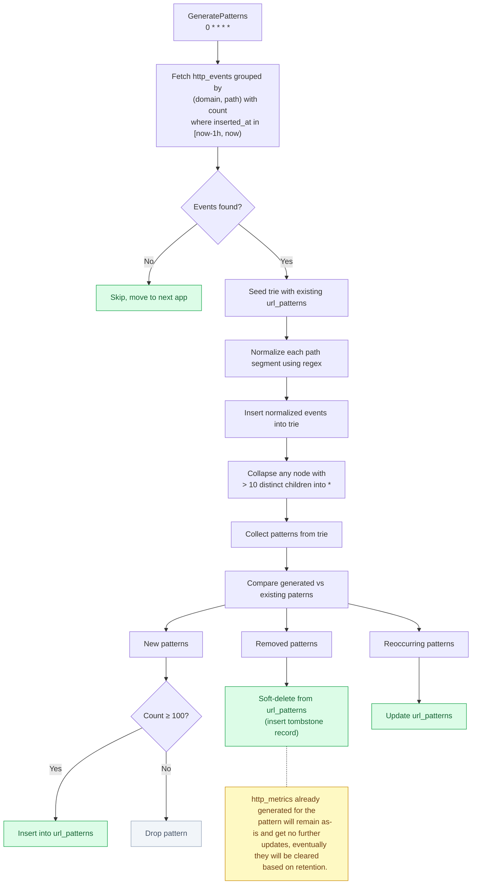
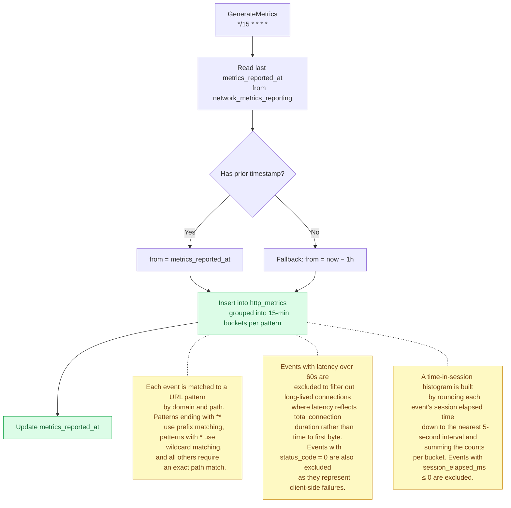

# Network Jobs

## GeneratePatterns (0 * * * *)

```mermaid
flowchart TD
    PatternJob["GeneratePatterns
        0 * * * *"] --> FetchEvents["Fetch http_events grouped by
        (domain, path) with count
        where inserted_at in [now-1h, now)"]
    FetchEvents --> EventsFound{Events found?}
    EventsFound -- No --> SkipPattern[Skip, move to next app]

    EventsFound -- Yes --> SeedTrie["Seed trie with existing url_patterns"]
    SeedTrie --> NormalizePaths["Normalize each path segment using regex"]
    NormalizePaths --> BuildTrie["Insert normalized events into trie"]
    BuildTrie --> CollapseTrie["Collapse any node with
        > 10 distinct children into *"]
    CollapseTrie --> CollectPatterns[Collect patterns from trie]

    CollectPatterns --> ComparePhase[Compare generated vs existing paterns]

    ComparePhase --> NewPatterns["New patterns"]
    NewPatterns --> MeetsThreshold{"Count ≥ 100?"}
    MeetsThreshold -- Yes --> InsertNew["Insert into url_patterns"]
    MeetsThreshold -- No --> DropNew[Drop pattern]

    ComparePhase --> RemovedPatterns["Removed patterns"]
    RemovedPatterns --> SoftDelete["Soft-delete from url_patterns
        (insert tombstone record)"]

    NoteSoftDelete["http_metrics already generated for the
        pattern will remain as-is and get no further
        updates, eventually they will be cleared
        based on retention."]

    SoftDelete -.- NoteSoftDelete

    ComparePhase --> ReoccurringPatterns["Reoccurring patterns"]
    ReoccurringPatterns --> UpdateExisting["Update url_patterns"]

    classDef action fill:#dcfce7,stroke:#16a34a,color:#166534
    classDef skip fill:#f1f5f9,stroke:#94a3b8,color:#475569
    classDef note fill:#fef9c3,stroke:#ca8a04,color:#713f12

    class SkipPattern,InsertNew,SoftDelete,UpdateExisting action
    class DropNew skip
    class NoteSoftDelete note
```

## GenerateMetrics (*/15 * * * *)

```mermaid
flowchart TD
    MetricsJob["GenerateMetrics
        */15 * * * *"] --> ReadMetricsTS["Read last metrics_reported_at
        from network_metrics_reporting"]
    ReadMetricsTS --> HasMetricsTS{Has prior timestamp?}
    HasMetricsTS -- Yes --> MetricsFromPrev[from = metrics_reported_at]
    HasMetricsTS -- No --> MetricsFromDefault["Fallback: from = now − 1h"]
    MetricsFromPrev --> InsertMetrics
    MetricsFromDefault --> InsertMetrics

    InsertMetrics["Insert into http_metrics
        grouped into 15-min buckets per pattern"]
    InsertMetrics --> UpdateMetricsTS
    UpdateMetricsTS[Update metrics_reported_at]

    NoteJoin["Each event is matched to a URL pattern
        by domain and path. Patterns ending with **
        use prefix matching, patterns with * use
        wildcard matching, and all others require
        an exact path match."]

    NoteFilter["Events with latency over 60s are
        excluded to filter out long-lived connections
        where latency reflects total connection
        duration rather than time to first byte.
        Events with status_code = 0 are also excluded
        as they represent client-side failures."]

    NoteHistogram["A time-in-session histogram is built
        by rounding each event's session elapsed time
        down to the nearest 5-second interval and
        summing the counts per bucket. Events with
        session_elapsed_ms ≤ 0 are excluded."]

    InsertMetrics -.- NoteJoin
    InsertMetrics -.- NoteFilter
    InsertMetrics -.- NoteHistogram

    classDef action fill:#dcfce7,stroke:#16a34a,color:#166534
    classDef note fill:#fef9c3,stroke:#ca8a04,color:#713f12

    class InsertMetrics,UpdateMetricsTS action
    class NoteJoin,NoteFilter,NoteHistogram note
```
