# Authentication Flows

Measure has two authentication flows: **Dashboard** (browser-based sessions) and **MCP** (OAuth 2.0 for AI coding agents). Both share the same identity providers (GitHub, Google) and the same callback routes in the frontend.

## Dashboard Authentication

```mermaid
flowchart TD
    U[User visits /auth/login] --> ChooseProvider{Choose provider}

    ChooseProvider -- GitHub --> GHInit["Frontend: doGitHubLogin()
        generate random state
        POST /api/auth/github {type: init, state}"]
    ChooseProvider -- Google --> GOInit["Frontend: doGoogleLogin()
        generate random state
        POST /api/auth/google {type: init, state}"]

    GHInit --> SaveState1["Backend: SigninGitHub()
        save state to auth_states table
        provider = github"]
    GOInit --> SaveState2["Backend: SigninGoogle()
        save state to auth_states table
        provider = google"]

    SaveState1 --> GHRedirect["Redirect to GitHub OAuth
        github.com/login/oauth/authorize
        scope: user:email read:user
        redirect_uri: {siteOrigin}/auth/callback/github"]

    SaveState2 --> GORedirect["Redirect to Google OAuth
        accounts.google.com/o/oauth2/v2/auth
        scope: openid email profile
        access_type: offline, prompt: consent
        redirect_uri: {siteOrigin}/auth/callback/google"]

    %% -----------------------------------------------------------------
    %% Provider callback
    %% -----------------------------------------------------------------

    GHRedirect --> ProviderCB["Provider redirects to
        /auth/callback/{provider}?code=...&state=..."]
    GORedirect --> ProviderCB

    ProviderCB --> MCPCheck{state starts
        with mcp_?}
    MCPCheck -- Yes --> MCPFlow["Route to MCP flow
        (see MCP diagram below)"]
    MCPCheck -- No --> DashExchange

    %% -----------------------------------------------------------------
    %% Dashboard code exchange
    %% -----------------------------------------------------------------

    subgraph DashExchange [Dashboard Code Exchange]
        direction TB
        D1["Frontend: POST /api/auth/{provider}
            {type: code, state, code}"]
        D1 --> D2["Backend: validate state
            against auth_states table"]
        D2 --> D3["Exchange code with provider
            GitHub: POST github.com/.../access_token
            Google: POST oauth2.googleapis.com/token"]
        D3 --> D4["Fetch user profile
            GitHub: GET api.github.com/user + /user/emails
            Google: decode ID token claims"]
        D4 --> D5{"User exists
            in DB?"}
        D5 -- No --> D6["Create user + default team
            add to invited teams"]
        D5 -- Yes --> D7["Update last_sign_in_at"]
        D6 --> D8["Create auth session
            NewAuthSession(userId, provider, userMeta)"]
        D7 --> D8
        D8 --> D9["Save to auth_sessions table
            generate access token JWT (30m)
            generate refresh token JWT (7d)"]
        D9 --> D10["Return {access_token, refresh_token,
            session_id, user_id, own_team_id}"]
    end

    D10 --> SetCookies["Frontend: setCookiesFromJWT()
        set httpOnly secure cookies
        redirect to /{own_team_id}/overview"]

    %% -----------------------------------------------------------------
    %% Session lifecycle
    %% -----------------------------------------------------------------

    SetCookies --> Authed["User is authenticated
        browser sends cookies on every request"]
    Authed --> Middleware["Backend: ValidateAccessToken()
        parse JWT from cookie or Authorization header
        verify signature + expiry
        set userId + sessionId in context"]

    Middleware --> Expired{Access token
        expired?}
    Expired -- No --> Handler[Request proceeds]
    Expired -- Yes --> Refresh["Frontend: auto-refresh
        POST /auth/refresh (sends refresh_token cookie)
        Backend: validate refresh JWT, lookup session
        delete old session, create new session
        return new {access_token, refresh_token}
        retry original request"]

    Authed --> Signout["DELETE /auth/signout
        validate refresh token
        delete auth_sessions row
        clear cookies
        redirect to /auth/login"]

    %% -----------------------------------------------------------------
    %% Annotations
    %% -----------------------------------------------------------------

    N1["JWT Claims (HS256):
        Access Token: iat, sub (userId), jti (sessionId), exp (+30m), iss=measure
        Refresh Token: jti (sessionId), exp (+7d)"]
    D9 -.- N1

    N2["Tables:
        auth_states — state nonce + provider (deleted after use)
        auth_sessions — session_id, user_id, provider, user_metadata,
            at_expiry_at, rt_expiry_at"]
    D2 -.- N2

    N3["Cookies:
        access_token — httpOnly, secure (prod), sameSite strict (prod)
        refresh_token — httpOnly, secure (prod), sameSite strict (prod)"]
    SetCookies -.- N3

    %% Styling
    classDef provider fill:#dbeafe,stroke:#2563eb,color:#1e40af
    classDef frontend fill:#f3e8ff,stroke:#9333ea,color:#581c87
    classDef backend fill:#dcfce7,stroke:#16a34a,color:#166534
    classDef decision fill:#fef3c7,stroke:#d97706,color:#92400e
    classDef skip fill:#f1f5f9,stroke:#94a3b8,color:#475569
    classDef note fill:#fef3c7,stroke:#d97706,color:#92400e,stroke-dasharray:5 5

    class GHRedirect,GORedirect,ProviderCB provider
    class GHInit,GOInit,SetCookies,Authed,Signout frontend
    class SaveState1,SaveState2,Middleware,Handler,Refresh backend
    class MCPCheck,Expired decision
    class MCPFlow skip
    class N1,N2,N3 note
```

## MCP Authentication (OAuth 2.0 + PKCE)

```mermaid
flowchart TD
    Client["MCP client (Claude Code, Codex, etc.)"] --> Discover

    %% -----------------------------------------------------------------
    %% Discovery + Registration
    %% -----------------------------------------------------------------

    subgraph Setup [Discovery + Registration]
        direction TB
        Discover["GET /.well-known/oauth-authorization-server
            returns endpoints, supported methods (S256, client_secret_post)"]
        Discover --> Register["POST /oauth/register
            {client_name, redirect_uris}"]
        Register --> StoreClient["Backend: RegisterClient()
            generate client_id: msr_client_ + hex(8 bytes)
            generate client_secret: hex(32 bytes)
            store secret as SHA-256 hash
            insert into mcp_clients table"]
        StoreClient --> RegResp["Return {client_id, client_secret,
            redirect_uris, token_endpoint_auth_method}"]
    end

    %% -----------------------------------------------------------------
    %% Authorization
    %% -----------------------------------------------------------------

    RegResp --> AuthReq["GET /oauth/authorize
        response_type=code
        client_id, redirect_uri, state
        code_challenge (PKCE S256, required)
        provider (optional)"]

    AuthReq --> ValidateClient["Backend: MCPAuthorize()
        validate client_id exists in mcp_clients
        validate redirect_uri is registered
        verify code_challenge is present"]

    ValidateClient --> HasProvider{provider
        param set?}
    HasProvider -- No --> LoginPage["Redirect to /auth/login?mcp=1
        user picks GitHub or Google
        frontend builds authorize URL with provider param"]
    LoginPage --> AuthReq
    HasProvider -- Yes --> StoreValkey

    subgraph StoreValkey [Store State + Redirect]
        direction TB
        SV1["Generate random oauthState: hex(16 bytes)
            Store in Valkey (TTL 600s):
            key: mcp:oauth:state:{oauthState}
            value: {mcp_state, client_id, redirect_uri,
                code_challenge, provider}"]
        SV1 --> SV2["Redirect to provider OAuth
            state = mcp_{oauthState}
            redirect_uri = {siteOrigin}/auth/callback/{provider}"]
    end

    %% -----------------------------------------------------------------
    %% Unified callback
    %% -----------------------------------------------------------------

    SV2 --> ProviderAuth["User authorizes at GitHub/Google"]
    ProviderAuth --> UnifiedCB["Provider redirects to
        /auth/callback/{provider}?code=...&state=mcp_{oauthState}"]
    UnifiedCB --> Detect["Frontend: detect mcp_ prefix on state
        strip prefix, POST /mcp/auth/callback
        {code, state: oauthState}"]

    %% -----------------------------------------------------------------
    %% Callback exchange
    %% -----------------------------------------------------------------

    Detect --> CB1

    subgraph CBExchange [MCP Callback Exchange]
        direction TB
        CB1["Backend: Callback()
            retrieve + delete Valkey state
            decode OAuthStatePayload"]
        CB1 --> CB2["Exchange code with provider
            GitHub: get access token
            Google: get refresh token + ID token"]
        CB2 --> CB3["Get user info
            GitHub: GET api.github.com/user
            Google: decode ID token"]
        CB3 --> CB4{"User exists
            in DB?"}
        CB4 -- No --> CB5["Create user + default team"]
        CB4 -- Yes --> CB6["Touch last_sign_in_at"]
        CB5 --> CB7["Generate MCP auth code
            hex(32 bytes), expires in 10m
            insert into mcp_auth_codes
            with user_id, client_id, redirect_uri,
            code_challenge, provider, provider_token"]
        CB6 --> CB7
    end

    CB7 --> CBResp["Return {redirect_url:
        {client_redirect_uri}?code={auth_code}&state={mcp_state}}"]
    CBResp --> ClientCB["Frontend redirects browser to client redirect_uri
        MCP client receives auth code"]

    %% -----------------------------------------------------------------
    %% Token exchange
    %% -----------------------------------------------------------------

    ClientCB --> TokenReq["POST /oauth/token
        grant_type=authorization_code
        code, redirect_uri, client_id
        code_verifier (PKCE)"]

    TokenReq --> T1

    subgraph TokenExchange [Token Exchange]
        direction TB
        T1["Backend: Token()
            lookup auth code in mcp_auth_codes"]
        T1 --> T2{"Valid?
            not used, not expired
            client_id + redirect_uri match"}
        T2 -- No --> TErr[Return 400 error]
        T2 -- Yes --> T3{"PKCE verify
            SHA256(verifier) == challenge?"}
        T3 -- No --> TErr2[Return 400 error]
        T3 -- Yes --> T4["Mark code as used
            Generate access token:
            msr_ + base64url(32 bytes)
            Store SHA-256 hash in mcp_access_tokens
            with user_id, client_id, provider,
            provider_token, expires_at (+90d)"]
    end

    T4 --> TokenResp["Return {access_token: msr_...,
        token_type: Bearer, expires_in: 7776000}"]
    TokenResp --> Ready["MCP client stores token
        sends Authorization: Bearer msr_... on every request"]

    %% -----------------------------------------------------------------
    %% Request validation
    %% -----------------------------------------------------------------

    Ready --> MCPReq["POST/GET /mcp
        Authorization: Bearer msr_..."]
    MCPReq --> VT1

    subgraph ValidateToken [Token Validation Middleware]
        direction TB
        VT1["ValidateMCPToken()
            parse Bearer token from header
            SHA-256 hash the token
            query mcp_access_tokens
            WHERE token_hash = hash
            AND NOT revoked
            AND expires_at > now()"]
        VT1 --> VT2["Update last_used_at (async)"]
        VT2 --> VT3{"Provider token
            needs revalidation?
            (checked_at is null or > 1h ago)"}
        VT3 -- No --> VT4["Set userId in context
            forward to MCP server"]
        VT3 -- Yes --> VT5["Async: validate provider token
            GitHub: GET api.github.com/user
            Google: refresh token validation"]
        VT5 --> VT6{Provider token
            still valid?}
        VT6 -- Yes --> VT7["Update provider_token_checked_at"]
        VT6 -- No --> VT8["Revoke MCP token
            SET revoked = true"]
        VT7 --> VT4
        VT8 --> VT4
    end

    VT4 --> Tools["MCP tool handlers
        list_apps, get_errors, get_error_details"]

    %% -----------------------------------------------------------------
    %% Annotations
    %% -----------------------------------------------------------------

    N1["Token format:
        msr_ + base64url(32 random bytes)
        Stored as SHA-256 hex hash (never stored raw)"]
    T4 -.- N1

    N2["Tables:
        mcp_clients — client_id, client_secret (hash), name, redirect_uris
        mcp_auth_codes — code, user_id, client_id, redirect_uri,
            code_challenge, provider, provider_token, expires_at, used
        mcp_access_tokens — token_hash, user_id, client_id, provider,
            provider_token, provider_token_checked_at,
            last_used_at, revoked, expires_at"]
    StoreClient -.- N2

    N3["Constants:
        Valkey state TTL = 600s (10m)
        Auth code TTL = 10m
        Access token TTL = 90 days
        Provider revalidation interval = 1h"]
    SV1 -.- N3

    N4["Session binding:
        Provider tokens are stored alongside MCP tokens.
        If the user revokes access at GitHub/Google,
        the MCP token is automatically revoked on next use."]
    VT5 -.- N4

    %% Styling
    classDef provider fill:#dbeafe,stroke:#2563eb,color:#1e40af
    classDef frontend fill:#f3e8ff,stroke:#9333ea,color:#581c87
    classDef backend fill:#dcfce7,stroke:#16a34a,color:#166534
    classDef skip fill:#f1f5f9,stroke:#94a3b8,color:#475569
    classDef action fill:#dcfce7,stroke:#16a34a,color:#166534
    classDef block fill:#fee2e2,stroke:#dc2626,color:#991b1b
    classDef note fill:#fef3c7,stroke:#d97706,color:#92400e,stroke-dasharray:5 5

    class ProviderAuth,UnifiedCB provider
    class Client,Detect,ClientCB,Ready,MCPReq frontend
    class StoreClient,RegResp,CBResp,TokenResp,Tools backend
    class TErr,TErr2 block
    class LoginPage skip
    class N1,N2,N3,N4 note
```

