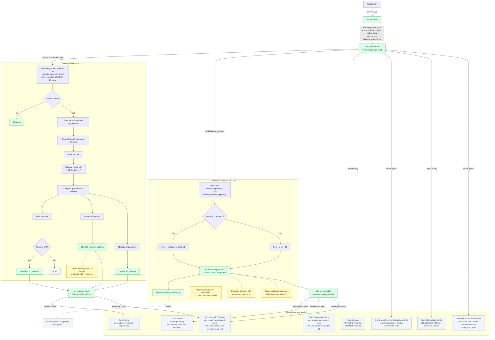

# Network Flow

```mermaid
flowchart TD
    SDK["Mobile SDK"] -->|"HTTP event"| Events["events table"]

    Events -->|"MV: http_events_mv<br/>extracts domain, path, status_code,<br/>latency_ms, session_elapsed_ms"| HttpEvents["http_events table<br/>(ReplacingMergeTree)"]

    %% ── GeneratePatterns (0 * * * *) ──

    subgraph GenPatternsJob ["GeneratePatterns (0 * * * *)"]
        direction TB
        FetchEvents["Fetch http_events grouped by<br/>(domain, path) with count<br/>where inserted_at in [now-1h, now)"]
        FetchEvents --> EventsFound{Events found?}
        EventsFound -- No --> SkipPattern[Skip app]
        EventsFound -- Yes --> SeedTrie["Seed trie with existing url_patterns"]
        SeedTrie --> NormalizePaths["Normalize path segments via regex"]
        NormalizePaths --> BuildTrie["Insert into trie"]
        BuildTrie --> CollapseTrie["Collapse nodes with<br/>&gt; 10 children to *"]
        CollapseTrie --> ComparePhase["Compare generated vs existing"]

        ComparePhase --> NewPatterns["New patterns"]
        NewPatterns --> MeetsThreshold{"Count ≥ 100?"}
        MeetsThreshold -- Yes --> InsertNew["Insert into url_patterns"]
        MeetsThreshold -- No --> DropNew[Drop]

        ComparePhase --> RemovedPatterns["Removed patterns"]
        RemovedPatterns --> HardDelete["DELETE from url_patterns"]

        ComparePhase --> ReoccurringPatterns["Reoccurring patterns"]
        ReoccurringPatterns --> UpdateExisting["Update url_patterns"]

        NoteHardDelete["Orphaned http_metrics remain<br/>until cleared by retention."]
        HardDelete -.- NoteHardDelete
    end

    HttpEvents -->|"grouped by domain, path"| FetchEvents
    InsertNew & UpdateExisting --> UrlPatterns
    HardDelete --> UrlPatterns

    UrlPatterns["url_patterns table<br/>(ReplacingMergeTree)"]

    %% ── GenerateMetrics (*/15 * * * *) ──

    subgraph GenMetricsJob ["GenerateMetrics (*/15 * * * *)"]
        direction TB
        ReadMetricsTS["Read last metrics_reported_at<br/>from network_metrics_reporting"]
        ReadMetricsTS --> HasMetricsTS{Has prior timestamp?}
        HasMetricsTS -- Yes --> MetricsFromPrev["from = metrics_reported_at"]
        HasMetricsTS -- No --> MetricsFromDefault["from = now − 1h"]
        MetricsFromPrev & MetricsFromDefault --> InsertMetrics["Insert into http_metrics<br/>15-min buckets per pattern"]
        InsertMetrics --> UpdateMetricsTS["Update metrics_reported_at"]

        NoteJoin["Pattern matching: ** → startsWith,<br/>* → LIKE, else exact match."]
        NoteFilter["Excludes latency &gt; 60s<br/>and status_code = 0."]
        NoteHistogram["Session-elapsed histogram:<br/>5s buckets, excludes ≤ 0."]
        InsertMetrics -.- NoteJoin
        InsertMetrics -.- NoteFilter
        InsertMetrics -.- NoteHistogram
    end

    HttpEvents -->|"JOIN with url_patterns"| ReadMetricsTS
    InsertMetrics --> HttpMetrics
    UpdateMetricsTS -.->|"upsert"| PgReporting["network_metrics_reporting<br/>(Postgres)"]

    HttpMetrics["http_metrics table<br/>(AggregatingMergeTree)"]

    %% ── API Queries ──

    subgraph APIQueries ["API Queries (api service)"]
        direction TB
        Domains["FetchDomains<br/>GROUP BY domain<br/>ORDER BY count()"]
        Paths["FetchPaths<br/>url_patterns + fallback http_events"]
        Trends["FetchTrends<br/>top endpoints by<br/>p95 latency, error rate, frequency"]
        OverviewStatus["GetNetworkOverviewStatusCodesPlot<br/>countIf per 2xx/3xx/4xx/5xx<br/>over time buckets"]
        OverviewTimeline["FetchOverviewTimeline<br/>per-session avg request count<br/>in 5s elapsed buckets, top 10"]
        EndpointLatency["GetEndpointLatencyPlot<br/>p50/p90/p95/p99 latency<br/>over time buckets"]
        EndpointStatus["GetEndpointStatusCodesPlot<br/>per-status-code counts<br/>over time buckets<br/>for single endpoint"]
        EndpointTimeline["FetchEndpointTimeline<br/>per-session avg request count<br/>in 5s elapsed buckets<br/>for single endpoint"]
    end

    HttpEvents -->|"direct query"| Domains
    HttpEvents -->|"direct query"| OverviewStatus
    HttpEvents -->|"direct query"| EndpointLatency
    HttpEvents -->|"direct query"| EndpointStatus
    UrlPatterns -->|"pattern lookup"| Paths
    UrlPatterns -->|"existence check"| EndpointTimeline
    HttpMetrics -->|"aggregated query"| Trends
    HttpMetrics -->|"aggregated query"| OverviewTimeline
    HttpMetrics -->|"aggregated query"| EndpointTimeline

    classDef action fill:#dcfce7,stroke:#16a34a,color:#166534
    classDef skip fill:#f1f5f9,stroke:#94a3b8,color:#475569
    classDef note fill:#fef9c3,stroke:#ca8a04,color:#713f12

    class Events,HttpEvents,UrlPatterns,HttpMetrics action
    class SkipPattern,InsertNew,HardDelete,UpdateExisting,InsertMetrics,UpdateMetricsTS action
    class DropNew,PgReporting skip
    class NoteHardDelete,NoteJoin,NoteFilter,NoteHistogram note
    class Domains,Paths,Trends,OverviewStatus,OverviewTimeline,EndpointLatency,EndpointStatus,EndpointTimeline skip
```
