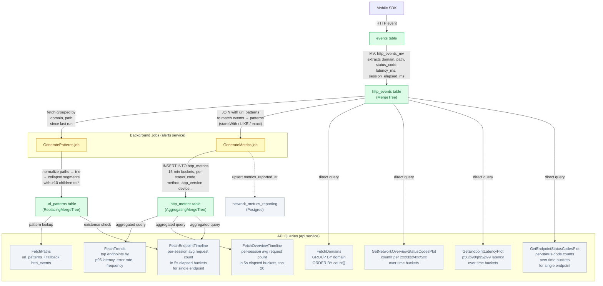

# Network API

```mermaid
flowchart TD
      SDK["Mobile SDK"] -->|"HTTP event"| Events["events table"]

      Events -->|"MV: http_events_mv<br/>extracts domain, path, status_code,<br/>latency_ms, session_elapsed_ms"| HttpEvents["http_events table<br/>(MergeTree)"]

      subgraph "Background Jobs (alerts service)"
          GenPatterns["GeneratePatterns job"]
          GenMetrics["GenerateMetrics job"]
      end

      HttpEvents -->|"fetch grouped by<br/>domain, path<br/>since last run"| GenPatterns
      GenPatterns -->|"normalize paths → trie<br/>→ collapse segments<br/>with >10 children to *"| UrlPatterns["url_patterns table<br/>(ReplacingMergeTree)"]

      HttpEvents -->|"JOIN with url_patterns<br/>to match events → patterns<br/>(startsWith / LIKE / exact)"| GenMetrics
      GenMetrics -->|"INSERT INTO http_metrics<br/>15-min buckets, per status_code,<br/>method, app_version, device..."| HttpMetrics["http_metrics table<br/>(AggregatingMergeTree)"]

      GenMetrics -.->|"upsert metrics_reported_at"| PgReporting["network_metrics_reporting<br/>(Postgres)"]

      subgraph "API Queries (api service)"
          direction TB

          Domains["FetchDomains<br/>GROUP BY domain<br/>ORDER BY count()"]
          Paths["FetchPaths<br/>url_patterns + fallback http_events"]
          Trends["FetchTrends<br/>top endpoints by<br/>p95 latency, error rate, frequency"]
          OverviewStatus["GetNetworkOverviewStatusCodesPlot<br/>countIf per 2xx/3xx/4xx/5xx<br/>over time buckets"]
          OverviewTimeline["FetchOverviewTimeline<br/>per-session avg request count<br/>in 5s elapsed buckets, top 20"]
          EndpointLatency["GetEndpointLatencyPlot<br/>p50/p90/p95/p99 latency<br/>over time buckets"]
          EndpointStatus["GetEndpointStatusCodesPlot<br/>per-status-code counts<br/>over time buckets<br/>for single endpoint"]
          EndpointTimeline["FetchEndpointTimeline<br/>per-session avg request count<br/>in 5s elapsed buckets<br/>for single endpoint"]
      end

      HttpEvents -->|"direct query"| Domains
      HttpEvents -->|"direct query"| OverviewStatus
      HttpEvents -->|"direct query"| EndpointLatency
      HttpEvents -->|"direct query"| EndpointStatus
      UrlPatterns -->|"pattern lookup"| Paths
      UrlPatterns -->|"existence check"| EndpointTimeline
      HttpMetrics -->|"aggregated query"| Trends
      HttpMetrics -->|"aggregated query"| OverviewTimeline
      HttpMetrics -->|"aggregated query"| EndpointTimeline

      classDef action fill:#dcfce7,stroke:#16a34a,color:#166534
      classDef skip fill:#f1f5f9,stroke:#94a3b8,color:#475569
      classDef note fill:#fef9c3,stroke:#ca8a04,color:#713f12

      class Events,HttpEvents,UrlPatterns,HttpMetrics action
      class GenPatterns,GenMetrics note
      class PgReporting skip
      class Domains,Paths,Trends,OverviewStatus,OverviewTimeline,EndpointLatency,EndpointStatus,EndpointTimeline skip
```