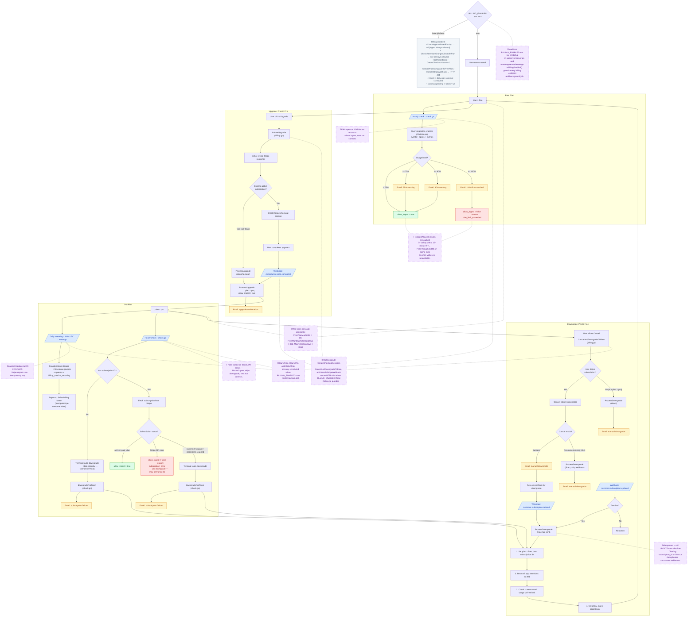

# Billing Lifecycle

```mermaid
flowchart TD
    %% ── Billing enabled gate ────────────────────────────────────────
    BillingEnabledCheck{"BILLING_ENABLED
        env var?"}

    BillingEnabledCheck -- "false (default)" --> BillingDisabled["Billing disabled:
        • CheckIngestAllowedForApp → nil (ingest always allowed)
        • CheckRetentionChangeAllowedInPlan → true (always allowed)
        • GetTeamBilling / CreateCheckoutSession /
          CancelAndDowngradeToFreePlan /
          HandleStripeWebhook → HTTP 404
        • Hourly + daily cron jobs not scheduled
        • canChangeBilling = false in UI"]

    BillingEnabledCheck -- "true" --> NewTeam

    NoteBillingEnabled["ℹ Read from BILLING_ENABLED env var at startup
        in api/server/server.go and metering/server/server.go.
        IsBillingEnabled() guards every billing endpoint
        and background job."]
    BillingEnabledCheck -.- NoteBillingEnabled

    %% ── Team creation ──────────────────────────────────────────────
    NewTeam[New team created] --> FreeState

    %% ── Free plan ──────────────────────────────────────────────────
    subgraph FreePlan [Free Plan]
        direction TB
        FreeState["plan = free"]

        FreeState --> HourlyFree[/"Hourly check · check.go"/]
        HourlyFree --> QueryUsage["Query ingestion_metrics
            (ClickHouse)
            events + spans + metrics"]
        QueryUsage --> ThresholdCheck{Usage level?}

        ThresholdCheck -- "< 75%" --> AllowIngest[allow_ingest = true]
        ThresholdCheck -- ">= 75%" --> Notify75["Email: 75% warning"] --> AllowIngest
        ThresholdCheck -- ">= 90%" --> Notify90["Email: 90% warning"] --> AllowIngest
        ThresholdCheck -- ">= 100%" --> Notify100["Email: 100% limit reached"]
        Notify100 --> BlockIngest["allow_ingest = false
            reason: plan_limit_exceeded"]
    end

    %% ── Upgrade flow ───────────────────────────────────────────────
    subgraph Upgrade [Upgrade: Free to Pro]
        direction TB
        UserClicksUpgrade[User clicks Upgrade] --> CreateCheckout["InitiateUpgrade
            (billing.go)"]
        CreateCheckout --> EnsureCustomer["Get or create Stripe customer"]
        EnsureCustomer --> SelfHeal{Existing active
            subscription?}
        SelfHeal -- "Yes (self-heal)" --> ReconcileUpgrade["ProcessUpgrade
            (skip checkout)"]
        SelfHeal -- No --> StripeCheckout[Create Stripe checkout session]
        StripeCheckout --> UserPays[User completes payment]
        UserPays --> CheckoutWebhook[/"Webhook: checkout.session.completed"/]
        CheckoutWebhook --> ProcessUpgrade
        ReconcileUpgrade --> ProcessUpgrade
        ProcessUpgrade["ProcessUpgrade
            plan = pro, allow_ingest = true"]
        ProcessUpgrade --> UpgradeEmail["Email: upgrade confirmation"]
    end

    FreeState --> UserClicksUpgrade
    ProcessUpgrade --> ProState

    %% ── Pro plan ───────────────────────────────────────────────────
    subgraph ProPlan [Pro Plan]
        direction TB
        ProState["plan = pro"]

        ProState --> DailyMeter[/"Daily metering · 3 AM UTC · meter.go"/]
        DailyMeter --> Snapshot["Snapshot total storage
            ClickHouse (events + spans) -> billing_metrics_reporting"]
        Snapshot --> ReportStripe["Report to Stripe Billing Meter
            (idempotent per customer:date)"]

        ProState --> HourlyPro[/"Hourly check · check.go"/]
        HourlyPro --> SubIDCheck{Has subscription ID?}

        SubIDCheck -- No --> AutoDowngradeNoSub["Terminal: auto-downgrade
            (data integrity — cannot self-heal)"]
        AutoDowngradeNoSub --> DowngradeProTeamNoSub["downgradeProTeam (check.go)"]
        DowngradeProTeamNoSub --> SubFailEmailNoSub["Email: subscription failure"]
        SubIDCheck -- Yes --> FetchSub[Fetch subscription from Stripe]
        FetchSub --> SubStatus{Subscription status?}

        SubStatus -- "active / past_due" --> ProAllowIngest[allow_ingest = true]
        SubStatus -- "Stripe API error" --> ProBlockTemp["allow_ingest = false
            reason: subscription_error
            (no downgrade — may be transient)"]
        SubStatus -- "canceled / unpaid / incomplete_expired" --> AutoDowngrade["Terminal: auto-downgrade"]
        AutoDowngrade --> AutoDowngradeProcess["downgradeProTeam (check.go)"]
        AutoDowngradeProcess --> SubFailEmail["Email: subscription failure"]
    end

    %% ── Downgrade paths ────────────────────────────────────────────
    subgraph DowngradeFlow [Downgrade: Pro to Free]
        direction TB
        ManualCancel["User clicks Cancel
            CancelAndDowngradeToFree (billing.go)"]
        ManualCancel --> HasStripeSub{Has Stripe
            subscription?}

        HasStripeSub -- Yes --> CancelStripeSub[Cancel Stripe subscription]
        CancelStripeSub --> CancelResult{Cancel result?}
        CancelResult -- Success --> ManualEmail1["Email: manual downgrade"]
        CancelResult -- "Resource missing (404)" --> DirectDowngrade1["ProcessDowngrade
            (direct, skip webhook)"]
        DirectDowngrade1 --> ManualEmail2["Email: manual downgrade"]
        ManualEmail1 --> WaitWebhook["Rely on webhook for downgrade"]

        HasStripeSub -- "No (but plan = pro)" --> DirectDowngrade2["ProcessDowngrade
            (direct)"]
        DirectDowngrade2 --> ManualEmail3["Email: manual downgrade"]

        SubDeletedWebhook[/"Webhook: customer.subscription.deleted"/] --> ProcessDowngradeWH
        SubUpdatedWebhook[/"Webhook: customer.subscription.updated"/] --> TerminalCheck{Terminal?}
        TerminalCheck -- Yes --> ProcessDowngradeWH
        TerminalCheck -- No --> Ignore[No action]

        ProcessDowngradeWH["ProcessDowngrade
            (no email sent)"]
        ProcessDowngradeWH --> Step1

        Step1["1. Set plan = free, clear subscription ID"]
        Step1 --> Step2["2. Reset all app retentions to 30d"]
        Step2 --> Step3["3. Check current month usage vs free limit"]
        Step3 --> Step4["4. Set allow_ingest accordingly"]
    end

    ProState --> ManualCancel
    AutoDowngradeProcess --> Step1
    DowngradeProTeamNoSub --> Step1
    WaitWebhook --> SubDeletedWebhook
    Step4 --> FreeState

    %% ── Annotations ───────────────────────────────────────────────
    NoteConstants["ℹ Plan limits are code constants:
        FreePlanMaxUnits = 1M, FreePlanMaxRetentionDays = 30d, MaxRetentionDays = 365d"]
    FreeState -.- NoteConstants
    ProState -.- NoteConstants

    NoteDowngrade["ℹ Idempotent — all UPDATEs are absolute.
        Clearing subscription_id on first run
        deduplicates concurrent webhooks."]
    ProcessDowngradeWH -.- NoteDowngrade

    NoteIngestCache["ℹ IsIngestAllowed results are cached
        in Valkey with a 15-minute TTL.
        Falls through to DB on cache miss
        or when Valkey is unavailable."]
    AllowIngest -.- NoteIngestCache
    BlockIngest -.- NoteIngestCache

    NoteHourlyFree["ℹ Fails open on ClickHouse errors —
        allows ingest, next run corrects."]
    HourlyFree -.- NoteHourlyFree

    NoteHourlyPro["ℹ Fails closed on Stripe API errors —
        blocks ingest, skips downgrade, next run corrects."]
    HourlyPro -.- NoteHourlyPro

    NoteSnapshot["ℹ Snapshot dedup via ON CONFLICT.
        Stripe reports use idempotency key."]
    DailyMeter -.- NoteSnapshot

    NoteCronGate["ℹ HourlyFree, HourlyPro, and DailyMeter
        are only scheduled when BILLING_ENABLED=true
        (metering/main.go)."]
    HourlyFree -.- NoteCronGate
    HourlyPro -.- NoteCronGate
    DailyMeter -.- NoteCronGate

    NoteApiGate["ℹ InitiateUpgrade (CreateCheckoutSession),
        CancelAndDowngradeToFree, and HandleStripeWebhook
        return HTTP 404 when BILLING_ENABLED=false
        (billing.go guards)."]
    CreateCheckout -.- NoteApiGate
    ManualCancel -.- NoteApiGate
    CheckoutWebhook -.- NoteApiGate

    %% ── Styling ────────────────────────────────────────────────────
    classDef email fill:#fef3c7,stroke:#d97706,color:#92400e
    classDef webhook fill:#dbeafe,stroke:#2563eb,color:#1e40af
    classDef block fill:#fee2e2,stroke:#dc2626,color:#991b1b
    classDef allow fill:#dcfce7,stroke:#16a34a,color:#166534
    classDef note fill:#f3e8ff,stroke:#9333ea,color:#581c87,stroke-dasharray:5 5
    classDef disabled fill:#f1f5f9,stroke:#94a3b8,color:#475569

    class Notify75,Notify90,Notify100,UpgradeEmail,SubFailEmail,SubFailEmailNoSub,ManualEmail1,ManualEmail2,ManualEmail3 email
    class CheckoutWebhook,SubDeletedWebhook,SubUpdatedWebhook,HourlyFree,HourlyPro,DailyMeter webhook
    class BlockIngest,ProBlockTemp block
    class AllowIngest,ProAllowIngest allow
    class NoteDowngrade,NoteHourlyFree,NoteHourlyPro,NoteSnapshot,NoteIngestCache,NoteConstants,NoteBillingEnabled,NoteCronGate,NoteApiGate note
    class BillingDisabled disabled
```
