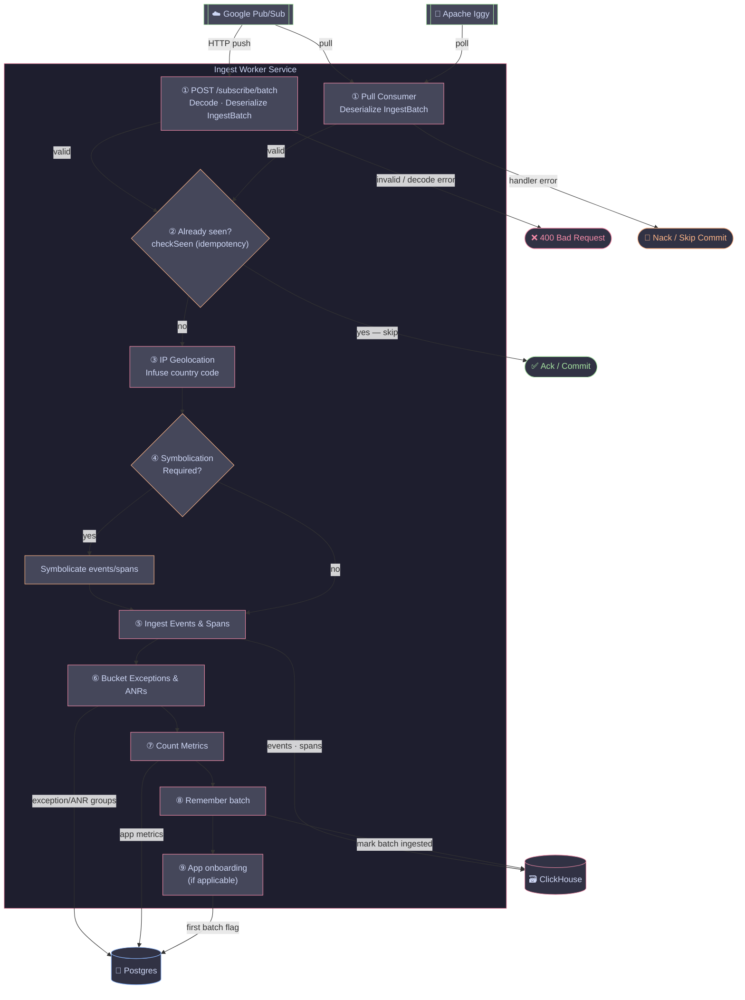

## Ingest Worker Service

Receives `IngestBatch` messages from the message bus and runs the full event processing pipeline. Two backends are supported:

- **[Google Cloud Pub/Sub](https://docs.cloud.google.com/pubsub)** (cloud) — pull-based consumer or HTTP push endpoint
- **[Apache Iggy](https://iggy.apache.org/)** (self-hosted) — pull-based consumer group with manual offset commits

Designed to scale independently from the ingest service based on message backlog.

### Flow

### Routes

| Method | Path | Description |
|--------|------|-------------|
| `GET` | `/ping` | Health check |
| `POST` | `/subscribe/batch` | Pub/Sub HTTP push endpoint (cloud only, when `INGEST_PUBSUB_PUSH_ENABLED=true`) |

### Message consumption

| Backend | Mode | Consumer type | Error handling |
|---------|------|---------------|----------------|
| Pub/Sub (pull) | Subscription pull | `bus.NewPubSubConsumer` | Nack on handler error, auto-redeliver |
| Pub/Sub (push) | HTTP push to `/subscribe/batch` | N/A (HTTP handler) | 500 triggers Pub/Sub retry |
| Iggy | Consumer group poll | `bus.NewIggyGroupConsumer` | Offset not committed on handler error, message retried on next poll |

### Environment Variables

| Variable | Required | Description |
|----------|----------|-------------|
| `POSTGRES_DSN` | Yes | PostgreSQL connection string |
| `CLICKHOUSE_DSN` | Yes | ClickHouse connection string |
| `REDIS_HOST` | Yes | Valkey/Redis host |
| `REDIS_PORT` | Yes | Valkey/Redis port |
| `SYMBOLICATOR_ORIGIN` | Yes | Origin URL of the symbolicator service |
| `API_ORIGIN` | Yes | Origin URL of the API service |
| `SYMBOLS_S3_BUCKET` | Yes | S3 bucket for mapping files |
| `SYMBOLS_S3_BUCKET_REGION` | Yes | Region of the symbols S3 bucket |
| `SYMBOLS_ACCESS_KEY` | Yes | Access key for symbols bucket |
| `SYMBOLS_SECRET_ACCESS_KEY` | Yes | Secret key for symbols bucket |
| `ATTACHMENTS_S3_BUCKET` | Yes | S3 bucket for attachments |
| `ATTACHMENTS_S3_BUCKET_REGION` | Yes | Region of the attachments S3 bucket |
| `ATTACHMENTS_ACCESS_KEY` | Yes | Access key for attachments bucket |
| `ATTACHMENTS_SECRET_ACCESS_KEY` | Yes | Secret key for attachments bucket |
| `AWS_ENDPOINT_URL` | No | Custom AWS endpoint (for local/self-hosted S3) |
| `IGGY_ADDR` | Self-hosted | Iggy server address (`host:port`) |
| `IGGY_USERNAME` | Self-hosted | Iggy authentication username |
| `IGGY_PASSWORD` | Self-hosted | Iggy authentication password |
| `INGEST_PUBSUB_SUBSCRIPTION` | Cloud | Pub/Sub subscription ID for pull-based consumption |
| `INGEST_PUBSUB_PUSH_ENABLED` | No | Set to `true` to enable the HTTP push endpoint and disable pull |
| `INGEST_BATCH_SIZE` | No | Max outstanding messages per poll (default: `20` for Pub/Sub, `500` for Iggy) |
| `INGEST_POLL_INTERVAL` | No | Delay between Iggy polls when idle (default: `30s`) |
| `OTEL_SERVICE_NAME` | No | Service name for OpenTelemetry traces/metrics |
| `OTEL_EXPORTER_OTLP_ENDPOINT` | No | OTLP collector endpoint |
| `OTEL_EXPORTER_OTLP_PROTOCOL` | No | OTLP protocol (`grpc` or `http`) |
| `INGEST_ENFORCE_TIME_WINDOW` | No | Reject events outside the allowed time window |
| `PORT` | No | HTTP port (default: `8086`) |
