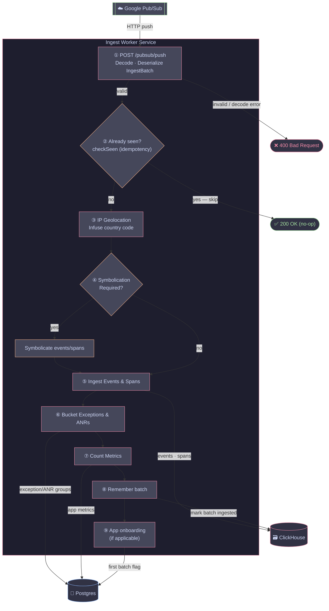

## Ingest Worker Service

Receives `IngestBatch` messages from Google Pub/Sub (via HTTP push) and runs the full event processing pipeline. Designed to scale independently from the ingest service based on message backlog.

### Flow

### Routes

| Method | Path | Description |
|--------|------|-------------|
| `GET` | `/ping` | Health check |
| `POST` | `/pubsub/push` | Pub/Sub push endpoint |

### Environment Variables

| Variable | Required | Description |
|----------|----------|-------------|
| `POSTGRES_DSN` | Yes | PostgreSQL connection string |
| `CLICKHOUSE_DSN` | Yes | ClickHouse connection string |
| `REDIS_HOST` | Yes | Valkey/Redis host |
| `REDIS_PORT` | Yes | Valkey/Redis port |
| `SYMBOLICATOR_ORIGIN` | Yes | Origin URL of the symbolicator service |
| `API_ORIGIN` | Yes | Origin URL of the API service |
| `SYMBOLS_S3_BUCKET` | Yes | S3 bucket for mapping files |
| `SYMBOLS_S3_BUCKET_REGION` | Yes | Region of the symbols S3 bucket |
| `SYMBOLS_ACCESS_KEY` | Yes | Access key for symbols bucket |
| `SYMBOLS_SECRET_ACCESS_KEY` | Yes | Secret key for symbols bucket |
| `ATTACHMENTS_S3_BUCKET` | Yes | S3 bucket for attachments |
| `ATTACHMENTS_S3_BUCKET_REGION` | Yes | Region of the attachments S3 bucket |
| `ATTACHMENTS_ACCESS_KEY` | Yes | Access key for attachments bucket |
| `ATTACHMENTS_SECRET_ACCESS_KEY` | Yes | Secret key for attachments bucket |
| `AWS_ENDPOINT_URL` | No | Custom AWS endpoint (for local/self-hosted S3) |
| `OTEL_SERVICE_NAME` | No | Service name for OpenTelemetry traces/metrics |
| `OTEL_EXPORTER_OTLP_ENDPOINT` | No | OTLP collector endpoint |
| `OTEL_EXPORTER_OTLP_PROTOCOL` | No | OTLP protocol (`grpc` or `http`) |
| `INGEST_ENFORCE_TIME_WINDOW` | No | Reject events outside the allowed time window |
| `PORT` | No | HTTP port (default: `8086`) |
