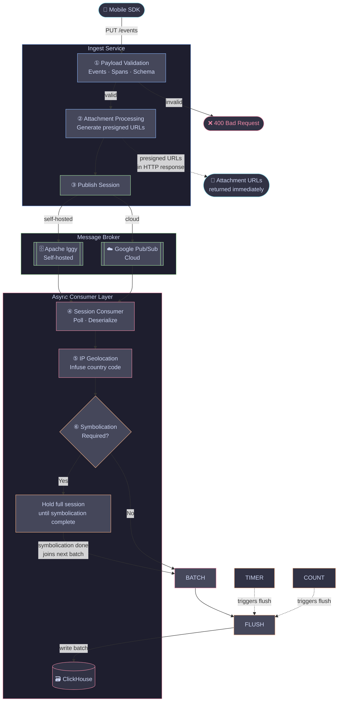

## Ingest Service

### Flow

```mermaid
flowchart TD
    SDK(["📱 Mobile SDK"])

    subgraph INGEST["Ingest Service"]
        direction TB
        V["① Payload Validation<br/>Events · Spans · Schema"]
        A["② Attachment Processing<br/>Generate presigned URLs"]
        PUB["③ Publish Session"]
    end

    subgraph BROKER["Message Broker"]
        direction LR
        IGGY[["🗄 Apache Iggy<br/>Self-hosted"]]
        PS[["☁️ Google Pub/Sub<br/>Cloud"]]
    end

    subgraph CONSUME["Async Consumer Layer"]
        direction TB
        POLL["④ Session Consumer<br/>Poll · Deserialize"]
        GEO["⑤ IP Geolocation<br/>Infuse country code"]
        SYM{"⑥ Symbolication<br/>Required?"}
        HOLD["Hold full session<br/>until symbolication complete"]
        CH[("🗃 ClickHouse")]
    end

    ATTACH_RESP(["🔗 Attachment URLs<br/>returned immediately"])

    SDK -->|"PUT /events"| V
    V -->|"invalid"| ERR(["❌ 400 Bad Request"])
    V -->|"valid"| A
    A -.->|"presigned URLs<br/>in HTTP response"| ATTACH_RESP
    A --> PUB

    PUB -->|"self-hosted"| IGGY
    PUB -->|"cloud"| PS

    IGGY --> POLL
    PS --> POLL

    POLL --> GEO
    GEO --> SYM
    SYM -->|"Yes"| HOLD
    HOLD -->|"symbolication done<br/>joins next batch"| BATCH
    SYM -->|"No"| BATCH
    BATCH --> FLUSH
    TIMER -.->|"triggers flush"| FLUSH
    COUNT -.->|"triggers flush"| FLUSH
    FLUSH -->|"write batch"| CH

    style INGEST fill:#1e1e2e,stroke:#89b4fa,color:#cdd6f4
    style BROKER fill:#1e1e2e,stroke:#a6e3a1,color:#cdd6f4
    style CONSUME fill:#1e1e2e,stroke:#f38ba8,color:#cdd6f4
    style SDK fill:#313244,stroke:#89dceb,color:#cdd6f4
    style ATTACH_RESP fill:#313244,stroke:#89dceb,color:#cdd6f4
    style ERR fill:#313244,stroke:#f38ba8,color:#f38ba8
    style V fill:#45475a,stroke:#89b4fa,color:#cdd6f4
    style A fill:#45475a,stroke:#89b4fa,color:#cdd6f4
    style PUB fill:#45475a,stroke:#a6e3a1,color:#cdd6f4
    style IGGY fill:#45475a,stroke:#a6e3a1,color:#cdd6f4
    style PS fill:#45475a,stroke:#a6e3a1,color:#cdd6f4
    style POLL fill:#45475a,stroke:#f38ba8,color:#cdd6f4
    style GEO fill:#45475a,stroke:#f38ba8,color:#cdd6f4
    style SYM fill:#45475a,stroke:#fab387,color:#cdd6f4
    style HOLD fill:#45475a,stroke:#fab387,color:#cdd6f4
    style BATCH fill:#45475a,stroke:#f38ba8,color:#cdd6f4
    style FLUSH fill:#45475a,stroke:#fab387,color:#cdd6f4
    style TIMER fill:#313244,stroke:#fab387,color:#cdd6f4
    style COUNT fill:#313244,stroke:#fab387,color:#cdd6f4
    style CH fill:#313244,stroke:#f38ba8,color:#cdd6f4
```
