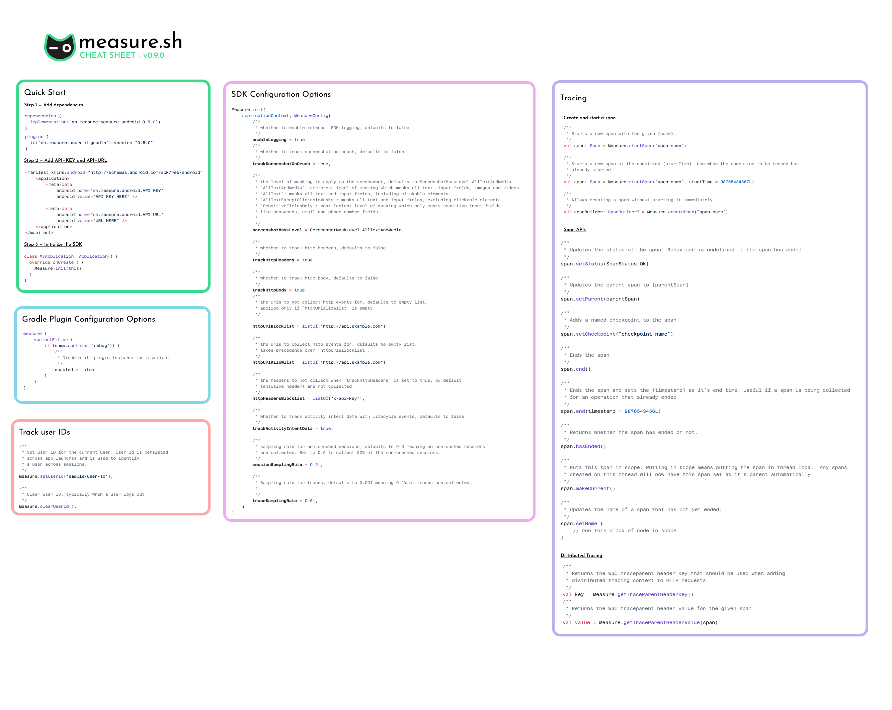

# Measure Android SDK

* [Minimum requirements](#minimum-requirements)
* [Self host compatibility](#self-host-compatibility)
* [Quick reference](#quick-reference)
* [Getting started](#getting-started)
* [Custom events](#custom-events)
  * [Handled exceptions](#handled-exceptions)
  * [Screen view](#screen-view)
* [Features](#features)
* [Performance Impact](#performance-impact)
  * [Benchmarks](#benchmarks)
  * [Profiling](#profiling)
  * [Implementation](#implementation)

# Minimum requirements

| Name                  | Version       |
|-----------------------|---------------|
| Android Gradle Plugin | 7.4           |
| Min SDK               | 21 (Lollipop) |
| Target SDK            | 31            |

# Self-host compatibility

Before updating to Android SDK version 0.9.0, make sure the deployed self-host version is *atleast* 0.5.0. For more 
details, checkout the [self-host guide](../hosting/README.md).

| SDK version   | Minimum required self-host version |
|---------------|------------------------------------|
| 0.1.0 - 0.8.2 | 0.1.1                              |
| 0.9.0         | 0.5.0                              |
 
# Quick reference

A quick reference to the entire public API for Measure Android SDK.



# Getting started

Once you have access to the dashboard, create a new app and follow the steps below:

### 1. Add the API Key & API URL

Copy the API Key and API URL from the dashboard and add it to `AndroidManifest.xml` file.

```xml

<application>
    <meta-data android:name="sh.measure.android.API_KEY" android:value="YOUR_API_KEY" />
    <meta-data android:name="sh.measure.android.API_URL" android:value="API_URL" />
</application>
```

<details>
  <summary>Configure API Keys for different build types</summary>

You can also
use [manifestPlaceholders](https://developer.android.com/build/manage-manifests#inject_build_variables_into_the_manifest)
to configure different values for different build types or flavors.

In the `build.gradle.kts` file:

```kotlin
android {
    buildTypes {
        debug {
            manifestPlaceholders["measureApiKey"] = "YOUR_API_KEY"
            manifestPlaceholders["measureUrlKey"] = "API_URL"
        }
        release {
            manifestPlaceholders["measureApiKey"] = "YOUR_API_KEY"
            manifestPlaceholders["measureUrlKey"] = "API_URL"
        }
    }
}
```

or in the `build.gradle` file:

```groovy
android {
    buildTypes {
        debug {
            manifestPlaceholders = ["measureApiKey": "YOUR_API_KEY"]
            manifestPlaceholders = ["measureUrlKey": "API_URL"]
        }
        release {
            manifestPlaceholders = ["measureApiKey": "YOUR_API_KEY"]
            manifestPlaceholders = ["measureUrlKey": "API_URL"]
        }
    }
}
```

Then add the following in the `AndroidManifest.xml` file:

```xml

<application>
    <meta-data android:name="sh.measure.android.API_KEY" android:value="${measureApiKey}" />
    <meta-data android:name="sh.measure.android.API_URL" android:value="${measureUrlKey}" />
</application>
```

</details>

### 2. Add the Measure gradle plugin

Add the following plugin to your project.

```kotlin
plugins {
    id("sh.measure.android.gradle") version "0.7.0"
}
```

or, use the following if you're using `build.gradle`.

```groovy
plugins {
    id 'sh.measure.android.gradle' version '0.7.0'
}
```

[Read](gradle-plugin.md) more about Measure gradle plugin.

<details>
  <summary>Configure variants</summary>

By default, the plugin is applied to all variants. To disable plugin for specific variants,
use the `measure` block in your build file.

> [!IMPORTANT]
> Setting `enabled` to `false` will disable the plugin for that variant. This prevents the
> plugin to collect `mapping.txt` file and other build information about the app. Features like
> tracking app size, de-obfuscating stack traces, etc. will not work.

For example to disable the plugin for `debug` variants, add the following to your
`build.gradle.kts` file:

```kotlin
measure {
  variantFilter {
    if (name.contains("debug")) {
      enabled = false
    }
  }
}
```

or in the `build.gradle` file:

```groovy
measure {
  variantFilter {
    if (name.contains("debug")) {
      enabled = false
    }
  }
}
```

</details>


### 3. Add Measure SDK

Add the following to your app's `build.gradle.kts`file.

```kotlin
implementation("sh.measure:measure-android:0.9.0")
```

or, add the following to your app's `build.gradle`file.

```groovy
implementation 'sh.measure:measure-android:0.9.0'
```

### 4. Initialize the SDK

Add the following to your app's Application class `onCreate` method.

> [!IMPORTANT]
> To be able to detect early crashes and accurate launch time metrics,
> initialize the SDK as soon as possible in Application `onCreate` method.

```kotlin
Measure.init(context)
```

If you wish to configure the SDK during initialization with a custom config use the overloaded function:

```kotlin
Measure.init(
    context, MeasureConfig(
        // override the default configuration here
    )
)
```

By default, init also starts collection of events. To delay start to a different point in your app
use [configuration options](configuration-options.md#autostart).

```kotlin
Measure.init(
  context, MeasureConfig(
    // delay starting of collection
    autoStart = false,
  )
)

// Start collecting
Measure.start()

// Stop collecting
Measure.stop()
```

See all the [configuration options](configuration-options.md) available.

### 5. Verify

The SDK automatically collects data when a crash occurs. You can verify if the SDK is working by triggering a crash
after the SDK is initialized:

```kotlin
throw RuntimeException("This is a test crash")
```

Reopen the app and launch the dashboard, you should see the crash report in the dashboard.

> [!CAUTION]
> Make sure to remove the test crash code before releasing the app to production.

🎉 Congratulations, you have successfully integrated Measure into your app!

# Custom events

Custom events provide more context on top of automatically collected events. They provide the context
specific to the app to debug issues and analyze impact.

To track a custom event use `trackEvent` method.

```kotlin
Measure.trackEvent("event_name")
```

A custom event can also contain attributes which are key value paris.

- Attribute keys must be strings with max length of 256 chars.
- Attribute values must be one of the primitive types: int, long, double, float or boolean.
- String attribute values can have a max length of 256 chars.

```kotlin
val attributes = AttributesBuilder()
  .put("is_premium_user", true)
  .build()
Measure.trackEvent("event_name", attributes = attributes)
```

A custom event can also be triggered with a timestamp to allow tracking events which might 
have happened before the app or SDK was initialized. The timestamp must be in format milliseconds 
since epoch.

```kotlin
Measure.trackEvent("event_name", timestamp = 1734443973879L)
```

Apart from sending a custom event, the following events can be tracked with a predefined scehama:

* [Handled exceptions](#handled-exceptions)
* [ScreenView](#screen-view)


### Handled exceptions

To track exceptions which were caught and handled by the app, use the `trackHandledException`
method.

```kotlin
try {
    methodThatThrows()
} catch (e: Exception) {
    Measure.trackHandledException(e)
}
```

### Screen View

Measure automatically tracks `screen_view` events
for [androidx.navigation](https://developer.android.com/jetpack/androidx/releases/navigation)
library. It also
tracks [lifecycle_activity](features/feature_navigation_and_lifecycle.md#activity-lifecycle)
events
and [lifecycle_fragment](features/feature_navigation_and_lifecycle.md#fragment-lifecycle)
events.

However, `screen_view` events can also be triggered manually using the following method to keep
a track of the user flow.

```kotlin
Measure.trackScreenView("checkout")
```

# Features

All the features supported by the Measure SDK are listed below.

* [Crash tracking](features/feature_crash_tracking.md)
* [ANR tracking](features/feature_anr_tracking.md)
* [Network monitoring](features/feature_network_monitoring.md)
* [Network changes](features/feature_network_changes.md)
* [Gesture tracking](features/feature_gesture_tracking.md)
* [Layout Snapshots](features/feature_layout_snapshots.md)
* [Navigation & Lifecycle](features/feature_navigation_and_lifecycle.md)
* [App launch](features/feature_app_launch.md)
* [App exit info](features/feature_app_exit_info.md)
* [CPU monitoring](features/feature_cpu_monitoring.md)
* [Memory monitoring](features/feature_memory_monitoring.md)
* [App size](features/feature_app_size.md)

# Session

A session represents a continuous period of activity in the app. A new session begins when an app is launched for the first time,
or when there's been no activity for a 20-minute period. A single session can continue across multiple app background and
foreground events; brief interruptions will not cause a new session to be created. This approach is helpful when reviewing
session replays, as it shows the app switching between background and foreground states within the same session.

The current session can be retrived by using `getSessionId` method.

```kotlin
val sessionId = Measure.getSessionId()
```


# Performance Impact

## Benchmarks

We benchmark the SDK's performance impact using a Pixel 4a running Android 13 (API 33). Each test runs 35 times using
macro-benchmark. For detailed methodology, see [android/benchmarks](../../android/benchmarks/README.md).

> [!IMPORTANT]
> Benchmark results are specific to the device and the app. It is recommended to run the benchmarks
> for your app to get results specific to your app. These numbers are published to provide
> a reference point and are used internally to detect any performance regressions.

Benchmarks results for v0.9.0:

* Adds 26.258ms-34.416ms to the app startup time (Time to Initial Display) for a simple app.
* Adds 0.57ms for view-based layouts, and 0.65ms for compose based layouts to every gesture.

## Profiling

To measure the SDK's impact on your app, we've added traces to key areas of the code. These traces help you track
performance using [Macro Benchmark](https://developer.android.com/topic/performance/benchmarking/macrobenchmark-overview)
or by using [Perfetto](https://perfetto.dev/docs/quickstart/android-tracing) directly.

* `msr-init` — time spent on the main thread while initializing.
* `msr-start` — time spent on the main thread when `Measure.start` is called.
* `msr-stop` — — time spent on the main thread when `Measure.stop` is called.
* `msr-trackEvent` — time spent in storing an event to local storage. Almost all of this time is spent _off_ the main
  thread. 
* `msr-trackGesture` — time spent on the main thread to track a gesture.
* `msr-generateSvgAttachment` — time spent on background thread to generate a SVG layout.

## Implementation

For details on data storage, syncing behavior, and threading, see
our [Internal Documentation](../../android/docs/internal-documentation.md).