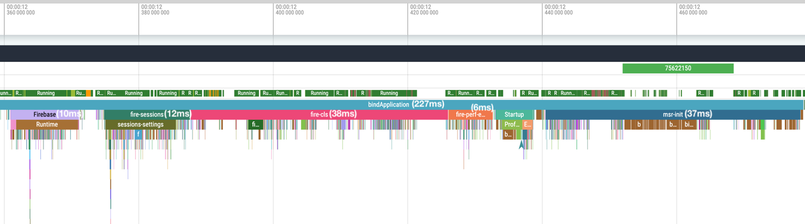

# Measure Android SDK

* [Requirements](#requirements)
* [Quick start](#quick-start)
* [Verify integration](#verify-integration)
* [Manually start/stop the SDK](#manually-start-or-stop-the-sdk)
* [Features](#features)
  * [Automatic collection](#automatic-collection)
  * [Identify users](#identify-users)
  * [Track custom events](#track-custom-events)
  * [Performance tracing](#performance-tracing)
    * [Activity load time](#activity-load-time)
    * [Custom performance traces](#custom-performance-traces)
  * [Handled exceptions](#handled-exceptions)
  * [Screen views](#screen-view)
  * [Bug reports](#bug-reports)
* [Configuration options](#configuration-options)
* [Concepts](#concepts)
  * [Sampling](#sampling)
  * [Session](#session)
* [Performance impact](#performance-impact)
  * [Benchmarks](#benchmarks)
  * [Profiling](#profiling)
  * [Comparison to Firebase initialization](#comparison-to-firebase-initialization)

# Requirements

### Minimum requirements

| Name                  | Version       |
|-----------------------|---------------|
| Android Gradle Plugin | 7.4           |
| Min SDK               | 21 (Lollipop) |
| Target SDK            | 31            |


### Self-host compatibility

Before updating to Android SDK version 0.9.0, make sure the deployed self-host version is *atleast* 0.5.0. For more 
details, checkout the [self-host guide](../hosting/README.md).

| SDK version   | Minimum required self-host version |
|---------------|------------------------------------|
| 0.10.0        | 0.6.0                              |
| 0.9.0         | 0.5.0                              |
| 0.1.0 - 0.8.2 | 0.1.1                              |


# Quick start

Once you have access to the dashboard, create a new app and follow the steps below:

### 1. Add the API Key & API URL

Copy the API Key and API URL from the dashboard and add it to `AndroidManifest.xml` file.

```xml

<application>
    <meta-data android:name="sh.measure.android.API_KEY" android:value="YOUR_API_KEY" />
    <meta-data android:name="sh.measure.android.API_URL" android:value="API_URL" />
</application>
```

<details>
  <summary>Configure API Keys for different build types</summary>

You can also
use [manifestPlaceholders](https://developer.android.com/build/manage-manifests#inject_build_variables_into_the_manifest)
to configure different values for different build types or flavors.

In the `build.gradle.kts` file:

```kotlin
android {
    buildTypes {
        debug {
            manifestPlaceholders["measureApiKey"] = "YOUR_API_KEY"
            manifestPlaceholders["measureUrlKey"] = "API_URL"
        }
        release {
            manifestPlaceholders["measureApiKey"] = "YOUR_API_KEY"
            manifestPlaceholders["measureUrlKey"] = "API_URL"
        }
    }
}
```

or in the `build.gradle` file:

```groovy
android {
    buildTypes {
        debug {
            manifestPlaceholders = ["measureApiKey": "YOUR_API_KEY"]
            manifestPlaceholders = ["measureUrlKey": "API_URL"]
        }
        release {
            manifestPlaceholders = ["measureApiKey": "YOUR_API_KEY"]
            manifestPlaceholders = ["measureUrlKey": "API_URL"]
        }
    }
}
```

Then add the following in the `AndroidManifest.xml` file:

```xml

<application>
    <meta-data android:name="sh.measure.android.API_KEY" android:value="${measureApiKey}" />
    <meta-data android:name="sh.measure.android.API_URL" android:value="${measureUrlKey}" />
</application>
```

</details>

### 2. Add the Measure gradle plugin

Add the following plugin to your project.

```kotlin
plugins {
    id("sh.measure.android.gradle") version "0.8.0"
}
```

or, use the following if you're using `build.gradle`.

```groovy
plugins {
    id 'sh.measure.android.gradle' version '0.8.0'
}
```

[Read](gradle-plugin.md) more about Measure gradle plugin.

<details>
  <summary>Configure variants</summary>

By default, the plugin is applied to all variants. To disable plugin for specific variants,
use the `measure` block in your build file.

> [!IMPORTANT]
> Setting `enabled` to `false` will disable the plugin for that variant. This prevents the
> plugin to collect `mapping.txt` file and other build information about the app. Features like
> tracking app size, de-obfuscating stack traces, etc. will not work.

For example to disable the plugin for `debug` variants, add the following to your
`build.gradle.kts` file:

```kotlin
measure {
  variantFilter {
    if (name.contains("debug")) {
      enabled = false
    }
  }
}
```

or in the `build.gradle` file:

```groovy
measure {
  variantFilter {
    if (name.contains("debug")) {
      enabled = false
    }
  }
}
```

</details>


### 3. Add Measure SDK

Add the following to your app's `build.gradle.kts`file.

```kotlin
implementation("sh.measure:measure-android:0.10.0")
```

or, add the following to your app's `build.gradle`file.

```groovy
implementation 'sh.measure:measure-android:0.10.0'
```

### 4. Initialize the SDK

Add the following to your app's Application class `onCreate` method.

> [!IMPORTANT]
> To be able to detect early crashes and accurate launch time metrics,
> initialize the SDK as soon as possible in Application `onCreate` method.

```kotlin
Measure.init(context, MeasureConfig(
        // Set to 1 to track all sessions, useful for debug builds.
        samplingRateForErrorFreeSessions = 1f, 
    )
)
```

# Verify integration

Launch the app and use it. Data is synced to server every 30 seconds or when the app goes to background. To be sure a sync is triggered, try killing and reopening the app.

Launch the dashboard, you must be able to see some data coming in. Checkout the sessions page.

🎉 Congratulations, you have successfully integrated Measure into your app!

### Troubleshoot

If you see no data on the dashboard. Here's how to investigate:

#### Enable logs

Enable logging during SDK initialization. All Meaure SDK logs use the tag `Measure`.

```kotlin
MeasureConfig(enableLogging = true)
```

#### Verify missing configuration

If logs show any of the following errors, then review [Step 1: Add API Key & URL](#1-add-the-api-key--api-url).
```
sh.measure.android.API_URL is missing in the manifest
sh.measure.android.API_KEY is missing in the manifest
```

#### Verify sampling rate

Try setting `samplingRateForErrorFreeSessions` to 1, which would enforce all sessions to be
sent to the server. It's typically a good idea to set this to `1` for debug builds. 


#### Verify server connection

If logs contain `Failed to send batch` or `Request failed with unknown error`:
* Verify the API_URL in the AndroidManifest is correct
* Check server status to ensure it is reachable


In case you face any issue, feel free to reach out to us on [Discord](https://discord.gg/f6zGkBCt42).

# Manually start or stop the SDK

By default, `Measure.init` starts collection of events. To delay start to a different point in your app
use [configuration options](configuration-options.md#autostart). This can be used to control the scope of where Measure is active in your application.

```kotlin
Measure.init(
  context, MeasureConfig(
    // delay starting of collection
    autoStart = false,
  )
)

// Start collecting
Measure.start()

// Stop collecting
Measure.stop()
```

> [!IMPORTANT]
> Some SDK instrumentation remains active even when stopped. This is to maintain state and ensure seamless data collection when it is started. 
> Additonally, cold, warm & hot launch events are also always captured. However, no data is sent to the server until the SDK is started.

# Features

Measure SDK operates on an event-based architecture, automatically collecting key debugging events while letting you track custom events, performance traces, screenshots and layout snapshots, etc. Read along for more details.

### Automatic collection

The following data is automatically collected by Measure. Read the individual docs for more details.

* [Crash tracking](features/feature_crash_tracking.md)
* [ANR tracking](features/feature_anr_tracking.md)
* [Network monitoring](features/feature_network_monitoring.md)
* [Network changes](features/feature_network_changes.md)
* [Gesture tracking](features/feature_gesture_tracking.md)
* [Layout Snapshots](features/feature_layout_snapshots.md)
* [Navigation & Lifecycle](features/feature_navigation_and_lifecycle.md)
* [App launch](features/feature_app_launch.md)
* [App exit info](features/feature_app_exit_info.md)
* [CPU monitoring](features/feature_cpu_monitoring.md)
* [Memory monitoring](features/feature_memory_monitoring.md)
* [App size](features/feature_app_size.md)
* [Screen load time](features/feature_screen_load_time.md)

## Identify users

Correlating sessions with users is critical for debugging certain issues. Measure allows setting a user ID which can
then be used to query sessions and events on the dashboard. User ID is persisted across app
launches.

```kotlin
Measure.setUserId("user-id")
```

To clear a user ID. 
```kotlin
Measure.clearUserId()
```

> It is recommended to avoid the use of PII (Personally Identifiable Information) in the
> user ID like email, phone number or any other sensitive information. Instead, use a hashed
> or anonymized user ID to protect user privacy.

## Track custom events

Custom events provide more context on top of automatically collected events. They provide the context
specific to the app to debug issues and analyze impact.

To track a custom event use `trackEvent` method.

```kotlin
Measure.trackEvent("event_name")
```

A custom event can also contain attributes which are key value paris.

- Attribute keys must be strings with max length of 256 chars.
- Attribute values must be one of the primitive types: int, long, double, float or boolean.
- String attribute values can have a max length of 256 chars.

```kotlin
val attributes = AttributesBuilder()
  .put("is_premium_user", true)
  .build()
Measure.trackEvent("event_name", attributes = attributes)
```

A custom event can also be triggered with a timestamp to allow tracking events which might 
have happened before the app or SDK was initialized. The timestamp must be in format milliseconds 
since epoch.

```kotlin
Measure.trackEvent("event_name", timestamp = 1734443973879L)
```

## Performance tracing

Use the [performance tracing](features/feature_performance_tracing.md) APIs to track performance of any part of your application - API calls,
DB queries, any function, user journey, etc. The SDK supports nested spans to track hierarchical operations.

### Screen load time

Measure can automatically track the time taken to load an Activity/Fragment. This feature is enabled by default and
can be disabled during SDK initialization.

To disable Activity load time tracking, use the following configuration:

```kotlin
Measure.init(context, config = MeasureConfig(trackActivityLoadTime = false))
```

To disable Fragment load time tracking, use the following configuration:

```kotlin
Measure.init(context, config = MeasureConfig(trackFragmentLoadTime = false))
```

See [Screen load time](features/feature_screen_load_time.md) for more details.

### Custom performance traces

Following are some *simplified* examples:

Example — track a user flow

```kotlin
val onboardingSpan = Measure.startSpan("onboarding-flow")
try {
    val signupSpan = Measure.startSpan("signup", parent = onboardingSpan)
    userSignup()
    signupSpan.end()

    val tutorialSpan = Measure.startSpan("tutorial", parent = onboardingSpan)
    showTutorial()
    tutorialSpan.end(SpanStatus.Ok)
} finally {
    onboardingSpan.end(SpanStatus.Error)
}
```

This will result in a trace like the following:

```
onboarding-flow ━━━━━━━━━━━━━━━━━━━━━━━━━━━━━━━━━━━━ [2.4s] ✓
┃
┣━ signup ━━━━━━━━━ [800ms]
┃
┗━ tutorial ━━━━━━━━━━━━━━━━ [1.6s]
```

Example — track HTTP calls using an interceptor

```kotlin
class HttpInterceptor : Interceptor {
    override fun intercept(chain: Interceptor.Chain): Response {
        val request = chain.request()
        val span = Measure.startSpan("${request.method} /${request.url.redact()}")

        return try {
            val response = chain.proceed(request)
            span.end(SpanStatus.SUCCESS)
            response
        } catch (e: Exception) {
            span.end(SpanStatus.ERROR)
            throw e
        }
    }
}
```

This will result in a trace like the following:

```
GET /orders ━━━━━━━━━━━━━━━━━━━━━━━━━━━━━━━━━━━━ [2.4s] ✗
```

For more detailed API documentation and examples, checkout [performance tracing docs](features/feature_performance_tracing.md).


### Handled exceptions

To track exceptions which were caught and handled by the app, use the `trackHandledException`
method. While your app gracefully recovers from these exceptions, tracking them helps identify potential degraded app experience.

```kotlin
try {
    methodThatThrows()
} catch (e: Exception) {
    Measure.trackHandledException(e)
}
```

### Screen View

Measure automatically tracks `screen_view` events
for [androidx.navigation](https://developer.android.com/jetpack/androidx/releases/navigation)
library. It also
tracks [lifecycle_activity](features/feature_navigation_and_lifecycle.md#activity-lifecycle)
events
and [lifecycle_fragment](features/feature_navigation_and_lifecycle.md#fragment-lifecycle)
events.

However, `screen_view` events can also be triggered manually using the following method to keep
a track of the user flow.

```kotlin
Measure.trackScreenView("checkout")
```

### Bug Reports

Bug reports enable users to report issues directly from the app. To launch the bug reporting flow:

```kotlin
Measure.launchBugReportActivity(activity)
```

You can also capture a bug report by building your own UI using:

```kotlin
Measure.trackBugReport(description = "Items from cart disappear after reopening the app")
```

Bug reports can be captured with screenshots and attributes. Read more details about 
bug reports [here](features/feature_bug_reports.md).

# Configuration options

See all the [configuration options](configuration-options.md) available.

# Concepts
* [Crash tracking](features/feature_crash_tracking.md)
* [ANR tracking](features/feature_anr_tracking.md)
* [Network monitoring](features/feature_network_monitoring.md)
* [Network changes](features/feature_network_changes.md)
* [Gesture tracking](features/feature_gesture_tracking.md)
* [Layout Snapshots](features/feature_layout_snapshots.md)
* [Navigation & Lifecycle](features/feature_navigation_and_lifecycle.md)
* [App launch](features/feature_app_launch.md)
* [App exit info](features/feature_app_exit_info.md)
* [CPU monitoring](features/feature_cpu_monitoring.md)
* [Memory monitoring](features/feature_memory_monitoring.md)
* [App size](features/feature_app_size.md)
* [Bug Reports](features/feature_bug_reports.md)

## Sampling

Sampling controls what percentage of data is collected and sent to the server, helping balance data quality with system performance and storage costs.

#### Session Sampling

Set [samplingRateForErrorFreeSessions](configuration-options.md#samplingrateforerrorfreesessions) to control event collection from sessions without errors. By default, the SDK sends all events from crashed sessions to the server, while collecting no events from error-free sessions.

* 0.0 — No events from error-free sessions (default)
* 0.1 — 10% of error-free sessions
* 1.0 — All sessions

Session sampling helps optimize data collection for crash and error analysis.

#### Trace Sampling 

[traceSamplingRate](configuration-options.md#tracesamplingrate) controls performance trace collection independently of session sampling. While session sampling determines which session-level events are sent, trace sampling specifically controls performance monitoring data.

This separation ensures:
- Performance traces are collected based on their own sampling rate.
- Critical performance data is captured regardless of session errors.
- Session data remains focused on crash analysis and debugging.

## Session

A session represents a continuous period of activity in the app. A new session begins when an app is launched for the first time,
or when there's been no activity for a 20-minute period. A single session can continue across multiple app background and
foreground events; brief interruptions will not cause a new session to be created. This approach is helpful when reviewing
session replays, as it shows the app switching between background and foreground states within the same session.

The current session can be retrived by using `getSessionId` method.

```kotlin
val sessionId = Measure.getSessionId()
```

# Performance Impact

## Benchmarks

We benchmark the SDK's performance impact using a Pixel 4a running Android 13 (API 33). Each test runs 35 times using
macro-benchmark. For detailed methodology, see [android/benchmarks](../../android/benchmarks/README.md).

> [!IMPORTANT]
> Benchmark results are specific to the device and the app. It is recommended to run the benchmarks
> for your app to get results specific to your app. These numbers are published to provide
> a reference point and are used internally to detect any performance regressions.

Benchmarks results for v0.9.0:

* Adds 26.258ms-34.416ms to the app startup time (Time to Initial Display) for a simple app.
* Adds 0.57ms for view-based layouts, and 0.65ms for compose based layouts to every gesture.

## Profiling

To measure the SDK's impact on your app, we've added traces to key areas of the code. These traces help you track
performance using [Macro Benchmark](https://developer.android.com/topic/performance/benchmarking/macrobenchmark-overview)
or by using [Perfetto](https://perfetto.dev/docs/quickstart/android-tracing) directly.

* `msr-init` — time spent on the main thread while initializing.
* `msr-start` — time spent on the main thread when `Measure.start` is called.
* `msr-stop` — — time spent on the main thread when `Measure.stop` is called.
* `msr-trackEvent` — time spent in storing an event to local storage. Almost all of this time is spent _off_ the main
  thread. 
* `msr-trackGesture` — time spent on the main thread to track a gesture.
* `msr-generateSvgAttachment` — time spent on background thread to generate a SVG layout.
* `msr-captureScreenshot` — time spent on main thread to capture and compress a screenshot.
* `msr-loadImageFromFile` — time spent on main thread to load an image from a file.
* `msr-loadImageFromUri` — time spent on main thread to load an image from a Uri.

## Comparison to Firebase initialization

The following are the results from running a macro-benachmark test to compare initialization 
time of Measure SDK vs Firebase. Tested with firebase BOM version `33.7.0` and 
Measure Android SDK version `0.10.0` running on a Pixel 4a.

Firebase initializes in multiple phases. The total median time to initialize when running the 
benchmark for an app with Firebase crashlytics, performance and analytics SDK 
was observed as `77.6ms`.

Measure has a single initialization for all it's features, and it took `35.0ms` in the same
macro-benchmark test.

| Slice                | min   | median | max   |
|----------------------|-------|--------|-------|
| FirebaseMaxMs        | 9.0   | 10.2   | 12.4  |
| fire-clsMaxMs        | 36.2  | 44.6   | 52.6  |
| fire-perf-earlyMaxMs | 6.6   | 8.8    | 22.2  |
| fire-sessionsMaxMs   | 12.7  | 14.0   | 18.5  |
| msr-initMaxMs        | 29.5  | 35.0   | 43.6  |

Perfetto screenshot from one of the runs: 



## Implementation

For details on data storage, syncing behavior, and threading, see
our [Internal Documentation](../../android/docs/internal-documentation.md).
