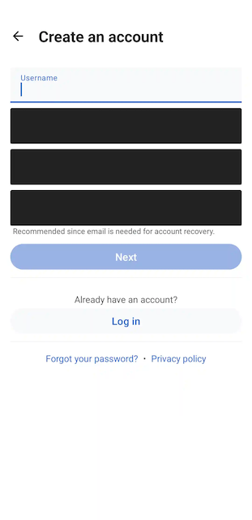

# Configuration Options

Measure provides a number of configuration options to customize the data collected and the behavior of the SDK. These
options can be set in the `MeasureConfig` object which is passed to the `Measure.init` method. Example:

```kotlin
Measure.init(
    context, MeasureConfig(
      enableLogging = true,
      trackScreenshotOnCrash = true,
      screenshotMaskLevel = if (BuildConfig.DEBUG) {
        ScreenshotMaskLevel.SensitiveFieldsOnly
      } else {
        ScreenshotMaskLevel.AllTextAndMedia
      },
      trackHttpHeaders = true,
      trackHttpBody = true,
      trackActivityIntentData = true,
      httpUrlBlocklist = listOf("http://localhost:8080"),
      sessionSamplingRate = 0.5f,
    )
)
```

# Contents

* [**trackScreenshotOnCrash**](#trackScreenshotOnCrash)
* [**screenshotMaskLevel**](#screenshotMaskLevel)
* [**httpUrlBlocklist**](#httpUrlBlocklist)
* [**trackHttpHeaders**](#trackHttpHeaders)
* [**httpHeadersBlocklist**](#httpHeadersBlocklist)
* [**trackHttpBody**](#trackHttpBody)
* [**trackActivityIntentData**](#trackActivityIntentData)
* [**sessionSamplingRate**](#sessionSamplingRate)
* [**enableLogging**](#enableLogging)

## `trackScreenshotOnCrash`

Whether to capture a screenshot of the app when it crashes due to an unhandled exception or ANR.
Defaults to `true`.

## `screenshotMaskLevel`

Allows changing the masking level of screenshots if `trackScreenshotOnCrash` is enabled to prevent sensitive
information from leaking. Defaults to `ScreenshotMaskLevel.AllTextAndMedia`.

The following levels of masking can be applied to the screenshots:

* [Mask All Text And Media](#maskalltextandmedia)
* [Mask All Text](#maskalltext)
* [Mask Text Except Clickable](#masktextexceptclickable)
* [Mask Sensitive Input Fields](#masksensitiveinputfields)

#### maskAllTextAndMedia

Masks all text, buttons, input fields, image views and video.

For View based UI, video masking is performed on VideoView and Exoplayer's `androidx.media3.ui.PlayerView`
and image masking is performed on `ImageView`. Image and video masking is currently not supported for Compose based UI.

Example:


#### maskAllText

Masks all text, buttons & input fields.

Example:


#### maskTextExceptClickable

Masks all text & input fields except clickable views like buttons.

Example:


#### maskSensitiveInputFields

Masks sensitive input fields like password, email & phone fields.

For View based UI, all input fields
with [inputType](https://developer.android.com/reference/android/text/InputType)
set to `textPassword`, `textVisiblePassword`, `textWebPassword`, `numberPassword`, `textEmailAddress`, `textEmail`
and `phone` are masked in the screenshot.

For compose based UI, all input fields with KeyboardOptions set
to `KeyboardOptions(keyboardType = KeyboardType.Password)`
are masked in the screenshot by default.

Example:

|                                                                     |                                                                     |
|---------------------------------------------------------------------|---------------------------------------------------------------------|
|  |  |

#### Mask an entire screen from screenshot

If these options do not satisfy your requirements, consider
using [FLAG_SECURE](https://developer.android.com/reference/android/view/WindowManager.LayoutParams#FLAG_SECURE) to hide
an entire screen with potential sensitive information from screenshots.

## `trackHttpHeaders`

Allows enabling/disabling capturing of HTTP request and response headers. Disabled by default.

## `httpHeadersBlocklist`

Allows specifying HTTP headers which should not be captured.
See [HTTP headers blocklist](features/feature_network_monitoring.md#httpHeadersBlocklist)

By default, the following headers are always disallowed to prevent sensitive information from
leaking:

* Authorization
* Cookie
* Set-Cookie
* Proxy-Authorization
* WWW-Authenticate
* X-Api-Key


## `trackHttpBody`

Allows enabling/disabling capturing of HTTP request and response body. Disabled by default.

## `httpUrlBlocklist`

Allows disabling collection of `http` events for certain URLs. This is useful to setup if you do not
want to collect data for certain endpoints or third party domains. By default, no URLs are blocked.

## `trackActivityIntentData`

Android [Intent](https://developer.android.com/reference/android/content/Intent#standard-extra-data)
can contain
a bundle with any arbitrary information. While this can be useful to debug certain issues which
require
checking what data was passed as part of the bundle, it might also contain sensitive information.

`trackActivityIntentData` allows enabling/disabling of collection of intent data for the following events:

* `lifecycle_activity.created` event, which is collected with the Activity lifecycle
  event `onCreate` is triggered.
* `cold_launch` event, which is collected when the app is launched from a cold start.
* `warm_launch` event, which is collected when the app is launched from a warm start.
* `hot_launch` event, which is collected when the app is launched from a hot start.

Disabled by default.

## `sessionSamplingRate`

Measure SDK by default collects events for every session. This is useful to get a complete picture of
the app's behavior and performance. However, in case you want to reduce the amount of data
collected, you can set a sampling rate for _non-crashed_ sessions using `sessionSamplingRate.

Defaults to 1.0, meaning all sessions are exported by default.

The sampling rate is a value between 0 and 1. For example, a value of `0.1` will export only 10%
of the non-crashed sessions, a value of `0` will disable exporting of non-crashed sessions.

Note that crashed sessions are always exported. And certain events like `cold_launch`, `warm_launch`,
`hot_launch` are always exported regardless of the sampling rate.

## `enableLogging`

Allows enabling/disabling internal logging of Measure SDK. This is useful to debug issues with the SDK
itself. By default, logging is disabled.
