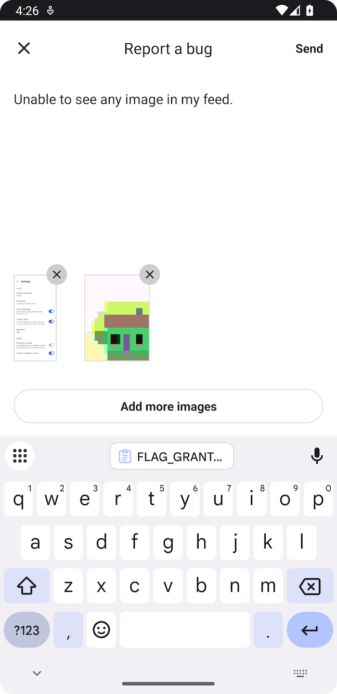

# Bug Reports

Bug reports enable users to report issues directly from the app. Measure SDK provides two approaches to implement bug
reporting.

* [Built-in Experience](#built-in-experience)
    * [Theming](#theming)
* [Custom Experience](#custom-experience)
    * [Attachments](#attachments)
* [Add attributes](#add-attributes)
* [Shake to report bug](#shake-to-report-bug)
* [Benchmarks](#benchmarks)

## Built-in Experience

Launch the default bug report interface using `Measure.launchBugReportActivity`. A screenshot is automatically taken
when this method is
called and automatically added to the bug report. The user can choose to remove the screenshot.

| Dark Mode                                 | Light Mode                                  |
|-------------------------------------------|---------------------------------------------|
|  |  |

Usage:

```kotlin
Measure.launchBugReportActivity(activity)
```

To disable taking a screenshot when this method is called, pass in a parameter:

```kotlin
Measure.launchBugReportActivity(activity, takeScreenshot = false)
```

### Theming

A custom theme can be applied by overriding any of the values in the theme:
https://github.com/measure-sh/measure/tree/main/android/measure/src/main/res/values/themes.xml

For more details on customizing themes, refer to the Android documentation
on [theming](https://developer.android.com/develop/ui/views/theming/themes#CustomizeTheme).

## Custom Experience

A custom experience can be built to match the look and feel of your app.
Once the bug report has been entered by the user, trigger the `Measure.trackBugReport` method.

```kotlin
// Track the bug report
Measure.trackBugReport(description = "Items from cart disappear after reopening the app")
```

### Attachments

Bug reports can be enhanced with attachments. A maximum of 5 attachments can be added per bug report.

The following ways can be used to add attachments to bug report:

* [Capture screenshot](#capture-screenshot)
* [Capture layout snapshot](#capture-layout-snapshot)
* [Add image from gallery](#add-image-from-gallery)

#### Capture screenshot

Capture a screenshot using `captureScreenshot`. This function must be called from the main thread.

```kotlin
private val attachments = mutableListOf<Attachment>()

Measure.captureScreenshot(activity, onCaptured = { attachment ->
    attachments.add(attachment)
})

Measure.trackBugReport(
    description = "Items from cart disappear after reopening the app",
    attachments = attachments
)
```

> [!IMPORTANT]
> For privacy, screenshots can be masked with the same configuration as provided during SDK initialization. See all the
> configuration
>
options [here](https://github.com/measure-sh/measure/blob/main/docs/android/configuration-options.md#screenshotmasklevel).

#### Capture layout snapshot

Capture a screenshot using `captureLayoutSnapshot`. This function must be called from the main thread. Read more about
layout snapshots [here](../feature_layout_snapshots.md).

```kotlin
private val attachments = mutableListOf<Attachment>()

Measure.captureLayoutSnapshot(activity, onCaptured = { attachment ->
    attachments.add(attachment)
})

Measure.trackBugReport(
    description = "Items from cart disappear after reopening the app",
    attachments = attachments
)
```

#### Add image from gallery

To add images selected by a user from gallery, use `imageUriToAttachment` to convert the `Uri` to an `Attachment`.

Make sure the Uri has the `FLAG_GRANT_READ_URI_PERMISSION` permission granted as shown below in the example.

```kotlin
private val attachments = mutableListOf<Attachment>()

registerForActivityResult(
    ActivityResultContracts.GetContent()
) { uri ->
    uri?.let {
        // Ensure the Uri has this permission to be able to read the image content
        context.contentResolver.takePersistableUriPermission(
            uri,
            Intent.FLAG_GRANT_READ_URI_PERMISSION
        )

        // This will compress the image and convert it into an attachment
        Measure.imageUriToAttachment(context, uri) { attachment ->
            attachments.add(attachment)
        }
    }
}
// Restrict picker to only allow selecting images
    .launch("image/*")

Measure.trackBugReport(
    description = "Items from cart disappear after reopening the app",
    attachments = attachments
)
```

## Add attributes

Attributes allow attaching additional contextual data to bug reports. This helps in adding relevant information
about the user's state, app configuration, or other metadata that can help with debugging.

- Attribute keys must be strings with max length of 256 chars.
- Attribute values must be one of the primitive types: int, long, double, float or boolean.
- String attribute values can have a max length of 256 chars.

Add attributes when the Bug Report Activity is launched:

```kotlin
val attributes = AttributesBuilder().put("is_premium", true).build()
Measure.launchBugReportActivity(this, attributes = attributes)
```

or, when `trackBugReport` is called:

```kotlin
val attributes = AttributesBuilder()
    .put("is_premium_user", true)
    .build()
Measure.trackBugReport(description = "...", attributes = attributes)
```

## Shake to report bug

Enable this feature to use a shake gesture for launching the bug reporting flow. TO enable this feature use one of the following approaches based on your control requirements:

* Enable for the entire app: This automatically launches the bug reporting flow when users shake their devices.

```kotlin
Measure.init(context, MeasureConfig(enableShakeToLaunchBugReport = true))
```


* Enable/disable at any point in the app: Enable to automatically launch the bug reporting flow when users shake their devices.

```kotlin
// Enable shake to report
Measure.enableShakeToLaunchBugReport()

// Disable shake to report
Measure.disableShakeToLaunchBugReport()
```

* Manually listen to the shake gesture: Use this approach to show a confirmation dialog to users before launching the bug reporting flow.

```kotlin
Measure.setShakeListener(object : MsrShakeListener {
    override fun onShake() {
        Measure.launchBugReportActivity(false)
    }
})
```

## Benchmarks

Bug reporting flow deals with loading images from file system or capturing screenshots which might lead to
both increased memory and CPU consumption. The following perfetto traces can help in debugging any potential
bottlenecks:

* `msr-captureScreenshot` — time spent on main thread to capture and compress a screenshot.
* `msr-loadImageFromFile` — time spent on main thread to load an image from a file.
* `msr-loadImageFromUri` — time spent on main thread to load an image from a Uri.
