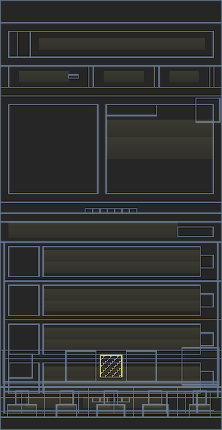

# Feature — Layout Snapshots

Layout snapshots provide a lightweight way to capture the structure of your UI at key user interactions.
They are automatically collected during click events (with throttling) and store the layout hierarchy as SVG rather than
full screenshots.
This approach gives valuable context about the UI state during user interactions while being significantly more
efficient to capture and store than traditional screenshots.

| Screenshot                                            | Layout snapshot                                  |
|-------------------------------------------------------|--------------------------------------------------|
|  |  |

## How it works

Once a [gesture is detected](feature_gesture_tracking.md), the layout is parsed by going over every element
(view or compose), recording dimensions and size information.
The result is then converted into an SVG and tracked as an [attachment](../../api/sdk/README.md#attachments).

For view-based systems, it is simply done by traversing the layout once.
While for Compose, this is done by traversing the semantics tree
using [SemanticsOwner.getAllSemanticsNodes](https://developer.android.com/reference/kotlin/androidx/compose/ui/semantics/package-summary#(androidx.compose.ui.semantics.SemanticsOwner).getAllSemanticsNodes(kotlin.Boolean,kotlin.Boolean)).

## Impact on Performance

To analyze the impact of this feature on the performance of your app, take a system trace on a release build and see
how long the following traces take:

* `msr-trackGesture` — time spent on the main thread to parse the layout.
* `msr-generateSvgAttachment` — time spent on background thread to generate the SVG layout.

Based on the results we capture on the sample application, `msr-trackGesture` adds 0.57ms for view-based layouts, 
and 0.65ms for compose based layouts.  