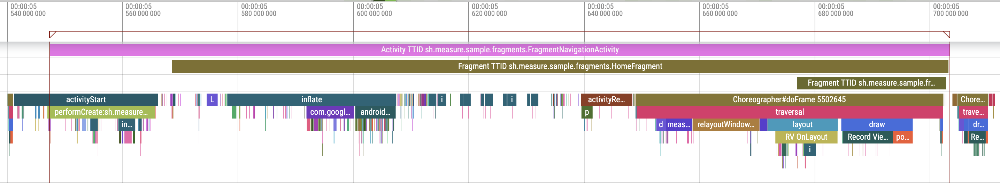

# Feature - Screen load time

Measure can automatically track the time taken to load an Activity/Fragment.
This feature is enabled by default and can be disabled during SDK initialization
using `MeasureConfig(trackActivityLoadTime = false)` and `MeasureConfig(trackFragmentLoadTime = false)`.

**Activity load time** measures the time between the Activity being created and the first
frame drawn on the screen. This is also known as Time to First Frame or
Time to Initial Display (TTID).

Each Activity load time is captured using a unique span with the name `Activity TTID` followed
by the fully qualified class name of the Activity. For example, for `MainActivity` the span
name would be `Activity TTID com.example.MainActivity`.

An attribute called `app_startup_first_activity` with value of _true_ is automatically added to the span to indicate
if the Activity was being loaded as part of a [cold](feature_app_launch.md#cold-launch) launch.

**Fragment load time** measures the time between the Fragment view being created and the
first frame drawn on the screen.
This is also known as Time to First Frame (TTF) or Time to Initial Display (TTID).

Each Fragment load time is captured using a unique span with the name `Fragment TTID` followed
by the fully qualified class name of the Fragment. For example, for `HomeFragment` the span
name would be `Fragment TTID com.example.HomeFragment`.

A large TTID means users wait too long to see content while navigating the app.

> Note that the fully qualified activity name may be truncated to fit within the 64 character limits for span names.

## How it works

**Activity load time** a span starts in the `onCreate` callback of the Activity. The span ends
when the first frame is drawn on the screen. This is achieved using two techniques:

1. Attach a `View.addOnAttachStateChangeListener` to the root view of the Activity to detect when the view is
   attached to the window.
2. Post runnable using `Handler.sendMessageAtFrontOfQueue` on the main thread as a proxy for detecting when the
   first frame is drawn.

**Fragment load time** is calculated similarly. The span starts in the `onAttached` callback. The span ends when
the first frame is drawn on the screen.

## Data captured

A span with the name `Activity TTID {fully qualified activity name}` is created for each Activity load. And a
span with the name `Fragment TTID {fully qualified fragment name}` is created for each Fragment load.

The Activity TTID span may have the following attributes if applicable:

| Attribute                  | Description                                                      |
|----------------------------|------------------------------------------------------------------|
| app_startup_first_activity | Whether this activity is the first activity launched in the app. |

The spans have the following checkpoints:

| Checkpoint                  | Description                              |
|-----------------------------|------------------------------------------|
| fragment_lifecycle_attached | The time when the Fragment was attached. |
| fragment_lifecycle_started  | The time when the Fragment was started.  |
| fragment_lifecycle_resumed  | The time when the Fragment was resumed.  |
| activity_lifecycle_created  | The time when the Activity was created.  |
| activity_lifecycle_started  | The time when the Activity was started.  |
| activity_lifecycle_resumed  | The time when the Activity was resumed.  |

# Spans visualized using Perfetto

The following image shows TTID spans of an Activity along with its two Fragments.

