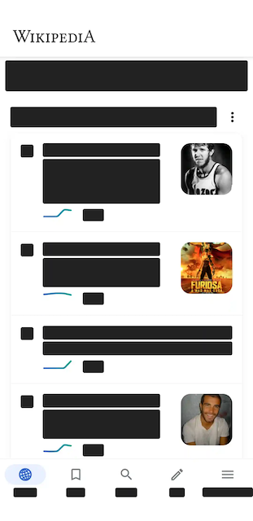
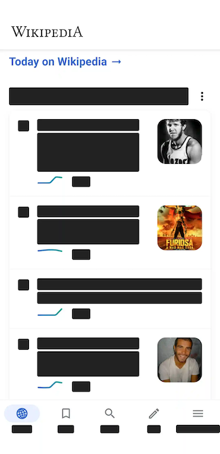

# Configuration Options

Measure provides a number of configuration options to customize the data collected and the behavior of the SDK. These
options are set at the time of SDK initialization and can be adjusted based on your app's requirements.

* [**Set Configuration Options**](#set-configuration-options)
    * [**Android**](#android)
    * [**iOS**](#ios)
* [**Explore all Configuration Options**](#configuration-options-1)

## Set Configuration Options

#### Android

For Android, options can be set in the `MeasureConfig` object which is passed to the `Measure.init` method. Example:

```kotlin
Measure.init(
    context, MeasureConfig(
        enableLogging = true,
        trackScreenshotOnCrash = true,
        screenshotMaskLevel = if (BuildConfig.DEBUG) {
            ScreenshotMaskLevel.SensitiveFieldsOnly
        } else {
            ScreenshotMaskLevel.AllTextAndMedia
        },
        trackHttpHeaders = true,
        trackHttpBody = true,
        trackActivityIntentData = true,
        httpUrlBlocklist = listOf("example.com"),
        httpUrlAllowlist = listOf("api.example.com"),
        httpHeadersBlocklist = listOf("X-USER-EMAIL"),
        samplingRateForErrorFreeSessions = 0.5f,
        autoStart = false,
        traceSamplingRate = 0.001f,
    )
)
```

#### iOS

For Android, options can be set in the `BaseMeasureConfig` object which is passed to the `Measure.shared.initialize`
method. Example:

```swift
let config = BaseMeasureConfig(enableLogging: true,
                               samplingRateForErrorFreeSessions: 1.0,
                               trackHttpHeaders: true,
                               trackHttpBody: true,
                               httpHeadersBlocklist: ["Authorization"],
                               httpUrlBlocklist: ["example.api.com"],
                               httpUrlAllowlist: ["api.example.com"],
                               autoStart: true,
                               trackViewControllerLoadTime: true)
Measure.shared.initialize(with: clientInfo, config: config)
```

## Configuration Options

* [**trackScreenshotOnCrash**](#trackScreenshotOnCrash)
* [**screenshotMaskLevel**](#screenshotMaskLevel)
* [**httpUrlBlocklist**](#httpUrlBlocklist)
* [**httpUrlAllowlist**](#httpUrlAllowlist)
* [**trackHttpHeaders**](#trackHttpHeaders)
* [**httpHeadersBlocklist**](#httpHeadersBlocklist)
* [**trackHttpBody**](#trackHttpBody)
* [**trackActivityIntentData**](#trackActivityIntentData)
* [**samplingRateForErrorFreeSessions**](#samplingRateForErrorFreeSessions)
* [**enableLogging**](#enableLogging)
* [**traceSamplingRate**](#traceSamplingRate)
* [**autoStart**](#autoStart)
* [**trackViewControllerLoadTime**](#trackViewControllerLoadTime)
* [**trackActivityLoadTime**](#trackActivityLoadTime)
* [**trackFragmentLoadTime**](#trackFragmentLoadTime)


## `trackScreenshotOnCrash`

Applies only to Android.

Whether to capture a screenshot of the app when it crashes due to a crash. 

Defaults to `true`.

## `screenshotMaskLevel`

Allows changing the masking level of screenshots if `trackScreenshotOnCrash` is enabled to prevent sensitive
information from leaking. Defaults to `ScreenshotMaskLevel.AllTextAndMedia`. Applies only to Android.

The following levels of masking can be applied to the screenshots:

* [Mask All Text And Media](#maskalltextandmedia)
* [Mask All Text](#maskalltext)
* [Mask Text Except Clickable](#masktextexceptclickable)
* [Mask Sensitive Input Fields](#masksensitiveinputfields)

#### maskAllTextAndMedia

Masks all text, buttons, input fields, image views and video.

For View based UI, video masking is performed on VideoView and Exoplayer's `androidx.media3.ui.PlayerView`
and image masking is performed on `ImageView`. Image and video masking is currently not supported for Compose based UI.

Example:


#### maskAllText

Masks all text, buttons & input fields.

Example:



#### maskTextExceptClickable

Masks all text & input fields except clickable views like buttons.

Example:



#### maskSensitiveInputFields

Masks sensitive input fields like password, email & phone fields.

For View based UI, all input fields
with [inputType](https://developer.android.com/reference/android/text/InputType)
set to `textPassword`, `textVisiblePassword`, `textWebPassword`, `numberPassword`, `textEmailAddress`, `textEmail`
and `phone` are masked in the screenshot.

For compose based UI, all input fields with KeyboardOptions set
to `KeyboardOptions(keyboardType = KeyboardType.Password)`
are masked in the screenshot by default.

Example:


#### Mask an entire screen from screenshot

If these options do not satisfy your requirements, consider
using [FLAG_SECURE](https://developer.android.com/reference/android/view/WindowManager.LayoutParams#FLAG_SECURE) to hide
an entire screen with potential sensitive information from screenshots.

## `trackHttpHeaders`

Allows enabling/disabling capturing of HTTP request and response headers. Disabled by default.

## `httpHeadersBlocklist`

Allows specifying HTTP headers which should not be captured.
See [HTTP headers blocklist](features/feature_network_monitoring.md#httpHeadersBlocklist)

By default, the following headers are always disallowed to prevent sensitive information from
leaking:

* Authorization
* Cookie
* Set-Cookie
* Proxy-Authorization
* WWW-Authenticate
* X-Api-Key

## `trackHttpBody`

Allows enabling/disabling capturing of HTTP request and response body. 

Defaults to `false`.

## `httpUrlBlocklist`

Allows disabling collection of `http` events for certain URLs. This is useful to setup if you do not
want to collect data for certain endpoints or third party domains. By default, no URLs are blocked.

Note that this list is used only if `httpUrlAllowlist` is empty.

## `httpUrlAllowlist`

Allows enabling collection of `http` events only for certain URLs. This is useful to setup if you want
to collect data only for certain endpoints or third party domains. If this list is empty, `httpUrlBlocklist` is
considered. By default, this list is empty.

## `trackActivityIntentData`

_Applies only to Android._

Android [Intent](https://developer.android.com/reference/android/content/Intent#standard-extra-data)
can contain a bundle with any arbitrary information. While this can be useful to debug certain issues which require
checking what data was passed as part of the bundle, it might also contain sensitive information.

`trackActivityIntentData` allows enabling/disabling of collection of intent data for the following events:

* `lifecycle_activity.created` event, which is collected with the Activity lifecycle
  event `onCreate` is triggered.
* `cold_launch` event, which is collected when the app is launched from a cold start.
* `warm_launch` event, which is collected when the app is launched from a warm start.
* `hot_launch` event, which is collected when the app is launched from a hot start.

Defaults to `false`.

## `samplingRateForErrorFreeSessions`

Controls sampling rate for non-crashed sessions. 

A value between 0.0 and 1.0 can be set:

* 0.0 (default): Only collect crashed sessions
* 0.1: Collect 10% of non-crashed sessions
* 1.0: Collect all sessions

Defaults to `0`.

Note that sessions with a crash or a bug report are collected regardless of this setting.

## `traceSamplingRate`

Measure SDK collects traces at a sampled rate of 0.1%. Meaning 0.1% of all traces will be sent to the server. To modify
this rate use `traceSamplingRate`.

The sampling rate is a value between 0 and 1. For example, a value of `0.1` will export only 10%
of the traces, a value of `0` will disable exporting of traces completely.

Defaults to `0.1` (10%).

## `enableLogging`

Allows enabling/disabling internal logging of Measure SDK. This is useful to debug issues with the SDK
itself.

Defaults to `false`.

## `autoStart`

Controls whether to start tracking immediately or delay starting the SDK.

Defaults to `true`.

Use `Measure.start` to start the SDK at a different point and `Measure.stop` to stop the SDK from tracking
data.

## `trackViewControllerLoadTime`

Enables or disables automatic collection of ViewController load time.

Defaults to `true`.

ViewController load time measures the time between when the ViewController's view is loaded and the first frame is drawn
on the screen. This is also known as **Time to First Frame (TTF)** or **Time to Initial Display (TTID)**.

A large TTID value means users are waiting too long before any content appears on screen during app navigation.

Each ViewController load time is captured as a `Span` with the name `VC TTID <class name>`. For example, for a
class `MainViewController`, the span name would be: `VC TTID MainViewController`.

## `trackActivityLoadTime`

Enables or disables automatic collection of Activity load time.

Defaults to `true`.

Activity load time measures the time between when the Activity is created and the first frame is drawn on the screen.
This is also known as **Time to First Frame (TTF)** or **Time to Initial Display (TTID)**.

A large TTID value means users are waiting too long before any content appears on screen during app navigation.

Each Activity load time is captured as a `Span` with the name `Activity TTID <class name>`. For example, for an
fully qualified Activity class `com.example.MainActivity`, the span name would
be: `Activity TTID com.example.MainActivity`.

## `trackFragmentLoadTime`

Enables or disables automatic collection of Fragment load time.

Defaults to `true`.

Fragment load time measures the time between when the Fragment is created and the first frame is drawn on the screen.
This is also known as **Time to First Frame (TTF)** or **Time to Initial Display (TTID)**.

A large TTID value means users are waiting too long before any content appears on screen during app navigation.

Each Fragment load time is captured as a `Span` with the name `Fragment TTID <class name>`. For example, for a
fully qualified Fragment class `com.example.MainFragment`, the span name would
be: `Fragment TTID com.example.MainFragment`.
