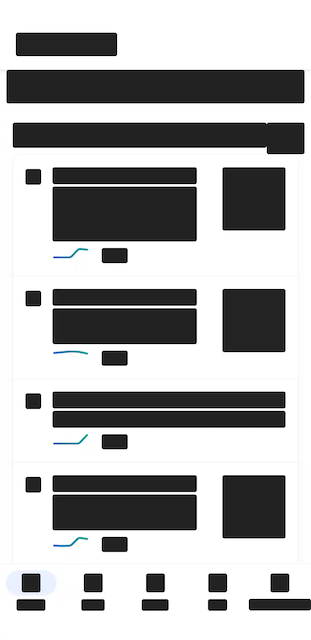

# Configuration Options

Measure provides a number of configuration options to customize data collection and SDK behavior. These options are
available in two ways:

* **SDK Options** — Set at initialization time in your app's code.
* **Remote Configuration Options** — Configured remotely from the Measure dashboard. Changes take effect without
  releasing a new
  app version.

# Table of Contents

* [**SDK Configuration Options**](#sdk-configuration-options)
    * [**API Reference**](#api-reference)
        * [**Android**](#android)
        * [**iOS**](#ios)
        * [**Flutter**](#flutter)
    * [**trackActivityIntentData**](#trackActivityIntentData)
    * [**enableLogging**](#enableLogging)
    * [**autoStart**](#autoStart)
    * [**requestHeadersProvider**](#requestHeadersProvider)
    * [**maxDiskUsageInMb**](#maxDiskUsageInMb)
    * [**enableFullCollectionMode**](#enableFullCollectionMode)
* [**Remote Configuration Options**](#remote-configuration-options)
    * [**Crash Reporting**](#crash-reporting)
    * [**ANR Reporting**](#anr-reporting)
    * [**Trace Sampling**](#trace-sampling)
    * [**Launch Metrics Sampling**](#launch-metrics-sampling)
    * [**Journey Sampling**](#journey-sampling)
    * [**HTTP Events**](#http-events)
    * [**Screenshot Mask Level**](#screenshot-mask-level)

# SDK Configuration Options

## API Reference

#### Android

For Android, options can be set in the `MeasureConfig` object which is passed to the `Measure.init` method. Example:

```kotlin
Measure.init(
    context, MeasureConfig(
        enableLogging = true,
        autoStart = true,
        maxDiskUsageInMb = 50,
        trackActivityIntentData = true,
        requestHeadersProvider = customRequestHeadersProvider,
        enableFullCollectionMode = false,
    )
)
```

#### iOS

For iOS, options can be set in the `BaseMeasureConfig` object which is passed to the `Measure.initialize`
method. Example:

```swift
let config = BaseMeasureConfig(enableLogging: true,
                               autoStart: true,
                               maxDiskUsageInMb: 50,
                               requestHeadersProvider: customRequestHeadersProvider,
                               enableFullCollectionMode: false)
Measure.initialize(with: clientInfo, config: config)
```

#### Flutter

For Flutter, options can be set in the `MeasureConfig` object which is passed to the `Measure.init` method. Example:

```dart
Future<void> main() async {
  await Measure.instance.init(
        () => runApp(MeasureWidget(child: MyApp())),
    config: const MeasureConfig(
      enableLogging: true,
      autoStart: true,
      maxDiskUsageInMb: 50,
      enableFullCollectionMode: false,
    ),
  );
}
```

## `trackActivityIntentData`

_Applies only to Android._

Android [Intent](https://developer.android.com/reference/android/content/Intent#standard-extra-data)
can contain a bundle with any arbitrary information. While this can be useful to debug certain issues which require
checking what data was passed as part of the bundle, it might also contain sensitive information.

`trackActivityIntentData` allows enabling/disabling of collection of intent data for the following events:

* `lifecycle_activity.created` event, which is collected with the Activity lifecycle
  event `onCreate` is triggered.
* `cold_launch` event, which is collected when the app is launched from a cold start.
* `warm_launch` event, which is collected when the app is launched from a warm start.
* `hot_launch` event, which is collected when the app is launched from a hot start.

Defaults to `false`.

## `enableLogging`

Allows enabling/disabling internal logging of Measure SDK. This is useful to debug issues with the SDK
itself.

Defaults to `false`.

## `autoStart`

Controls whether to start tracking immediately or delay starting the SDK.

Defaults to `true`.

Use `Measure.start` to start the SDK at a different point and `Measure.stop` to stop the SDK from tracking
data.

## `requestHeadersProvider`

Allows configuring custom HTTP headers for requests made by the Measure SDK to the Measure API. This is useful **only
for
self-hosted** clients who may require additional headers for requests in their infrastructure.

Defaults to `null`, which means no additional headers are added.

The following headers are reserved by the SDK and will be ignored if provided:

- `Content-Type`
- `msr-req-id`
- `Authorization`
- `Content-Length`

#### Android Usage

```kotlin
class CustomHeaderProvider : MsrRequestHeadersProvider {
    private val requestHeaders: ConcurrentMap<String, String> = ConcurrentHashMap()

    fun addHeader(key: String, value: String) {
        requestHeaders[key] = value
    }

    fun removeHeader(key: String) {
        requestHeaders.remove(key)
    }

    override fun getRequestHeaders(): Map<String, String> {
        return requestHeaders.toMap() // Return immutable copy
    }
}

Measure.init(
    context, MeasureConfig(
        requestHeadersProvider = CustomHeadersProvider()
    )
)
```

#### iOS Usage

Using Swift:

```swift
class CustomHeaderProvider: NSObject, MsrRequestHeadersProvider {
    func getRequestHeaders() -> NSDictionary {
        return ["X-App-Version": "1.0.0"]
    }
}

Measure.initialize(with: clientInfo, config: BaseMeasureConfig(requestHeadersProvider: CustomHeadersProvider()))
```

<details>
<summary>Using ObjC</summary>

```objc
@interface RequestHeaderProvider : NSObject <MsrRequestHeadersProvider>

@end

@implementation RequestHeaderProvider

- (NSDictionary *)getRequestHeaders {
    return @{ @"X-Custom-Header": @"value" };
}

@end

// add below snippet while initializing the SDK.
ClientInfo *clientInfo = [[ClientInfo alloc] initWithApiKey:@"api-key" apiUrl:@"api-url"];
    BaseMeasureConfig *config = [[BaseMeasureConfig alloc] initWithEnableLogging:YES
                                                samplingRateForErrorFreeSessions:1.0
                                                               traceSamplingRate:1.0
                                                                trackHttpHeaders:YES
                                                                   trackHttpBody:NO
                                                            httpHeadersBlocklist:@[@"Authorization", @"Cookie"]
                                                                httpUrlBlocklist:@[@"https://sensitive.example.com"]
                                                                httpUrlAllowlist:@[@"https://api.example.com"]
                                                                       autoStart:YES
                                                     trackViewControllerLoadTime:YES
                                                             screenshotMaskLevel:ScreenshotMaskLevelObjcAllText
                                                          requestHeadersProvider:[RequestHeaderProvider new]];
    [Measure initializeWith:clientInfo config:config]
```

</details>

## `maxDiskUsageInMb`

Allows setting the maximum disk usage for Measure SDK. This is useful to control the amount of disk space
used by the SDK for storing session data, crash reports, and other collected information.

All Measure SDKs store data to disk and upload it to the server in batches. While the app is in foreground, the data
is synced periodically and usually the disk space used by the SDK is low. However, if the device is offline
or the server is unreachable, the SDK will continue to store data on disk until it reaches the maximum disk usage limit.

Defaults to `50MB`. Allowed values are between `20MB` and `1500MB`. Any value outside this range will be clamped
to the nearest limit.

Note that the storage usage is not exact and works on estimates and typically the SDK will use much less disk space than
the configured limit. When the SDK reaches the maximum disk usage limit, it will start deleting the oldest data to make
space for new data.

# `enableFullCollectionMode`

Overrides all sampling configurations and enables full data collection for all sessions. Use this option for debugging
and testing purposes. Defaults to `false`. Use this option with caution as it can lead to high data collection and
storage costs if done at scale in production.

# Remote Configuration Options

A number of configuration options are available remotely from the Measure dashboard. Changes take effect without
releasing a new app version. To change the remote configuration settings, navigate to the "Apps" tab in the
Measure dashboard.

The SDK requests this configuration and caches it locally. For a new configuration to take effect, it takes
two app launches. First, the SDK fetches the new configuration and caches it locally. On the next app launch, the new
configuration takes effect.

#### Defaults

The following defaults are set for each app:

| Configuration                        | Default Value                                                                       |
|--------------------------------------|-------------------------------------------------------------------------------------|
| Take screenshot on Crash             | true                                                                                |
| Crash session timeline duration      | 300 seconds (5 minutes)                                                             |
| Take screenshot on ANR               | true                                                                                |
| ANR session timeline duration        | 300 seconds (5 minutes)                                                             |
| Bug Report session timeline duration | 300                                                                                 |
| Trace sampling rate                  | 0.01%                                                                               |
| Journey sampling rate                | 0.01%                                                                               |
| Launch Metrics sampling rate         | 0.01%                                                                               |
| Disable HTTP event for URLs          | (empty)                                                                             |
| Track HTTP request body for URLs     | (empty)                                                                             |
| Track HTTP response body for URLs    | (empty)                                                                             |
| Blocked HTTP headers                 | Authorization, Cookie, Set-Cookie, Proxy-Authorization, WWW-Authenticate, X-Api-Key |
| Screenshot mask level                | AllTextAndMedia                                                                     |

## Crash Reporting

### Enable/Disable Screenshots

Each Crash, by default comes with a screenshot of the app at the time of the crash. You can choose to disable
this feature if you do not want screenshots to be captured.

### Session timeline duration

When a crash occurs, a session timeline _up to a few minutes_ leading up to the crash is captured. You can configure
this duration to control the number of events collected in each session timeline.

By default, _5 minutes_ of events before the crash are captured in the session timeline. You can adjust this duration
to control the amount of data collected.

## ANR Reporting

### Enable/Disable Screenshots

Each ANR, by default comes with a screenshot of the app at the time of the ANR. You can choose to disable
this feature if you do not want screenshots to be captured.

### Session timeline duration

When an ANR occurs, a session timeline _up to a few minutes_ leading up to the ANR is captured. You can configure
this duration to control the number of events collected in each session timeline.

By default, _5 minutes_ of events before the ANR are captured in the session timeline. You can adjust this duration
to control the amount of data collected.

## Bug Reports

### Session timeline duration

When a bug report is submitted, a session timeline _up to a few minutes_ leading up to the bug report is captured.
You can configure this duration to control the number of events collected in each session timeline.

By default, _5 minutes_ of events before the bug report are captured in the session timeline. You can adjust this
duration to control the amount of data collected.

## Trace Sampling

By default, 0.01% (1 in 10000) traces are reported. You can adjust this percentage from 0.001% to 100% to control
the amount of data collected.

## Launch Metrics Sampling

Launch metrics include Cold Launch, Warm Launch, and Hot Launch metrics shown on the Overview page on the dashboard. A
sampling rate can be configured to control the number of sessions for whom these launch metrics are collected.

By default, 0.01% (1 in 10000) of sessions will have launch metrics collected. You can adjust this percentage
from 0.001% to 100% to control the amount of data collected.

## Journey Sampling

Journey events are used to construct the Journey view in the Measure dashboard. Journey events include Activity
Lifecycle events, Fragment Lifecycle events, and Screen View events. A sampling rate can be configured to control
the number of sessions for whom these Journey events are collected.

By default, 0.01% (1 in 10000) of sessions will have Journey events collected. You can adjust this percentage from
0.001% to 100% to control the amount of data collected.

## HTTP Events

HTTP events contain information about network requests made by your app. The following configuration options are
available
for HTTP events:

### Enable/Disable HTTP events

You can choose to enable or disable the collection of HTTP events by providing a URL. We support both exact URL matches
and wildcard URL matches (using `*` as a wildcard character).

Examples:

- Disable a specific endpoint: `https://example.com/api/v1/users`
- Disable a domain and all its endpoints: `https://example.com/*`
- Disable a specific path across all domains: `*/api/v1/orders`
- Disable a specific URL path: `https://example.com/api/*/payments`

### Enable Request Body Collection

By default, request body and headers are not collected for HTTP events. Note that enabling request body collection
should only be done for very specific URLs which do not contain sensitive information and the payload size is not too
large.

You can provide a list of URLs with wildcards for which request body and headers should be collected. We support both
exact URL matches and wildcard URL matches (using `*` as a wildcard character).

### Enable Response Body Collection

By default, response body and headers are not collected for HTTP events. Note that enabling response body collection
should only be done for very specific URLs which do not contain sensitive information and the payload size is not too
large.

You can provide a list of URLs with wildcards for which response body and headers should be collected. We support both
exact URL matches and wildcard URL matches (using `*` as a wildcard character).

### Headers Blocklist

Request and response headers are only collected if Request or Response Body Collection is enabled for a URL. By default,
no headers are collected.

This configuration allows you to specify which headers should be not collected for requests and responses. You can
provide a list of header names to be blocked. Header name matching is case-insensitive.

By default, the following headers are never collected, even if not specified in the blocklist:

- Authorization
- Cookie
- Set-Cookie
- Proxy-Authorization
- WWW-Authenticate
- X-Api-Key

## Screenshot Mask Level

Change the masking level of screenshots collected with Crashes and ANRs. It helps prevent sensitive
information from leaking.

The following levels of masking can be applied to the screenshots:

#### Mask all text and media

Masks all text, buttons, input fields, image views and video.

For View based UI, video masking is performed on VideoView and Exoplayer's `androidx.media3.ui.PlayerView`
and image masking is performed on `ImageView`. Image and video masking is currently not supported for Compose based UI.

Example:



#### Mask all text

Masks all text, buttons & input fields.

Example:


#### Mask text except clickable

Masks all text & input fields except clickable views like buttons.

Example:


#### Mask sensitive input fields

Masks sensitive input fields like password, email & phone fields.

For View based UI, all input fields
with [inputType](https://developer.android.com/reference/android/text/InputType)
set to `textPassword`, `textVisiblePassword`, `textWebPassword`, `numberPassword`, `textEmailAddress`, `textEmail`
and `phone` are masked in the screenshot.

For compose based UI, all input fields with KeyboardOptions set
to `KeyboardOptions(keyboardType = KeyboardType.Password)`
are masked in the screenshot by default.

Example:


