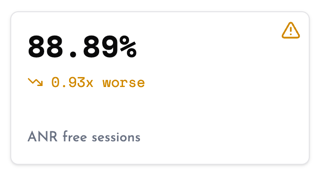

# ANR Reporting

* [**Debugging ANRs**](#debugging-anrs)
* [**Metrics**](#metrics)
* [**Data Collected**](#data-collected)
* [**How It Works**](#how-it-works)

ANRs (Application Not Responding errors) are automatically tracked. Optionally, the SDK can also capture a snapshot of your app’s UI at the moment the crash occurred.

## Debugging ANRs

You can easily debug ANRs by following the in-depth guide in the [Android documentation](https://developer.android.com/topic/performance/anrs/diagnose-and-fix-anrs). It covers different scenarios that lead to ANRs and how to approach fixing them.

You can also use the session timelines in Measure to see what was happening in the app before the ANR occurred. The timeline shows all app activity, including CPU and Memory usage, giving you crucial context for understanding the ANR and pinpointing the cause.

Additionally, starting from Android API level 30, the Application Exit feature provides valuable insights. Measure tracks all app exit events and reports them to the server along with the stack trace. Here’s an example snippet from a trace:

```
"main" prio=5 tid=1 Blocked
  at sh.measure.sample.ExceptionDemoActivity.deadLock$lambda$10(ExceptionDemoActivity.kt:66)
  - waiting to lock <0x0a293e9f> (a java.lang.Object) held by thread 22
  at sh.measure.sample.ExceptionDemoActivity.$r8$lambda$kc26SdTV_Hqz6i5PLOpVXKS016U(unavailable:0)
  at sh.measure.sample.ExceptionDemoActivity$$ExternalSyntheticLambda9.run(unavailable:2)
  at android.os.Handler.handleCallback(Handler.java:942)
  at android.os.Handler.dispatchMessage(Handler.java:99)
  at android.os.Looper.loopOnce(Looper.java:201)
  at android.os.Looper.loop(Looper.java:288)
  at android.app.ActivityThread.main(ActivityThread.java:7872)
  at java.lang.reflect.Method.invoke(Native method)
  at com.android.internal.os.RuntimeInit$MethodAndArgsCaller.run(RuntimeInit.java:548)
  at com.android.internal.os.ZygoteInit.main(ZygoteInit.java:936)


"APP: Locker" prio=5 tid=22 Sleeping
  at java.lang.Thread.sleep(Native method)
  - sleeping on <0x06290e31> (a java.lang.Object)
  at java.lang.Thread.sleep(Thread.java:450)
  - locked <0x06290e31> (a java.lang.Object)
  at java.lang.Thread.sleep(Thread.java:355)
  at sh.measure.sample.ExceptionDemoActivity.sleep(ExceptionDemoActivity.kt:86)
  at sh.measure.sample.ExceptionDemoActivity.access$sleep(ExceptionDemoActivity.kt:12)
  at sh.measure.sample.ExceptionDemoActivity$LockerThread.run(ExceptionDemoActivity.kt:80)
  - locked <0x0a293e9f> (a java.lang.Object)
```

In this example, the “main” thread is blocked, waiting to lock an object held by _thread 22_, which is sleeping and holding that lock. This creates a deadlock, leading to an ANR.

> [!NOTE]  
> Starting from API 31, for native crashes, App Exit Info contains the [tombstone](https://source.android.com/docs/core/tests/debug) stack trace. Support for native crash reports is not yet implemented and will be coming soon. Track the updates in this [issue](https://github.com/measure-sh/measure/issues/103).

## Metrics



The ANR-Free Rate measures the percentage of sessions that didn’t experience any ANRs. Here’s how it’s calculated:

```
ANR-Free Rate = (Total Sessions - ANR Sessions) / Total Sessions * 100
```

Where:

- **Total Sessions**: The total number of sessions recorded.
- **ANR Sessions**: The number of sessions that experienced an ANR.

## Data Collected

Check out all the data collected for App Exit in the [App Exit Event](../../api/sdk/README.md#appexit) section.

## How It Works

Measure SDK detects ANRs by tracking the `SIGQUIT` signal. When an ANR occurs, this signal is sent to the app process. The SDK picks up on this signal and reports the ANR to the server.

#### Implementation Details

* [Signal](#handling-signals)
* [Signal Delivery](#signal-delivery)
* [Handling Signals](#handling-signals)
* [Semaphores](#semaphores)
* [Detecting SIGQUIT on Android](#detecting-sigquit-on-android)

Apart from setting a signal disposition using [sigaction](https://man7.org/linux/man-pages/man2/sigaction.2.html), a thread can also set up a [sigwait](https://man7.org/linux/man-pages/man3/sigwait.3.html). This allows the registered signals to be handled on this thread without triggering the `sigaction` handler.

## Handling Signals

Signals can be *handled* using [sigaction](https://man7.org/linux/man-pages/man2/sigaction.2.html) or [sigwait](https://man7.org/linux/man-pages/man3/sigwait.3.html) (among others which we'll not cover in this article).

### sigaction(2)

The `sigaction` system call is used to change the action taken by a process on receipt of a specific signal. The handler function provided affects how the process handles the signal (i.e., signal handler is not per thread).

> Signal handlers are per-process, but signal masks are per-thread.

### sigwait(3)

The `sigwait` function suspends execution of the calling thread until one of the signals specified in the signal set becomes `pending`. **Once a signal is processed by this thread, it is automatically cleared from the set of pending signals**. It then returns that signal number. No signal handlers set using `sigaction` are triggered for this signal once cleared by `sigwait`.

`sigwait` makes it easy to handle the signals synchronously in normal program execution.

## Semaphores

The implementation relies on Semaphores to synchronize the threads.

### sem_wait(3)

`sem_wait` decrements (locks) the semaphore. If the semaphore's value is greater than zero, then the decrement proceeds, and the function returns immediately. If the semaphore currently has the value zero, then the call blocks until it becomes possible to perform the decrement (i.e., the semaphore value rises above zero).

### sem_post(3)

`sem_post` increments (unlocks) the semaphore. If the semaphore's value consequently becomes greater than zero, then the thread blocked in a `sem_wait` call will be woken up and proceed to lock the semaphore.

## Detecting SIGQUIT on Android

Setting a signal handler using `sigaction` is the typical way to detect and track a `SIGQUIT` on a Linux system. However, Android registers [sigwait](https://man7.org/linux/man-pages/man3/sigwait.3.html) for the `SIGQUIT` signal for every app ([reference](https://android.googlesource.com/platform/art/+/refs/heads/main/runtime/signal_catcher.cc)). Hence, simply registering a `sigaction` will not have any effect as noted earlier.

1. Find the thread ID of the thread called "[Signal Catcher](https://android.googlesource.com/platform/art/+/refs/heads/main/runtime/signal_catcher.cc)". This is the thread using which Android registers the `sigwait`. Thread ID is found by looping over the directory `/proc/<pid>/task/` and reading the thread name from the contents of the `comm` file in each subdirectory to find the thread name. More on this can be found [here](https://man.freebsd.org/cgi/man.cgi?apropos=0&arch=default&format=html&manpath=CentOS+7.1&query=proc&sektion=5#:~:text=%2Fproc%2F%5Bpid%5D%2Ftask%09(since%20Linux%202.6.0%2Dtest6)).
2. Create a new thread called "Watchdog" using `pthread_create` and set the signal mask to unblock the `SIGQUIT` signal using `pthread_sigmask` for this thread. This ensures that the new thread can receive the `SIGQUIT` signal instead of the _Signal Catcher_ thread.
3. Register a semaphore using [sem_wait](https://man7.org/linux/man-pages/man3/sem_wait.3.html) in the _Watchdog_ thread which blocks it until the `SIGQUIT` signal is received.
4. Register a signal handler using `sigaction` for the `SIGQUIT` signal. When `SIGQUIT` is received, the handler invokes [sem_post](https://man7.org/linux/man-pages/man3/sem_post.3.html) to unblock the _Watchdog_ thread.
5. When the _Watchdog_ thread's semaphore is unlocked, it notifies Measure SDK of an ANR by a callback using JNI.
6. Eventually, the Watchdog thread notifies the "Signal Catcher" thread to handle the signal as usual by using `syscall`:
    ```c
    syscall(SYS_tgkill, pid, signal_catcher_tid, SIGQUIT);
    ```