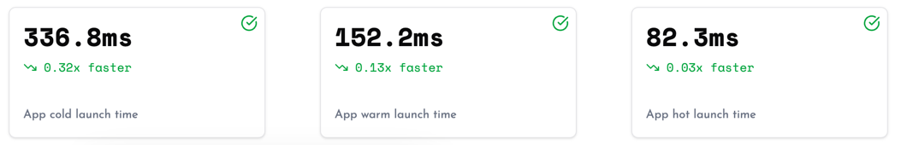

# App Launch Metrics

* [**Introduction**](#introduction)
* [**Sampling**](#sampling)
* [**Data Collected**](#data-collected)
* [**How It Works**](#how-it-works)
    * [**Android**](#android)
    * [**iOS**](#ios)

## Introduction

Measure automatically tracks cold, warm, and hot app launches along with the time taken for each. No sampling is done, ensuring that the data is accurate and represents the real-world performance of your app.

- **Cold Launch**: The time taken to launch the app from scratch.
- **Warm Launch**: The time taken to launch the app from a previously cached state.
- **Hot Launch**: The time taken to launch the app when it is already running in the background.

You can easily track these metrics in the dashboard, allowing you to monitor the performance of your app's launch.

## Sampling

See [Configuration Options](configuration-options.md)  for details on how to configure sampling for launch 
metrics.

## Data Collected

Check out the data collected by Measure for [Cold Launch](../api/sdk/README.md#coldlaunch), [Warm Launch](../api/sdk/README.md#warmlaunch), and [Hot Launch](../api/sdk/README.md#hotlaunch) respectively.

## How It Works

* [**Android**](#android)
* [**iOS**](#ios)

### Android

#### Cold Launch

A [cold launch](https://developer.android.com/topic/performance/vitals/launch-time#cold) refers to an app starting
from scratch. Cold launch happens in cases such as an app launching for the first time since the device booted or since
the system killed the app.

There are typically two important metrics to track for a cold launch:

1. **Time to Initial Display (TTID)** - the time taken from when the app was launched to when the first frame is displayed.
2. **Time to Full Display (TTFD)** - the time taken from when the app was launched to when the first meaningful content is displayed to the user.

> [!NOTE]  
> Measuring TTFD is not possible yet; support will be added in a future version.

Meanwhile, **Time to Initial Display (TTID)** is automatically calculated by recording two timestamps:

1. The time when the app was launched.
2. The time when the app's first frame was displayed.

_The time when the app was launched_ is calculated differently for different SDK versions. We use the most accurate measurement possible for the given SDK version.

* Up to API 24: the _uptime_ when Measure content provider's attachInfo callback is invoked.
* API 24 - API 32: the process start uptime, using [Process.getStartUptimeMillis](https://developer.android.com/reference/android/os/Process#getStartUptimeMillis())
* API 33 and beyond: the process start uptime, using [Process.getStartRequestedUptimeMillis](https://developer.android.com/reference/android/os/Process#getStartRequestedUptimeMillis())

_The time when the app's first frame was displayed_ is a bit more complex. Simplifying some of the steps, it is calculated in the following way:

1. Get the decor view by registering [onContentChanged](https://developer.android.com/reference/android/app/Activity#onContentChanged()) callback on the first Activity.
2. Get the next draw callback by registering [OnDrawListener](https://developer.android.com/reference/android/view/ViewTreeObserver.OnDrawListener) on the decor view.
3. [Post a runnable in front of the next draw callback](https://github.com/square/papa/blob/main/papa/src/main/java/papa/internal/Handlers.kt#L8-L13) to record the time just before the first frame was displayed.

#### Warm Launch

A [warm launch](https://developer.android.com/topic/performance/vitals/launch-time#warm) refers to the re-launch of an
app causing an Activity `onCreate` to be triggered instead of just `onResume`. This requires the system to recreate
the activity from scratch and hence requires more work than a hot launch.

Warm launch is calculated by keeping track of the time when the Activity `onCreate` of the Activity being recreated is triggered and the time when the first frame is displayed. The same method as for cold launch is used to calculate the time when the first frame is rendered.

#### Hot Launch

A [hot launch](https://developer.android.com/topic/performance/vitals/launch-time#hot) refers to the re-launch of an
app causing an Activity `onResume` to be triggered. This typically requires less work than a warm launch as the system
does not need to recreate the activity from scratch. However, if there were any trim memory events leading to the
certain resources being released, the system might need to recreate those resources.

#### Further Reading

* [Android docs on app startup](https://developer.android.com/topic/performance/vitals/launch-time#warm)
* [Py's android vitals series](https://dev.to/pyricau/series/7827)
* [Py's PAPA GitHub project](https://github.com/square/papa)

### iOS

#### Cold Launch

A cold launch refers to an app starting up from scratch. Cold launches occur when the app is launched after a reboot or when the app is updated. When an app is launched from scratch, the app is brought from the disk to the memory, iOS loads startup system-side services that support the app, frameworks, and daemons that the app depends on to launch might also require re-launching and paging in from disk. Once this is done, the process is spanned.

#### Warm Launch

Once a cold launch is done, for every subsequent launch, the app still needs to be spanned but the app is still in memory and some of the system-side services are already available. So this launch is a bit faster and a bit more consistent. This type of launch is referred to as the warm launch.

In iOS 15 and later, the system may, depending on device conditions, **pre-warm** your app, launching non-running application processes to reduce the amount of time the user waits before the app is usable. If a app is pre-warmed, we ignore the launch event.

#### Hot Launch

A hot launch occurs when a user reenters your app from either the home screen or the app switcher. As you know, the app is already launched at this point, so it's going to be very fast. Apple generally refers to this as a `resume` rather than a hot launch.

#### Further Reading

* [WWDC talk on app startup](https://developer.apple.com/videos/play/wwdc2019/423)
* [Reducing your app launch time](https://developer.apple.com/documentation/xcode/reducing-your-app-s-launch-time)