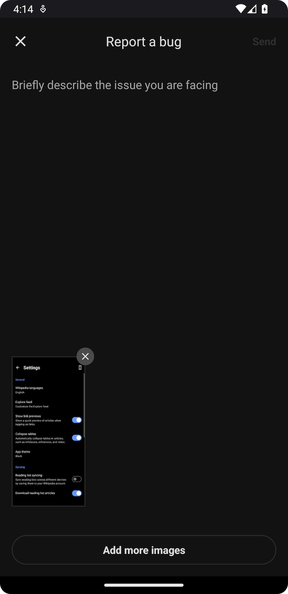
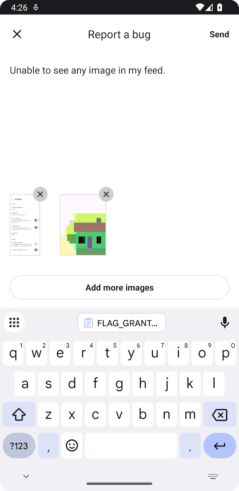

# Bug Reports — Android

Bug reports enable users to report issues directly from the app. Measure SDK provides two approaches to implement bug reporting.

* [Built-in Experience](#built-in-experience)
    * [Theming](#theming)
    * [Permissions](#permissions)
* [Custom Experience](#custom-experience)
    * [Attachments](#attachments)
* [Add Attributes](#add-attributes)
* [Shake to Report Bug](#shake-to-report-bug)
* [Benchmarks](#benchmarks)

## Built-in Experience

Launch the default bug report interface using `Measure.launchBugReportActivity`. A screenshot is automatically taken when this method is called and added to the bug report. Users can choose to remove the screenshot if they wish.

| Dark Mode                                        | Light Mode                                         |
|--------------------------------------------------|----------------------------------------------------|
|  |  |

Usage:

```kotlin
Measure.launchBugReportActivity(activity)
```

To disable taking a screenshot when this method is called, pass in a parameter:

```kotlin
Measure.launchBugReportActivity(activity, takeScreenshot = false)
```

### Theming

You can apply a custom theme by overriding any of the values in the theme: [themes.xml](https://github.com/measure-sh/measure/tree/main/android/measure/src/main/res/values/themes.xml).

For more details on customizing themes, refer to the Android documentation on [theming](https://developer.android.com/develop/ui/views/theming/themes#CustomizeTheme).


### Permissions

Users can add images from gallery to report bugs. We rely on
the `androidx-activity` [photo picker](https://developer.android.com/training/data-storage/shared/photo-picker#device-availability).
This requires **no additional permissions** to be declared in the app's manifest.

The new photo picker UI is only available on Android 11 (API level 30) and above. For devices running Android 10 (API
level 29) and below, this falls back to using `ACTION_OPEN_DOCUMENT` to select images from the gallery. Optionally, to 
achieve a consistent experience across all Android versions, you can follow the instructions in the
official [documentation](https://developer.android.com/training/data-storage/shared/photo-picker#device-availability) to
install a back-ported version of the photo picker.

> [!NOTE]
> If you are using Measure SDK version `0.11.0` or earlier, you'll need the `READ_MEDIA_IMAGES` permission
> to allow users to select images from the gallery. Without this permission, the button to select images
> from gallery will not be visible.

## Custom Experience

You can build a custom experience to match the look and feel of your app. Once the bug report is entered by the user, trigger the `Measure.trackBugReport` method.

```kotlin
// Track the bug report
Measure.trackBugReport(description = "Items from cart disappear after reopening the app")
```

### Attachments

Bug reports can be enhanced with attachments. A maximum of `5` attachments can be added per bug report.

You can add attachments to bug reports in the following ways:

* [Capture Screenshot](#capture-screenshot)
* [Capture Layout Snapshot](#capture-layout-snapshot)
* [Add Image from Gallery](#add-image-from-gallery)

#### Capture Screenshot

Capture a screenshot using `captureScreenshot`. This function must be called from the main thread.

```kotlin
private val attachments = mutableListOf<Attachment>()

Measure.captureScreenshot(activity, onCaptured = { attachment ->
    attachments.add(attachment)
})

Measure.trackBugReport(
    description = "Items from cart disappear after reopening the app",
    attachments = attachments
)
```

> [!IMPORTANT]
> For privacy, screenshots can be masked with the same configuration provided during SDK initialization. See all the configuration options [here](configuration-options.md#screenshotmasklevel).

#### Capture Layout Snapshot

Capture a layout snapshot using `captureLayoutSnapshot`. This function must be called from the main thread. Read more about layout snapshots [here](../feature_layout_snapshots.md).

```kotlin
private val attachments = mutableListOf<Attachment>()

Measure.captureLayoutSnapshot(activity, onCaptured = { attachment ->
    attachments.add(attachment)
})

Measure.trackBugReport(
    description = "Items from cart disappear after reopening the app",
    attachments = attachments
)
```

#### Add Image from Gallery

To add images selected by a user from the gallery, use `imageUriToAttachment` to convert the `Uri` to an `Attachment`.

Ensure the Uri has the `FLAG_GRANT_READ_URI_PERMISSION` permission granted, as shown in the example below.

```kotlin
private val attachments = mutableListOf<Attachment>()

registerForActivityResult(
    ActivityResultContracts.GetContent()
) { uri ->
    uri?.let {
        // Ensure the Uri has this permission to be able to read the image content
        context.contentResolver.takePersistableUriPermission(
            uri,
            Intent.FLAG_GRANT_READ_URI_PERMISSION
        )

        // This will compress the image and convert it into an attachment
        Measure.imageUriToAttachment(context, uri) { attachment ->
            attachments.add(attachment)
        }
    }
}
// Restrict picker to only allow selecting images
    .launch("image/*")

Measure.trackBugReport(
    description = "Items from cart disappear after reopening the app",
    attachments = attachments
)
```

## Add Attributes

Attributes allow attaching additional contextual data to bug reports. This helps in adding relevant information about the user's state, app configuration, or other metadata that can help with debugging.

- Attribute keys must be strings with a maximum length of 256 characters.
- Attribute values must be one of the primitive types: `int`, `long`, `double`, `float`, or `boolean`.
- String attribute values can have a maximum length of 256 characters.

Add attributes when the Bug Report Activity is launched:

```kotlin
val attributes = AttributesBuilder().put("is_premium", true).build()
Measure.launchBugReportActivity(takeScreenshot = true, attributes = attributes)
```

or, when `trackBugReport` is called:

```kotlin
val attributes = AttributesBuilder()
    .put("is_premium_user", true)
    .build()
Measure.trackBugReport(description = "...", attributes = attributes)
```

## Shake to Report Bug

A shake listener can be set up to allow users to report bugs by shaking their device. This is particularly useful for
quickly reporting issues without navigating through the app.

To set up a shake listener, use the `setShakeListener` method. The listener will be triggered when a shake is detected,
use the `launchBugReportActivity` method to open the bug report interface or implement a custom UI.

> [!NOTE]
> The listener can get called multiple times if the device is shaken multiple times in quick succession.
> The `launchBugReportActivity` method handles this by ensuring that the bug report interface is only launched once.
> However, if you implement a custom UI, you may need to handle this logic yourself.

```kotlin
Measure.setShakeListener(object : MsrShakeListener {
    override fun onShake() {
      val attributes = AttributesBuilder().put("is_premium", true).build()
      Measure.launchBugReportActivity(takeScreenshot = true, attributes = attributes)
    }
})
```

To disable the shake listener, use:

```kotlin
Measure.setShakeListener(null)
```

## Benchmarks

The bug reporting flow involves loading images from the file system or capturing screenshots, which might lead to increased memory and CPU consumption. The following Perfetto traces can help in debugging any potential bottlenecks:

* `msr-captureScreenshot` — time spent on the main thread to capture and compress a screenshot.
* `msr-loadImageFromFile` — time spent on the main thread to load an image from a file.
* `msr-loadImageFromUri` — time spent on the main thread to load an image from a Uri.