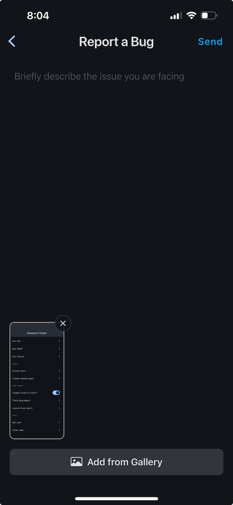
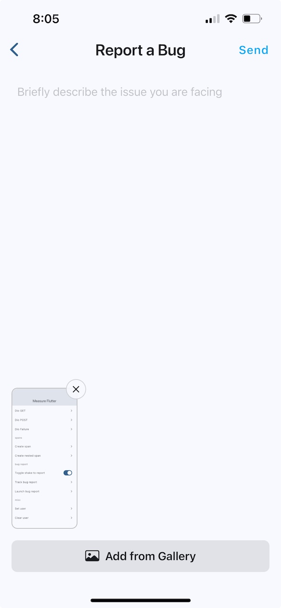
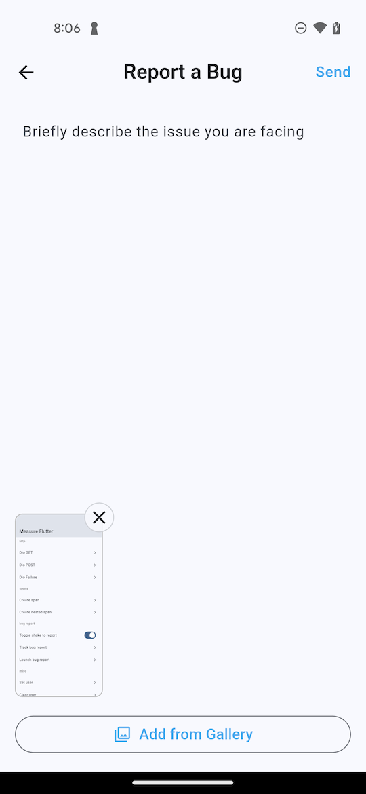
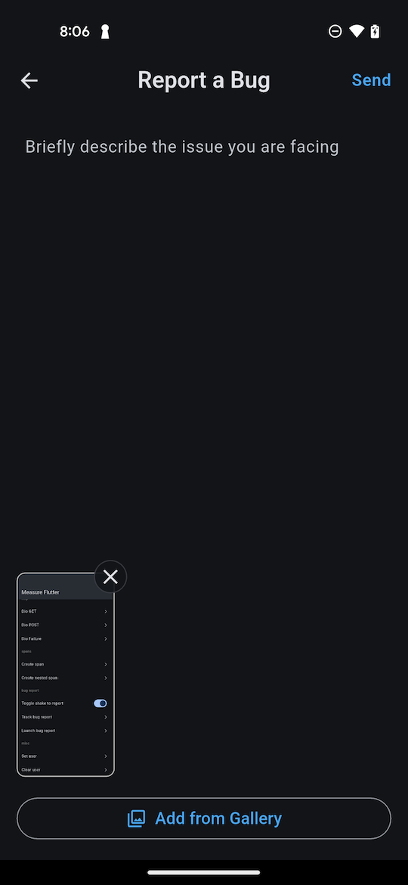

# Bug Reports — Flutter

Bug reports enable users to report issues directly from the app. Measure SDK provides two approaches to implement bug reporting.

* [**Session Timeline**](#session-timeline)
* [Built-in Experience](#built-in-experience)
    * [Theming](#theming)
    * [I18n](#i18n)
* [Custom Experience](#custom-experience)
    * [Attachments](#attachments)
    * [Limits](#limits)
* [Add Attributes](#add-attributes)
* [Shake to Report Bug](#shake-to-report-bug)
  * [Enabled/Disable shake detection](#enabledisable-shake-detection)]  

## Session Timeline

When a bug report is captured, it automatically comes with a session timeline that includes all events that occurred 5
minutes before the bug report was submitted. This provides rich context to help diagnose and fix the reported issue.

## Built-in Experience

### iOS

| Dark Mode                                             | Light Mode                                              |
|-------------------------------------------------------|---------------------------------------------------------|
|  |  |

### Android

| Dark Mode                                                | Light Mode                                                 |
|----------------------------------------------------------|------------------------------------------------------------|
|  |  |


Launch the default bug report interface by using `Measure.instance.createBugReportWidget` method. Usage:

```dart
final widget = Measure.instance.createBugReportWidget();
```

This is typically launched as a new screen:

```dart
final navigatorState = Navigator.of(context);
navigatorState.push(
  MaterialPageRoute<Widget>(
    builder: (context) => Measure.instance.createBugReportWidget(),
    settings: const RouteSettings(name: '/msr_bug_report'),
  ),
);
```

### Adding a screenshot

Include a screenshot when opening the bug report widget:

```dart
final navigatorState = Navigator.of(context);
final screenshot = await Measure.instance.captureScreenshot();

if (context.mounted) {
  navigatorState.push(
    MaterialPageRoute<Widget>(
      builder: (context) => Measure.instance.createBugReportWidget(screenshot: screenshot),
      settings: const RouteSettings(name: '/msr_bug_report'),
    ),
  );
}
```

### Theming

Override the default primary color for the "Add from Gallery" and "Send" buttons:

Example:

```dart
Measure.instance.createBugReportWidget(
  theme: const BugReportTheme(
    colors: BugReportColors(
      primaryColor: Colors.lightBlue,
    ),
  ),
)
```

### I18n

Localize widget text using the BugReportTheme object:

```
Measure.instance.createBugReportWidget(
  theme: const BugReportTheme(
    text: BugReportText(
      appBarTitle: 'your-localized-text',
      sendButton: 'your-localized-text',
      inputPlaceHolder: 'your-localized-text',
      addFromGalleryButton: 'your-localized-text',
    ),
  ),
)
```

## Custom Experience

You can build a custom experience to match the look and feel of your app. Once the bug report is entered by the user, trigger the `Measure.trackBugReport` method.

```dart
// Track the bug report
Measure.instance.trackBugReport(description: "...");
```

### Attachments

Bug reports can be enhanced with attachments. A maximum of `5` attachments can be added per bug
report. You can add screenshots to bug reports by using the `Measure.captureScreenshot` method.

```dart
final screenshot = await Measure.instance.captureScreenshot();

Measure.trackBugReport(
    description = "...",
    attachments = [screenshot]
)
```

### Limits

- Each bug report can have a maximum of `5` attachments.
- The bug report description can have a maximum length of `4000` characters.

## Add Attributes

Attributes allow attaching additional contextual data to bug reports. This helps in adding relevant information about the user's state, app configuration, or other metadata that can help with debugging.

- Attribute keys must be strings with a maximum length of 256 characters.
- Attribute values must be one of the primitive types: `int`, `long`, `double`, `float`, or `boolean`.
- String attribute values can have a maximum length of 256 characters.

To add attributes, use the optinal `attributes` property in `createBugReportWidget`:

```dart
final attributes = AttributeBuilder().add("order_id", "order-12345").build();
Measure.instance.createBugReportWidget(
  attributes: attributes,
);
```

Or add attributes with `trackBugReport` method.

```dart
final attributes = AttributeBuilder().add("order_id", "order-12345").build();
Measure.instance.trackBugReport(
  description: "...",
  attributes: attributes,
);
```

## Shake to Report Bug

A shake listener can be set up to allow users to report bugs by shaking their device. This is
particularly useful for quickly reporting issues without navigating through the app.

Use `MsrShakeDetectorMixin` on top level widget in your app if you want to enable shake detection
across the app. Setting up this mixin will automatically enable shake detection and provide 
a callback in `onShakeDetected` where you can launch the bug report interface. For example:

```dart
class ShakeExample extends StatefulWidget {
  @override
  State<ShakeExample> createState() => _ShakeExampleState();
}

class _ShakeExampleState extends State<ShakeExample> 
    with MsrShakeDetectorMixin {

  @override
  void onShakeDetected() {
    _launchBugReport();
  }

  void _launchBugReport() async {
    final screenshot = await Measure.instance.captureScreenshot();
    
    Navigator.of(context).push(
      MaterialPageRoute(
        builder: (context) => Measure.instance.createBugReportWidget(
          screenshot: screenshot,
        ),
      ),
    );
  }
  
  @override
  Widget build(BuildContext context) {
    return Scaffold(
      body: Center(
        child: Text('Shake device to report bug'),
      ),
    );
  }
}
```

### Enable/Disable shake detection

To conditionally enable/disable shake detection call `disableShakeDetection` and 
`enableShakeDetection` methods available in the mixin.