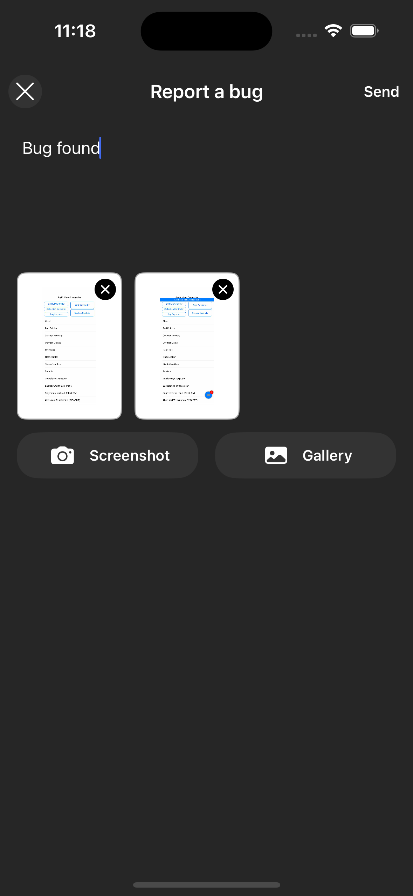
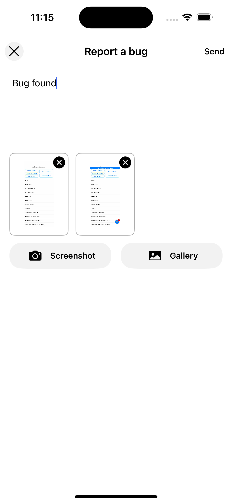

# Bug Reports — iOS

Bug reports enable users to report issues directly from the app. There are two ways to use the bug reporting feature:

1. **Built-in Experience**: Use the default bug report interface provided by the SDK.
2. **Custom Experience**: Build a custom bug reporting UI and use the SDK to track bug reports programmatically.

Additionally, the SDK supports using shake gestures to launch the bug reporting flow, allowing users to report bugs quickly and easily without having to navigate through the app.

* [**Session Timeline**](#session-timeline)
* [**Built-in Experience**](#built-in-experience)
* [**Theming**](#theming)
* [**Custom Experience**](#custom-experience)
* [**Add Attributes**](#add-attributes)
* [**Shake to Report Bug**](#shake-to-report-bug)

## Session Timeline

When a bug report is captured, it automatically comes with a session timeline that includes all events that occurred 5
minutes before the bug report was submitted. This provides rich context to help diagnose and fix the reported issue.

## Built-in Experience

Launch the default bug report interface using `Measure.launchBugReport`. A screenshot can be automatically taken and added to the bug report. Users can remove or add more attachments in the UI.

| Dark Mode                                    | Light Mode                                     |
|----------------------------------------------|------------------------------------------------|
|  |  |

When the screenshot button is clicked, a floating screenshot and exit button appear. Users can traverse through the app and take screenshots of the relevant screen.

[Bug Report demo](https://github.com/user-attachments/assets/491e685b-e1ae-4c8d-ac36-8f42d73fa3eb)

### Example Usage

```swift
Measure.launchBugReport(takeScreenshot: true)
```

To disable taking a screenshot when launching, set `takeScreenshot: false`:

```swift
Measure.launchBugReport(takeScreenshot: false)
```

You can also pass a custom UI config and attributes:

```swift
let color = BugReportConfig.default.colors.update(isDarkMode: false)
let config = BugReportConfig(colors: color)
let attributes: [String: AttributeValue] = ["user_id": .string("12345")]
Measure.launchBugReport(takeScreenshot: true, bugReportConfig: config, attributes: attributes)
```

Currently, you can have a maximum of 5 attachments and a description length of 4000 characters.

### Theming

You can customize the appearance of the bug report UI using `BugReportConfig`. To set the theme, update the colors using `.update(isDarkMode: ...)` and pass the result to the `BugReportConfig` initializer.

Check out [BugReportConfig](../../ios/Sources/MeasureSDK/Swift/BugReport/BugReportConfig/) to see all the configurable tokens.

### Example Usage

```swift
let color = BugReportConfig.default.colors.update(isDarkMode: false)
let dimensions = MsrDimensions(
    topPadding: 20
)
let config = BugReportConfig(colors: color, dimensions: dimensions)
Measure.launchBugReport(takeScreenshot: true, bugReportConfig: config)
```

## Custom Experience

You can build a custom bug reporting UI and use the SDK to track bug reports programmatically.

### Example Usage

```swift
let screenshot = Measure.captureScreenshot(for: viewController)
let layoutSnapshot = Measure.captureLayoutSnapshot(from: viewController)
Measure.trackBugReport(
    description: "Items from cart disappear after reopening the app",
    attachments: [screenshot, layoutSnapshot].compactMap { $0 },
    attributes: ["is_premium": .bool(true)]
)
```

### Attachments

Bug reports can include up to 5 attachments (screenshots or layout snapshots).

### Example Usage

```swift
if let screenshot = Measure.captureScreenshot(for: viewController) {
    Measure.trackBugReport(description: "Bug description", attachments: [screenshot], attributes: nil)
}
```

```swift
if let snapshot = Measure.captureLayoutSnapshot(from: viewController) {
    Measure.trackBugReport(description: "Bug description", attachments: [snapshot], attributes: nil)
}
```

## Add Attributes

You can attach additional contextual data to bug reports, such as user state or app configuration.

### Example Usage

```swift
let attributes: [String: AttributeValue] = [
    "is_premium_user": .bool(true),
    "user_id": .string("12345")
]
Measure.launchBugReport(attributes: attributes)
```

Or with custom bug reports:

```swift
Measure.trackBugReport(description: "Bug description", attachments: [], attributes: attributes)
```

## Shake to Report Bug

A shake listener can be set up to allow users to report bugs by shaking their device. This is particularly useful for
quickly reporting issues without navigating through the app.

To set up a shake listener, use the `onShake` method and pass a closure. This closure will be called whenever a shake gesture is detected.
You can either launch the default bug report interface using `launchBugReport`, or implement your own custom UI.

> [!NOTE]
> The listener can get called multiple times if the device is shaken multiple times in quick succession.
> The `launchBugReport` method handles this by ensuring that the bug report interface is only launched once. 
> However, if you implement a custom UI, you may need to handle this logic yourself.

```swift
Measure.onShake {
    Measure.launchBugReport(takeScreenshot: true, bugReportConfig: BugReportConfig.default, attributes: nil)
}
```

To disable the shake listener, use:

```swift
Measure.onShake(nil)
```
