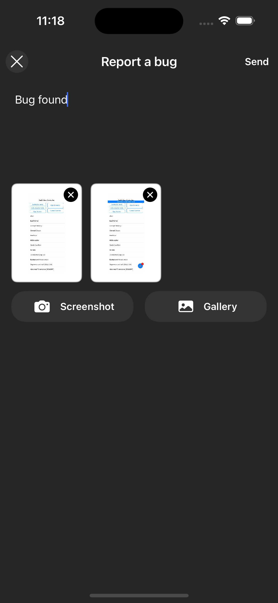
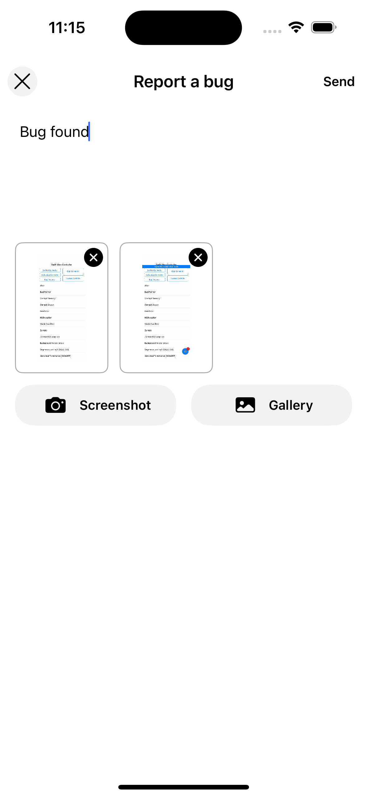
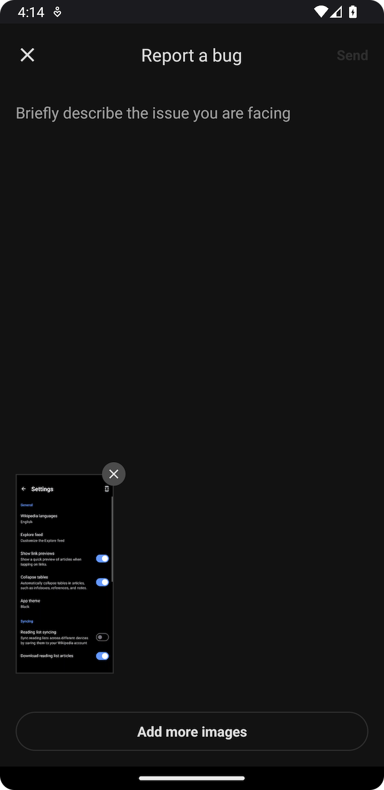
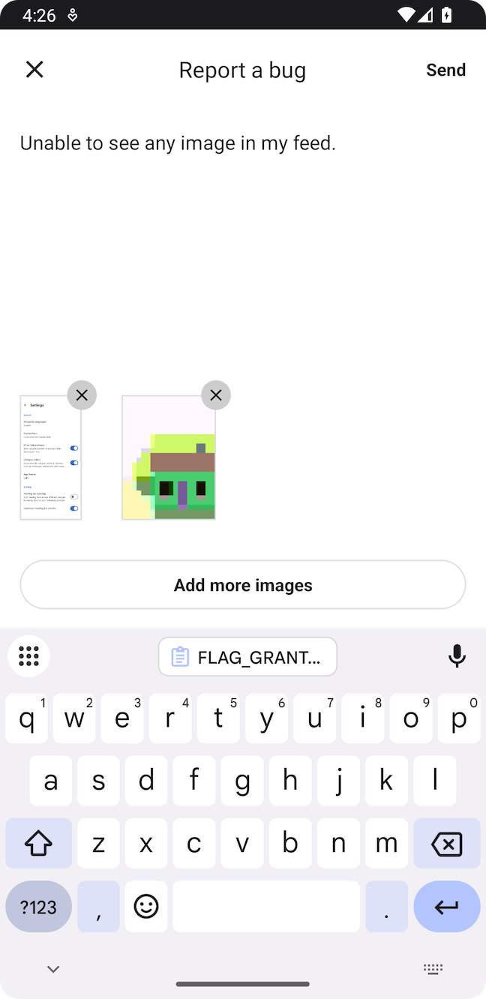

# Bug Reports — React Native

Bug reports enable users to report issues directly from the app. Measure SDK provides two approaches to implement bug reporting.

* [Session Timeline](#session-timeline)
* [Built-in Experience](#built-in-experience)
* [Custom Experience](#custom-experience)
    * [Attachments](#attachments)
        * [Capture Screenshot](#capture-screenshot)
    * [Limits](#limits)
* [Add Attributes](#add-attributes)
* [Shake to Report Bug](#shake-to-report-bug)

## Session Timeline

When a bug report is captured, it automatically comes with a session timeline that includes all events that occurred 5
minutes before the bug report was submitted. This provides rich context to help diagnose and fix the reported issue.

## Built-in Experience

Launch the default bug report interface using `Measure.launchBugReport`. A screenshot is automatically taken when this
method is called and added to the bug report. Users can choose to remove the screenshot if they wish.

|  Platform   | Dark Mode                                    | Light Mode                                     |
|-------------|----------------------------------------------|------------------------------------------------|
| iOS         |  |  |
| Android     |  |  |

```typescript
import { Measure } from '@measuresh/react-native';

Measure.launchBugReport();
```

To disable taking a screenshot:

```typescript
Measure.launchBugReport({ takeScreenshot: false });
```

## Custom Experience

You can build a custom experience to match the look and feel of your app. Once the bug report is entered by the user,
call `Measure.trackBugReport`.

```typescript
Measure.trackBugReport({ description: "Items from cart disappear after reopening the app" });
```

### Attachments

Bug reports can be enhanced with attachments. A maximum of `5` attachments can be added per bug report.

#### Capture Screenshot

Capture a screenshot using `captureScreenshot`. The screenshot is automatically redacted based on the
`screenshotMaskLevel` configuration.

```typescript
const screenshot = await Measure.captureScreenshot();

if (screenshot) {
  await Measure.trackBugReport({
    description: "Items from cart disappear after reopening the app",
    attachments: [screenshot],
  });
}
```

> [!IMPORTANT]
> For privacy, screenshots can be masked with the same configuration provided during SDK initialization. See all the
> configuration options [here](configuration-options.md#screenshotmasklevel).


### Limits

- Each bug report can have a maximum of `5` attachments.
- The bug report description can have a maximum length of `4000` characters.

## Add Attributes

Attributes allow attaching additional contextual data to bug reports.

- Attribute keys must be strings with a maximum length of 256 characters.
- Attribute values must be one of the primitive types: `string`, `number`, or `boolean`.
- String attribute values can have a maximum length of 256 characters.

Pass attributes when launching the built-in experience:

```typescript
Measure.launchBugReport({ takeScreenshot: true, attributes: { is_premium: true, screen: "Cart" } });
```

or when calling `trackBugReport`:

```typescript
Measure.trackBugReport({
  description: "Items from cart disappear",
  attributes: { is_premium: true, screen: "Cart" },
});
```

## Shake to Report Bug

A shake listener can be set up to allow users to report bugs by shaking their device. This is useful for
quickly reporting issues without navigating through the app.

```typescript
import { Measure } from '@measuresh/react-native';

Measure.onShake({ handler: () => {
  Measure.launchBugReport();
} });
```

To disable the shake listener:

```typescript
Measure.onShake({ handler: null });
```

> [!NOTE]
> The listener can be called multiple times if the device is shaken multiple times in quick succession.
> `launchBugReport` handles this by ensuring the bug report interface is only launched once.
