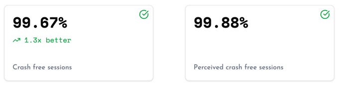

# Crash Reporting

Crashes are automatically tracked, optionally with a snapshot of the app's UI at the time of the crash.

* [**Metrics**](#metrics)
    * [Crash-Free Rate](#crash-free-rate)
    * [Perceived Crash Rate](#perceived-crash-rate)
* [**Crash Grouping**](#crash-grouping)
* [**API Reference**](#api-reference)
  * [**Symbolicate Stacktrace**](#symbolicate-stacktrace)
  * [**Get a UI Snapshot**](#get-a-ui-snapshot)
* [**Data Collected**](#data-collected)
* [**How It Works**](#how-it-works)

> [!NOTE]  
> Crash reporting for native crashes (from C/C++/etc.) is not yet supported. Track the progress [here](https://github.com/measure-sh/measure/issues/103). Upvote and comment on the issue if you are looking forward to this feature.

## Metrics

Metrics related to crashes are automatically computed and shown on the dashboard.



### Crash-Free Rate

The crash-free rate indicates the percentage of sessions that did not experience any crashes. It is calculated as follows:

```
Crash-Free Rate = (Total Sessions - Crashed Sessions) / Total Sessions * 100
```

Where:

- **Total Sessions**: The total number of sessions recorded.
- **Crashed Sessions**: The number of sessions that experienced a crash.
- **Crash-Free Rate**: The percentage of sessions that did not crash.

The crash-free rate is a key metric to monitor the stability of your app. A higher crash-free rate indicates a more stable app, while a lower rate suggests that users are experiencing issues that need to be addressed.

### Perceived Crash Rate

The perceived crash rate indicates the percentage of sessions that experienced a crash when the user was actively using the app. It is calculated as follows:

```
Perceived Crash Rate = Crashed Sessions When App Is in Foreground / Total Sessions * 100
```

Where:

- **Crashed Sessions When App Is in Foreground**: The number of sessions that experienced a crash while the app was actively being used by the user.
- **Total Sessions**: The total number of sessions recorded.

## Crash Grouping

Crashes are grouped to help you identify the most common issues in your app. Each group represents a unique crash, identified by the exception type and the stack trace. A percentage contribution of each crash group is also shown on the dashboard to get a quick idea about the impact of the issue.

### Android

Exceptions in Android (JVM) are grouped based on the exception type and the stack trace. Crashes with the same type and the same method name and file name from the _first frame_ of the stack trace are grouped together.

For example, for the following crash, the exception type is `java.lang.NullPointerException`, the method name of the first frame is `onCreate`, and the file name is `MainActivity.kt`:

```
java.lang.NullPointerException: Attempt to invoke virtual method 'void com.example.app.MainActivity.onCreate(android.os.Bundle)' on a null object reference
    at com.example.app.MainActivity.onCreate(MainActivity.kt:10)
    at android.app.Activity.performCreate(Activity.java:8000)
    ...
```

### iOS

Exceptions in iOS (Objective-C/Swift) are grouped based on the exception signal and the stack trace. Crashes with the same signal, for example, `SIGABRT`, the same method name and file name from the _first frame belonging to the application binary_ are grouped together.

For example, for the following crash, the signal is `SIGABRT`, the method name of the first relevant frame is `-viewDidLoad`, and the file name is `MainViewController.m`:

```
Exception Type: EXC_CRASH (SIGABRT)
Exception Codes: 0x0000000000000000, 0x0000000000000000
Crashed Thread: 0

Application Specific Information:
*** Terminating app due to uncaught exception 'NSInvalidArgumentException', reason: '-[MainViewController viewDidLoad]: unrecognized selector sent to instance 0x600000e2c0c0'

First Throw Call Stack:
(
    0   CoreFoundation                      0x000000010a2f3b6c __exceptionPreprocess + 220
    1   libobjc.A.dylib                     0x0000000109d8e5e1 objc_exception_throw + 48
    2   MainViewController.m                0x000000010a2f3b6c -[MainViewController viewDidLoad] + 0
    ...
)
```

### Flutter

In Flutter, crashes are grouped based on the exception type and the stack trace. Crashes with the same exception type
and the same method name and file name from the _first frame_ of the stack trace are grouped together.

For example, for the following crash, the exception type is `FlutterError`, the method name of the first frame
is `_incrementCounter`, and the file name is `main.dart`:

```
FlutterError (setState() called after dispose(): _MyHomePageState#12345(ticker: _TickerModeEnabled))
  at _MyHomePageState._incrementCounter (package:my_app/main.dart:42:9)
  at _MyHomePageState.build (package:my_app/main.dart:30:5)
  at StatelessElement.build (package:flutter/src/widgets/framework.dart:4620:27)
  ...
```

## API Reference

### Symbolicate Stacktrace

Stack traces from crashes may be obfuscated or contain memory addresses. To convert the stack traces to a human-readable format, you need to upload the mapping or symbol files based on the platform.

#### Android

If you are using ProGuard or R8 to obfuscate your code, you need to upload the mapping files to de-obfuscate the stack traces. Measure's Android Gradle Plugin automatically uploads the ProGuard/R8 mapping file to the Measure server when you run an `assemble` gradle task.

#### iOS

To symbolicate stack traces for iOS, you need to upload the dSYM files to map the memory addresses to a human-readable format. There are two ways to upload dSYM files:

##### Using Shell Script

Run the [`upload_dsyms.sh`](../../ios/Scripts/upload_dsyms.sh) script to manually upload DSYM files after building your app.

```sh
sh upload_dsyms.sh <path_to_ipa> <path_to_dsym_folder> <api_url> <api_key>
```

##### Using Build Phases

Add the [`upload_dsym_build_phases.sh`](../../ios/Scripts/upload_dsym_build_phases.sh) script as a **New Run Script Phase** in Xcode to upload DSYM files automatically.

```sh
sh "${SRCROOT}/path/to/upload_dsym_build_phases.sh" <api_url> <api_key>
```

> [!CAUTION]  
> If you are using Build Phases to upload DSYMs, make sure to **upload DSYMs only for release builds**.

#### Flutter

When obfuscating your Flutter app using --obfuscate and --split-debug-info options:

* **Android** — The Measure Android Gradle Plugin automatically uploads the required mapping files.
* **iOS** — You need to upload the dSYM files as described in the iOS section above. After building
  with `flutter build ipa`, run the `upload_dsyms.sh` script using the IPA path and the path to the dSYM folder
  (typically under _/build/ios/Release-iphoneos/_)

### Get a UI Snapshot

#### Android

A screenshot of the app is captured when an app crashes on Android. This feature is disabled by default and can be
configured using the following options at the time of SDK initialization:

- `trackScreenshotOnCrash` — Enables or disables the automatic screenshot capture on crash. It is disabled by default.
- `screenshotMaskLevel` — To hide sensitive information in the screenshot, you can configure the masking level. See the [options](configuration-options.md#screenshotmasklevel) available.

#### iOS

A layout snapshot of the app is captured when an app crashes on iOS. This feature is always enabled.

#### Flutter

A screenshot of the app is captured when an app crashes on Flutter. This feature is disabled by default and can be
configured using the following options at the time of SDK initialization:

- `trackScreenshotOnCrash` — Enables or disables the automatic screenshot capture on crash. It is disabled by default.

> [!NOTE]
> Masking sensitive information in the screenshot is not supported on Flutter yet.

## Data Collected

Check out the data collected by Measure for each crash in the [Exception Event](../api/sdk/README.md#exception) section.

## How It Works

### Android

When an unhandled exception occurs, it is intercepted by Measure using an `UncaughtExceptionHandler`. The exception is then parsed and sent as an `exception` event. Crashes are attempted to be sent immediately, but if the app is terminated before the event is sent, it is stored locally and sent on the next app launch.

### iOS

We rely on [PLCrashReporter](https://github.com/microsoft/plcrashreporter) to detect crashes. When a crash occurs, a crash report is generated and stored locally on the device. On the next launch, the crash report is prepared and sent to the server.

### Flutter

When the SDK is initialized, it automatically sets up both `FlutterError.onError`
and `PlatformDispatcher.instance.onError` callbacks. Any errors are forwarded to the server. Internally, we rely
on [stack_trace](https://pub.dev/packages/stack_trace) to parse the stack trace and send it as an `exception` event. 

All crashes captured by the native Android or iOS SDK are also tracked for Flutter apps.