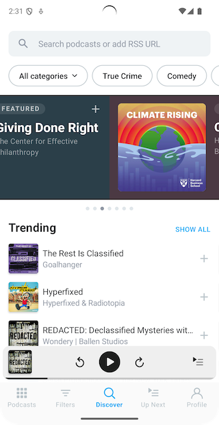
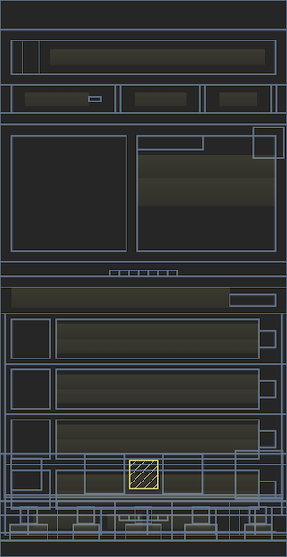

# Gesture Tracking

* [**Overview**](#overview)
* [**Layout Snapshots**](#layout-snapshots)
* [**How it works**](#how-it-works)
    * [**Android**](#android)
    * [**iOS**](#ios)
    * [**Flutter**](#flutter)
* [**Benchmark Results**](#benchmark-results)
    * [**Android**](#android-1)
    * [**iOS**](#ios-1)
* [**Data collected**](#data-collected)

## Overview

Measure SDK captures gestures like click, long click and scroll events automatically. These events make it easy to
understand user interactions with your app without having to manually instrument every view. Additionally,
a layout snapshot is captured at the time of the gesture, which helps in understanding the context of the gesture
and the state of the UI at that moment.

## Layout Snapshots

Layout snapshots provide a lightweight way to capture the structure of your UI at key user interactions.
They are automatically collected during click events (with throttling) and store the layout hierarchy as SVG rather than
full screenshots.
This approach gives valuable context about the UI state during user interactions while being significantly more
efficient to capture and store than traditional screenshots.

| Screenshot                                           | Layout snapshot                                |
|------------------------------------------------------|------------------------------------------------|
|  |  |

Layout snapshots are captured along with every gesture click event with throttling (750ms between consecutive
snapshots). This ensures that you get a representative snapshot of the UI without overwhelming the system with too many
images. The snapshots are stored in a lightweight SVG format, which is efficient for both storage and rendering.

## How it works

### Android

When Measure SDK is initialized, it registers a touch event interceptor using
the [Curtains library](https://github.com/square/curtains?tab=readme-ov-file#curtainskt). It allows Measure to
intercept every touch event in an application and process it.

There are two main parts to tracking gestures:

1. [Gesture detection](#gesture-detection)
2. [Gesture target detection](#gesture-target-detection)

#### Gesture detection

Measure tracks the time between `ACTION_DOWN` and `ACTION_UP` events and the distance moved to classify a touch as
click, long click or scroll.

A gesture is classified as a long click gesture if the time interval between `ACTION_DOWN` and `ACTION_UP` is more
than [ViewConfiguration.getLongPressTimeout](https://developer.android.com/reference/android/view/ViewConfiguration#getLongPressTimeout())
time and the distance moved by the pointer between the two events is
less
than [ViewConfiguration.get.getScaledTouchSlop](https://developer.android.com/reference/android/view/ViewConfiguration#getScaledTouchSlop()).

A gesture is classified as a click if the distance moved by the pointer between the two events is
less
than [ViewConfiguration.get.getScaledTouchSlop](https://developer.android.com/reference/android/view/ViewConfiguration#getScaledTouchSlop())
but the time interval between the two events is less
than [ViewConfiguration.getLongPressTimeout()](https://developer.android.com/reference/android/view/ViewConfiguration#getLongPressTimeout()).

A gesture is classified as a scroll if the distance moved by the pointer between the two events is more than
[ViewConfiguration.get.scaledTouchSlop](https://developer.android.com/reference/android/view/ViewConfiguration#getScaledTouchSlop()).
An estimation of direction in which the scroll happened based on the pointer movement.

**For compose**, a click/long click is detected by traversing the semantics tree
using [SemanticsOwner.getAllSemanticsNodes](https://developer.android.com/reference/kotlin/androidx/compose/ui/semantics/SemanticsOwner#(androidx.compose.ui.semantics.SemanticsOwner).getAllSemanticsNodes(kotlin.Boolean,kotlin.Boolean))
and finding a composable at the point where the touch happened and checking for Semantics Properties -
SemanticsActions.OnClick, SemanticsActions.OnLongClick and SemanticsActions.ScrollBy
for click, long click and scroll respectively.

> [!NOTE]
>
> Compose currently reports the target_id in the collected data using [testTag](https://developer.android.com/reference/kotlin/androidx/compose/ui/semantics/package-summary#(androidx.compose.ui.semantics.SemanticsPropertyReceiver).testTag()),
> if it is set. While the `target` is always reported as `AndroidComposeView`.

#### Gesture target detection

Along with the type of gesture which occurred, Measure can also **estimate** the target view/composable on which the
gesture was performed on.

For a click/long click, a hit test is performed to check the views which are under the point where the touch occurred. A
traversal is performed on the children of the view group found and is checked for any view which has
either [isClickable](https://developer.android.com/reference/android/view/View#isClickable())
or [isPressed](https://developer.android.com/reference/android/view/View#isPressed()) set to true. If one is found, it
is returned as the target, otherwise, the touch is discarded as can be classified as a "dead click".

Similarly, for a scroll, after the hit test, a traversal is performed for any view which
has [isScrollContainer](https://developer.android.com/reference/android/view/View#isScrollContainer()) set to
true and [canScrollVertically](https://developer.android.com/reference/android/view/View#canScrollVertically(int))
or [canScrollHorizontally](https://developer.android.com/reference/android/view/View#canScrollHorizontally(int)). If a
view which satisfies this condition it is returned as the target, otherwise, the scroll is discarded and can be
classified as a "dead scroll".

Gesture tracking consists of two main components:

1. [Gesture detection](#gesture-detection)
2. [Gesture target detection](#gesture-target-detection)

### iOS

#### Gesture detection

Measure SDK detects touch events by swizzling `UIWindow`'s `sendEvent` method. It processes touch events to classify
them into different gesture types:

- **Click**: A touch event that lasts for less than 500 ms.
- **Long Click**: A touch event that lasts for more than 500 ms.
- **Scroll**: A touch movement exceeding 3.5 points in any direction.

#### Gesture target detection

Gesture target detection identifies the UI element interacted with during a gesture. It first determines the view at the
touch location and then searches its subviews to find the most relevant target. For scroll detection, it checks if the
interacted element is a scrollable view like `UIScrollView`, `UIDatePicker`, or `UIPickerView`.

### Flutter

#### Gesture detection

Measure SDK detects touch events by listening to pointer events
from [Listener](https://api.flutter.dev/flutter/widgets/Listener-class.html) widget, which is
added to the root widget of the app using `MeasureWidget`.

It processes touch events to classify them into different gesture types:
- **Click**: A touch event that lasts for less than 500 ms.
- **Long Click**: A touch event that lasts for more than 500 ms.
- **Scroll**: A touch movement exceeding 20 pixels in any direction.

#### Gesture target detection

The SDK automatically identifies gesture targets by traversing the widget tree and checking if
widgets at the touch position are interactive. For clicks and long clicks, it searches for clickable
widgets, while for scrolls, it looks for scrollable widgets.

> [!NOTE]
> Any widget not listed in the tables below will not be automatically tracked for
> gestures. For custom widgets or unsupported widget types, gestures will not be detected unless they
> inherit from or contain one of the supported widget types.

**Supported Clickable Widgets:**

| Widget Type            |
|------------------------|
| `ButtonStyleButton`    |
| `MaterialButton`       |
| `IconButton`           |
| `FloatingActionButton` |
| `CupertinoButton`      |
| `ListTile`             |
| `PopupMenuButton`      |
| `PopupMenuItem`        |
| `DropdownButton`       |
| `DropdownMenuItem`     |
| `ExpansionTile`        |
| `Card`                 |
| `GestureDetector`      |
| `InputChip`            |
| `ActionChip`           |
| `FilterChip`           |
| `ChoiceChip`           |
| `Checkbox`             |
| `Switch`               |
| `Radio`                |
| `CupertinoSwitch`      |
| `CheckboxListTile`     |
| `SwitchListTile`       |
| `RadioListTile`        |
| `TextField`            |
| `TextFormField`        |
| `CupertinoTextField`   |
| `Stepper`              |

**Supported Scrollable Widgets:**

| Widget Type             |
|-------------------------|
| `ListView`              |
| `ScrollView`            |
| `PageView`              |
| `SingleChildScrollView` |

## Benchmark results

### Android

Checkout the results from a macro benchmark we ran for gesture target
detection [here](https://github.com/measure-sh/measure/pull/377#issue-2123559330).
TLDR;

* On average, it takes 0.458 ms to find the clicked view in a deep view hierarchy.
* On average, it takes 0.658 ms to find the clicked composable in a deep composable hierarchy.

### iOS

- On average, it takes **4 ms** to identify the clicked view in a view hierarchy with a depth of **1,500**.
- For more common scenarios, a view hierarchy with a depth of **20** takes approximately **0.2 ms**.
- You can find the benchmark tests
  in [GestureTargetFinderTests](../../ios/Tests/MeasureSDKTests/Gestures/GestureTargetFinderTests.swift).

## Data collected

Check out the data collected by Measure in
the [Gesture Click](../api/sdk/README.md#gesture_click), [Gesture Long Click](../api/sdk/README.md#gesture_long_click)
and [Gesture Scroll](../api/sdk/README.md#gesture_scroll) sections.