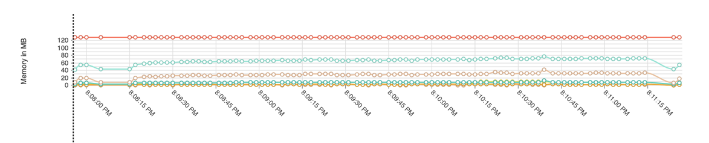
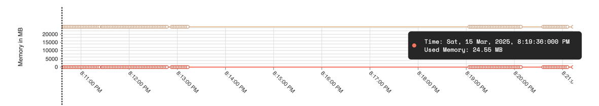

# Memory Monitoring

- [Introduction](#introduction)
- [Android](#android)
- [iOS](#ios)
- [Flutter](#flutter)
- [Data collected](#data-collected)

## Introduction

Measure automatically tracks memory usage for each session. Memory usage is shown along with the session timeline
and can be used to identify memory leaks or excessive memory usage in your app.

## Android

A worker thread reads the following properties every 2 seconds and reports them to Measure:

* **Max heap size** - The maximum amount of memory that the app can use. Collected
  using [Runtime.maxMemory](https://developer.android.com/reference/java/lang/Runtime#maxMemory()).
* **Total heap size** - The total amount of memory that the app is currently using. Collected
  using [Runtime.totalMemory](https://developer.android.com/reference/java/lang/Runtime#totalMemory()).
* **Free heap size** - The amount of memory that is currently free. Collected
  using [Runtime.freeMemory](https://developer.android.com/reference/java/lang/Runtime#freeMemory()).
* **RSS (Resident set size)** - The amount of memory that the app is currently using, including the memory used by the
  native code. Collected by reading the [proc/pid/statm](https://man7.org/linux/man-pages/man5/proc.5.html) file.
* **Total PSS (Proportional set size)** - The total amount of memory that the app is currently using, including the
  memory used by the native code, but excluding the memory used by the system. Collected
  using [Debug.getMemoryInfo](https://developer.android.com/reference/android/os/Debug#getMemoryInfo(android.os.Debug.MemoryInfo)).
* **Native total heap size** - The total amount of memory that the app is currently using for native code. Collected
  using [Debug.getNativeHeapSize](https://developer.android.com/reference/android/os/Debug#getNativeHeapSize()).
* **Native free heap size** - The amount of memory that is currently free for native code. Collected
  using [Debug.getNativeFreeHeapSize](https://developer.android.com/reference/android/os/Debug#getNativeHeapFreeSize()).

#### Data collected

Checkout all the data collected for memory usage in
the [Memory Usage Event](../api/sdk/README.md#memoryusage) section.

## iOS

Measure SDK calculates memory usage using the `task_info` API with the `TASK_VM_INFO` flavor. This API provides detailed
memory statistics for the app’s process. The SDK extracts the `phys_footprint` value, which represents the physical
memory footprint of the app. This value accounts for real memory pages in use, shared memory overhead and
compressed memory, making it an accurate measure of the app’s actual memory consumption.

If `phys_footprint` is unavailable, the SDK falls back to `resident_size`, which represents the resident memory size
allocated to the process. However, `resident_size` does not reflect memory compression or pressure, so it may
underreport actual memory usage compared to `phys_footprint`.

SDK falls back to `resident_size` in below cases:

- If `phys_footprint` is zero or not available due to system constraints.
- If the `task_info` API call fails (rare, but possible due to system restrictions or sand-boxing).

#### Impact on Dashboard Metrics

When `phys_footprint` is available, the reported memory usage reflects actual memory pressure.

When `resident_size` is used, the reported value may be lower than real usage since it excludes compressed memory.

The dashboard does not currently indicate when the SDK falls back to `resident_size`, but unusually low memory usage
readings may suggest this fallback occurred.

#### Further reading

* [Task Info](https://web.mit.edu/darwin/src/modules/xnu/osfmk/man/task_info.html)
* [iOS Memory Deep Dive](https://developer.apple.com/videos/play/wwdc2018/416/)
* [Apple Developer Forum Thread](https://developer.apple.com/forums/thread/105088)

## Flutter

Memory usage is collected for Flutter apps based on the platform the app is running on (Android or iOS). The SDK uses the
same methods as described above for Android and iOS.

## Data collected

Check out the data collected by Measure in the [Memory Usage Absolute](../api/sdk/README.md#memory_usage_absolute)
section.

