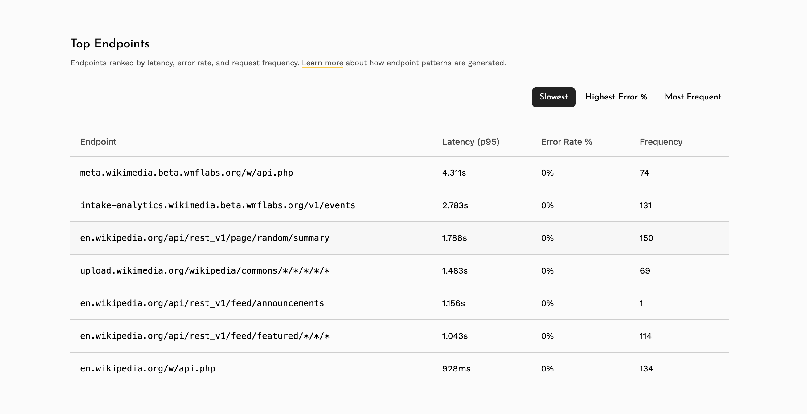
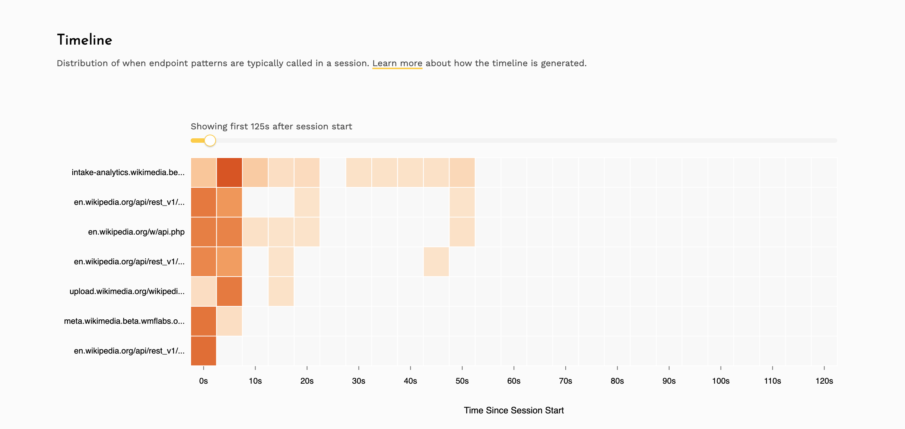

# Network Monitoring

* [**Overview**](#overview)
* [**Configuration Options**](#configuration-options)
* [**Top endpoints**](#top-endpoints)
* [**Request timeline**](#request-timeline)
* [**Searching for endpoints**](#searching-for-endpoints)
* [**How are endpoint patterns generated**](#how-are-endpoint-patterns-generated)

Measure SDK can capture network requests, responses and failures along with useful metrics to help understand how APIs
are performing in production from an end user perspective.

## Overview

Most heavy lifting of network monitoring is done automatically by the Measure SDK. There are a lot of configuration
options available to control the behavior of network monitoring.

#### Android

On Android, network requests made using the following clients, including any third party libraries that use them,
are automatically tracked by simply adding the Measure Android Gradle Plugin:

* [OkHttp](https://square.github.io/okhttp/): supported versions `4.7.0` to `5.3.2`. Requests made with versions
  outside this range will not be auto-instrumented.
* [HttpURLConnection](https://developer.android.com/reference/java/net/HttpURLConnection): requires minimum 
  Android SDK version: 0.18.0.

##### Using Retrofit

[Retrofit](https://square.github.io/retrofit/) uses OkHttp under the hood, but as a transitive dependency.
Auto-instrumentation does not work with transitive dependencies, so projects that depend only on Retrofit
are not instrumented automatically. Use one of the following workarounds:

**Option 1: Declare OkHttp as a direct dependency**

Pin the OkHttp version explicitly in your `build.gradle.kts`. This lets auto-instrumentation work without
any code changes:

```kotlin
dependencies {
    implementation("com.squareup.retrofit2:retrofit:3.0.0")
    implementation("com.squareup.okhttp3:okhttp:4.12.0")
}
```

**Option 2: Add the interceptor manually**

Configure the `OkHttpClient` passed to Retrofit with Measure's interceptor and event listener factory:

```kotlin
val client = OkHttpClient.Builder()
    .addInterceptor(MeasureOkHttpApplicationInterceptor())
    .eventListenerFactory(MeasureEventListenerFactory(null))
    .build()

val retrofit = Retrofit.Builder()
    .baseUrl("https://api.example.com")
    .client(client)
    .build()
```

#### iOS

On iOS, network requests made using the [URLSession](https://developer.apple.com/documentation/foundation/urlsession),
including any third party libraries, are automatically tracked by simply adding the iOS SDK to your project.

#### Flutter

On Flutter, network requests made using the [Dio](https://pub.dev/packages/dio) package can be tracked by adding
the `measure_dio` package to your project. This package provides `MsrInterceptor` that can automatically
track network requests done using Dio.

```yaml
dependencies:
  measure_dio: ^0.3.0
```

```dart
final dio = Dio();
dio.interceptors.add(MsrInterceptor());
```

For any other HTTP client libraries, you can manually track network requests using the `trackHttpEvent` method. 
Example using `http` package:

```dart
import 'package:http/http.dart' as http;
import 'package:measure/measure.dart';

Future<http.Response> trackedGet(Uri uri, {Map<String, String>? headers}) async {
  return _trackRequest(() => http.get(uri, headers: headers), uri, 'get', headers);
}

Future<http.Response> trackedPost(Uri uri, {Map<String, String>? headers, Object? body}) async {
  return _trackRequest(() => http.post(uri, headers: headers, body: body), uri, 'post', headers, body);
}

Future<http.Response> _trackRequest(
    Future<http.Response> Function() request,
    Uri uri,
    String method,
    Map<String, String>? headers,
    [Object? body]
    ) async {
  final measure = Measure.instance;
  final startTime = measure.getCurrentTime();

  try {
    final response = await request();

    measure.trackHttpEvent(
      url: uri.toString(),
      method: method,
      statusCode: response.statusCode,
      startTime: startTime,
      endTime: measure.getCurrentTime(),
      requestHeaders: headers,
      responseHeaders: response.headers,
      requestBody: body?.toString(),
      responseBody: response.body,
      client: 'http',
    );

    return response;
  } catch (e) {
    measure.trackHttpEvent(
      url: uri.toString(),
      method: method,
      startTime: startTime,
      endTime: measure.getCurrentTime(),
      failureReason: e.runtimeType.toString(),
      failureDescription: e.toString(),
      requestHeaders: headers,
      requestBody: body?.toString(),
      client: 'http',
    );
    rethrow;
  }
}
```

#### React Native

On React Native, `fetch` and `XHR` requests use URLSession on iOS and OkHttp on Android under the hood. HTTP
events are automatically tracked on iOS, but require additional setup on Android.

##### Android

To track HTTP events on Android, configure a custom `OkHttpClient` with `OkHttpClientProvider` in
`MainApplication.kt`:

```kotlin
OkHttpClientProvider.setOkHttpClientFactory(object : OkHttpClientFactory {
  override fun createNewNetworkModuleClient(): OkHttpClient {
    return OkHttpClient.Builder()
      .cookieJar(ReactCookieJarContainer())
      .addInterceptor(MeasureOkHttpApplicationInterceptor())
      .eventListenerFactory(MeasureEventListenerFactory(null))
      .build()
  }
})
```

Without this configuration, HTTP events are not tracked on Android.

##### iOS

HTTP requests are tracked automatically on iOS. To also capture HTTP responses, add `MSRNetworkInterceptor` to
the session configuration in `AppDelegate.mm`:

```objc
RCTSetCustomNSURLSessionConfigurationProvider(^NSURLSessionConfiguration *{
  NSURLSessionConfiguration *configuration = [NSURLSessionConfiguration defaultSessionConfiguration];
  [MSRNetworkInterceptor enableOn:configuration];
  return configuration;
});
```

##### Manual tracking

For HTTP clients not automatically instrumented, use `Measure.trackHttpEvent`:

```typescript
import { Measure } from '@measuresh/react-native';

const startTime = Measure.getCurrentTime();
try {
  const response = await fetch('https://api.example.com/data');
  await Measure.trackHttpEvent({
    url: 'https://api.example.com/data',
    method: 'GET',
    startTime,
    endTime: Measure.getCurrentTime(),
    statusCode: response.status,
  });
} catch (error) {
  await Measure.trackHttpEvent({
    url: 'https://api.example.com/data',
    method: 'GET',
    startTime,
    endTime: Measure.getCurrentTime(),
    error: (error as Error).message,
  });
}
```

## Configuration Options

See [Configuration Options - HTTP Events](configuration-options.md#http-events) for all available options.

## Top endpoints

The top endpoints section provides a ranked summary of your app's API endpoints across three dimensions:

* **Slowest** - endpoints ranked by p95 latency, helping identify the slowest APIs affecting user experience.
* **Highest Error %** - endpoints ranked by the percentage of 4xx and 5xx responses, highlighting unreliable APIs.
* **Most Frequent** - endpoints ranked by total request count, showing which APIs are called most often.

Clicking on any endpoint navigates to a detailed view with latency percentile charts (p50, p90, p95, p99) and
status code distribution over time.

These metrics are computed only for [endpoint patterns](#how-are-endpoint-patterns-generated) that have been
automatically generated. New endpoints will appear here once enough traffic has been collected to generate a
pattern.



## Request timeline

> This feature requires minimum SDK version: Android 0.16.2 and iOS 0.9.2

The request timeline is a heatmap that visualizes when network requests happen relative to session start. This helps
answer questions like "which APIs fire immediately on app launch?" and "are there endpoints being called repeatedly
in the background?"

The timeline shows the top [endpoint patterns](#how-are-endpoint-patterns-generated) ranked by request frequency.
New endpoints will appear here once enough traffic has been collected to generate a pattern.



## Searching for endpoints

You can search for any endpoint by typing its path in the "Explore endpoint" search bar. You can type the
exact path or use wildcards to find multiple matching endpoints.

#### Exact path

Type the full path to find a specific endpoint:

* `/v1/login` — matches only `/v1/login`
* `/api/users/123/profile` — matches only `/api/users/123/profile`

#### Using `*` to match any single part

A `*` stands in for any single part of a path:

* `/users/*/orders` — matches `/users/123/orders`, `/users/abc/orders`, etc.
* `/api/*/profile/*` — matches `/api/users/profile/avatar`, `/api/teams/profile/settings`, etc.

#### Using `**` to match everything after a prefix

Place `**` at the end of a path to match everything that follows:

* `/users/**` — matches `/users/123`, `/users/123/orders`, `/users/123/orders/456`, etc.
* `/api/v1/**` — matches `/api/v1/login`, `/api/v1/users/123/profile`, etc.

Note: `**` can only be used at the end of a path.

#### Mixing `*` and `**`

You can use `*` for specific parts and end with `**` to match the rest:

* `/api/*/users/**` — matches `/api/v1/users/123`, `/api/v2/users/123/orders/456`, etc.

## How are endpoint patterns generated

Measure automatically groups similar URLs into patterns so that requests like
`/api/users/123/profile` and `/api/users/456/profile` are grouped together as `/api/users/*/profile`.
A pattern is only created once it receives significant traffic - at least 100 requests in an hour. Once
established, patterns are retained as long as they continue to receive traffic. Patterns are discovered every
hour, and once available, metrics are refreshed every 15 minutes.

Raw URLs are grouped into patterns in two stages:

**1. Path normalization** - Each segment of a URL path is checked against known dynamic value formats. Segments
that match any of the following are replaced with a `*` wildcard:

* UUIDs (e.g. `550e8400-e29b-41d4-a716-446655440000`)
* SHA1 and MD5 hashes
* ISO 8601 date prefixes (e.g. `2024-01-15T...`)
* Hex values (e.g. `0x1a2b3c`)
* Integers with 2 or more digits (single-digit segments like `v1` are preserved)

For example, `/api/users/550e8400-e29b-41d4-a716-446655440000/orders/12345` becomes `/api/users/*/orders/*`.

**2. High-cardinality detection** - Some dynamic segments don't match a known format like UUIDs or integers.
For these, Measure looks at the variety of values seen in each position of a path. If a segment has many distinct
values (e.g. `/api/products/abc`, `/api/products/xyz`, ...), it is automatically replaced with `*` to form
`/api/products/*`.
