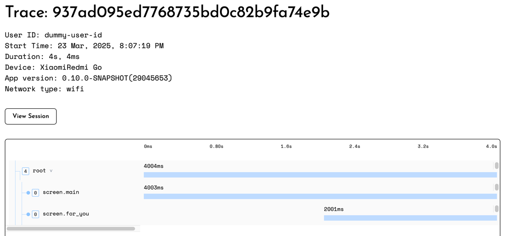
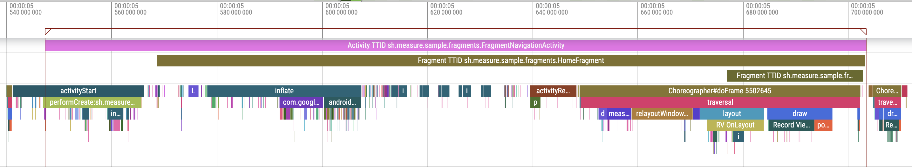

# Feature — Performance Tracing

* [**Introduction**](#introduction)
* [**Concepts**](#concepts)
* [**API Reference**](#api-reference)
    * [Limits](#limits)
    * [Start a Span](#start-a-span)
    * [End a Span](#end-a-span)
    * [Set Parent Span](#set-parent-span)
    * [Set Attributes](#set-attributes)
    * [Remove Attribute](#remove-attribute)
    * [Update Span Name](#update-span-name)
    * [Add Checkpoint](#add-checkpoint)
    * [Deferred Span Start](#deferred-span-start)
    * [Distributed Tracing](#distributed-tracing)
        * [Get a Trace Parent Header](#get-a-trace-parent-header)
* [**Recipes**](#recipes)
    * [Distributed Tracing with OkHttp Interceptor](#distributed-tracing-with-okhttp-interceptor)
    * [Distributed Tracing with URLSession Interceptor](#distributed-tracing-with-urlsession-interceptor)
* [**Screen Load Time**](#screen-load-time)
    * [Android](#android)
        * [How It Works](#how-it-works)
        * [Data Captured](#data-captured)
        * [Spans Visualized Using Perfetto](#spans-visualized-using-perfetto)
    * [iOS](#ios)
      * [How It Works](#how-it-works-1)
      * [Data Captured](#data-captured-1)

## Introduction

You can easily track the performance of any part of your application, such as API calls, DB queries, any function, or a user journey, using the performance tracing APIs. The SDK supports nested spans to track hierarchical operations.

> [!NOTE]
>
> measure-sh can automatically track traces for screen load times in Android and iOS apps for _Activities_, _Fragments_, and _UIViewControllers_. See [Screen Load Time](feature-screen-load-time.md) for more details.

Here's a simple example of how to use the performance tracing APIs:

<details>
    <summary>Android</summary>

```kotlin
val onboardingSpan = Measure.startSpan("onboarding-flow")
try {
    val signupSpan = Measure.startSpan("signup", parent = onboardingSpan)
    userSignup()
    signupSpan.end()

    val tutorialSpan = Measure.startSpan("tutorial", parent = onboardingSpan)
    showTutorial()
    tutorialSpan.end(SpanStatus.Ok)
} finally {
    onboardingSpan.end(SpanStatus.Error)
}
```

</details>

<details>
    <summary>iOS</summary>

```swift
let onboardingSpan: Span = Measure.startSpan(name: "onboarding-flow")
do {
    let signupSpan = Measure.startSpan("signup").setParent(parentSpan)
    userSignup()
    signupSpan.end()

    let tutorialSpan = Measure.startSpan("tutorial").setParent(parentSpan)
    showTutorial()
    tutorialSpan.end(status: .ok)
} catch {
    onboardingSpan.end(status: .error)
}
```

</details>

This will result in a trace like the following:

```
onboarding-flow ━━━━━━━━━━━━━━━━━━━━━━━━━━━━━━━━━━━━ [2.4s] ✓
┃
┣━ signup ━━━━━━━━━ [800ms] ✓
┃
┗━ tutorial ━━━━━━━━━━━━━━━━ [1.6s] ✓
```

## Concepts

Tracing helps you understand how long certain operations take to complete, from the moment they begin until they finish, including all the intermediate steps, dependencies, and parallel activities that occur during execution.

A **trace** represents the entire operation, which could be a complete user journey like onboarding, further divided into multiple steps like login, create profile, etc. A trace is represented by a `trace_id`.

A **span** is the fundamental building block of a trace. A span represents a single unit of work. This could be an HTTP request, a database query, a function call, etc. Each span contains information about the operation — when it started, how long it took, and whether it completed successfully or not. A span is identified using a `span_id` and a user-defined `name`.

Each span can optionally have a **parent span**, which allows you to create a hierarchy of spans. This is useful for tracking nested operations. For example, if a user journey involves multiple steps, each step can be represented as a child span of the main user journey span.



## API Reference

### Limits

The following limits apply to spans. Spans violating the limits will either be discarded or have their data truncated.

|                            | Limit |
|----------------------------|-------|
| Max Span Name Length       | 64    |
| Max Checkpoint Name Length | 64    |
| Max Checkpoints Per Span   | 100   |

### Start a Span

A span can be started using the `startSpan` function.

<details>
  <summary>Android</summary>

```kotlin
val span: Span = Measure.startSpan("span-name")
```

</details>

<details>
  <summary>iOS</summary>

```swift
let span: Span = Measure.startSpan(name: "span-name")
```

</details>

A span can also be started by providing the start time, this is useful in cases where a certain
operation has already started but there wasn't any way to access the Measure APIs in that part of the code.

> [!IMPORTANT]
> To set the start time, use `Measure.getTimestamp`, which returns epoch time calculated using a
> monotonic clock.
> Passing in `System.currentTimeInMillis` can lead to issues with corrupted span timings due to
> clock skew issues.

<details>
  <summary>Android</summary>

```kotlin
val span: Span = Measure.startSpan("span-name", timestamp = Measure.getTimestamp())
```

</details>

<details>
  <summary>iOS</summary>

```swift
let span: Span = Measure.startSpan(name: "operation-name", timestamp: Measure.getCurrentTime())
```

</details>

### End a Span

A span can be ended using the `end` function. Status is mandatory to set when ending a span.

<details>
  <summary>Android</summary>

```kotlin
val span: Span = Measure.startSpan("span-name")
span.end(Status.Ok)
```

</details>

<details>
  <summary>iOS</summary>

```swift
let span: Span = Measure.startSpan(name: "span-name")
span.setStatus(.ok).end()
```

</details>

A span can also be ended by providing the end time, this is useful in cases where a certain
operation has already ended
but there wasn't any way to access the Measure APIs in that part of the code.

> [!IMPORTANT]
> To set the end time, use `Measure.getTimestamp`, which returns epoch time calculated using a
> monotonic clock.
> Passing in `System.currentTimeInMillis` can lead to issues with corrupted span timings due to
> clock skew issues.

<details>
  <summary>Android</summary>

```kotlin
val span: Span = Measure.startSpan("span-name")
span.end(Status.Ok, timestamp = Measure.getTimestamp())
```

</details>


<details>
  <summary>iOS</summary>

```swift
let span: Span = Measure.startSpan(name: "span-name")
span.setStatus(.ok).end(timestamp: Measure.getCurrentTime())
```

</details>

### Set Parent Span

To set a parent span, use the `setParent` method.

<details>
  <summary>Android</summary>

```kotlin
val parentSpan: Span = Measure.startSpan("parent-span")
val childSpan: Span = Measure.startSpan("child-span").setParent(parentSpan)
```

</details>

<details>
  <summary>iOS</summary>

```swift
let parentSpan: Span = Measure.startSpan(name: "parent-span")
let childSpan: Span = Measure.startSpan(name: "child-span").setParent(parentSpan)
```

</details>

### Set Attributes

Attributes are key-value pairs that can be attached to a span. Attributes are used to add additional context to a span.

To add attributes to a span, use `setAttribute`.

<details>
  <summary>Android</summary>

```kotlin
val span: Span = Measure.startSpan("span-name")
span.setAttribute("key", "value")
```

</details>

<details>
  <summary>iOS</summary>

```swift
let span: Span = Measure.startSpan(name: "span-name")
span.setAttribute("key", "value")
```

</details>

To add multiple attributes at once use `setAttributes`.

<details>
  <summary>Android</summary>

```kotlin
val span: Span = Measure.startSpan("span-name")
val attributes = AttributesBuilder().put("key", "value").put("key2", "value2").build()
span.setAttributes(attributes)
```

</details>

<details>
  <summary>iOS</summary>

```swift
let span: Span = Measure.startSpan(name: "span-name")
let attributes: [String: AttributeValue] = ["key": "value", "key2": 42]
span.setAttributes(attributes)
```

</details>

### Remove Attribute

To remove an attribute use `removeAttribute`.

<details>
  <summary>Android</summary>

```kotlin
val span: Span = Measure.startSpan("span-name")
span.removeAttribute("key")
```

</details>

<details>
  <summary>iOS</summary>

```swift
let span: Span = Measure.startSpan(name: "span-name")
span.removeAttribute("key")
```

</details>

### Update Span Name

To update the name of the span after it is started, use `setName`.

<details>
  <summary>Android</summary>

```kotlin
val span: Span = Measure.startSpan("span-name")
span.setName("updated-name").end()
```

</details>

<details>
  <summary>iOS</summary>

```swift
let span: Span = Measure.startSpan(name: "span-name")
span.setName("updated-name").end()
```

</details>

### Add Checkpoint

To add a checkpoint use `setCheckpoint`.

<details>
  <summary>Android</summary>

```kotlin
val span: Span = Measure.startSpan("span-name").setCheckpoint("checkpoint-name")
```

</details>

<details>
  <summary>iOS</summary>

```swift
let span: Span = Measure.startSpan(name: "span-name").setCheckpoint("checkpoint-name")
```

</details>

### Deferred Span Start

The span builder API allows pre-configuring a span without starting it immediately.

<details>
  <summary>Android</summary>

```kotlin
val spanBuilder: SpanBuilder = Measure.createSpan("span-name")
val span: Span = spanBuilder.startSpan()
```

</details>


<details>
  <summary>iOS</summary>

```swift
let spanBuilder: SpanBuilder = Measure.createSpanBuilder(name: "span-name")!
let span: Span = spanBuilder.startSpan()
```

</details>

## Distributed Tracing

Distributed tracing is a monitoring method that helps tracking requests as they travel through
different services in a distributed system (like microservices, serverless functions, and mobile
apps).

The `traceparent` header is a key component of distributed tracing that helps track requests as they
flow through
different services. It follows
the [W3C Trace Context specification](https://www.w3.org/TR/trace-context/#header-name)
and consists of four parts in a single string:

Example: `00-4bf92f3577b34da6a3ce929d0e0e4736-00f067aa0ba902b7-01`

Where:

* `00`: Version
* `4bf92f3577b34da6a3ce929d0e0e4736`: Globally unique trace ID
* `00f067aa0ba902b7`: Parent span ID (representing the current operation)
* `01`: Trace flags (like whether sampling is enabled)

When your mobile app makes API calls, including this header allows you to correlate the client-side
operations with
server-side processing, giving you end-to-end visibility of your request flow.

### Get a trace parent header

<details>
    <summary>Android</summary>

```kotlin
val span = Measure.startSpan("http")
val key = Measure.getTraceParentHeaderKey()
val value = Measure.getTraceParentHeaderValue(span)
```

</details>

<details>
    <summary>iOS</summary>

```swift
let span = Measure.startSpan(name: "http")
let key = Measure.getTraceParentHeaderKey()
let value = Measure.getTraceParentHeaderValue(span: span)
```

</details>

## Recipes

### Distributed Tracing with OkHttp Interceptor

```kotlin
// First, create an interceptor to handle tracing
class TracingInterceptor : Interceptor {
    override fun intercept(chain: Interceptor.Chain): Response {
        val span = Measure.startSpan("http")
        try {
            // Add traceparent header to the request
            val originalRequest = chain.request()
            val tracedRequest = originalRequest.newBuilder()
                .header(
                    Measure.getTraceParentHeaderKey(),
                    Measure.getTraceParentHeaderValue(span)
                )
                .build()

            // Execute the request
            val response = chain.proceed(tracedRequest)

            // Set span status based on response
            if (response.isSuccessful) {
                span.setStatus(SpanStatus.Ok)
            } else {
                span.setStatus(SpanStatus.Error)
            }
            return response
        } finally {
            span.end()
        }
    }
}

// Set up OkHttp client with the interceptor
val okHttpClient = OkHttpClient.Builder()
    .addInterceptor(TracingInterceptor())
    .build()
```

### Distributed Tracing with URLSession Interceptor

```swift
// Create a URLSession interceptor to handle tracing
class TracingInterceptor: NSObject, URLSessionTaskDelegate {
    func urlSession(_ session: URLSession, task: URLSessionTask, willPerformHTTPRedirection response: HTTPURLResponse, newRequest request: URLRequest, completionHandler: @escaping (URLRequest?) -> Void) {
        let span = Measure.startSpan(name: "http")
        var tracedRequest = request
        tracedRequest.addValue(
            Measure.getTraceParentHeaderValue(span: span),
            forHTTPHeaderField: Measure.getTraceParentHeaderKey()
        )
        completionHandler(tracedRequest)
        span.setStatus(.ok).end()
    }
}

// Set up URLSession with the interceptor
let session = URLSession(configuration: .default, delegate: TracingInterceptor(), delegateQueue: nil)
```

## Screen Load Time

Time taken to load an Activity/Fragment in Android or a UIViewController in iOS is automatically tracked using a trace.

### Android

**Activity load time** measures the time between the Activity being created and the first
frame drawn on the screen. This is also known as Time to First Frame or
Time to Initial Display (TTID).

Each Activity load time is captured using a unique span with the name `Activity TTID` followed
by the fully qualified class name of the Activity. For example, for `MainActivity` the span
name would be `Activity TTID com.example.MainActivity`.

An attribute called `app_startup_first_activity` with value of _true_ is automatically added to the span to indicate
if the Activity was being loaded as part of a [cold](feature-app-launch-metrics.md#cold-launch) launch.

**Fragment load time** measures the time between the Fragment view being created and the
first frame drawn on the screen.
This is also known as Time to First Frame (TTF) or Time to Initial Display (TTID).

Each Fragment load time is captured using a unique span with the name `Fragment TTID` followed
by the fully qualified class name of the Fragment. For example, for `HomeFragment` the span
name would be `Fragment TTID com.example.HomeFragment`.

A large TTID means users wait too long to see content while navigating the app.

> Note that the fully qualified activity name may be truncated to fit within the 64 character limits for span names.

This feature is enabled by default and can be disabled during SDK initialization
using the following configurations:

```kotlin
// Disable activity load time traces
`MeasureConfig(trackActivityLoadTime = false)`

// Disable fragment load time traces
`MeasureConfig(trackFragmentLoadTime = false)`
```

#### How it works

**Activity load time** a span starts in the `onCreate` callback of the Activity. The span ends
when the first frame is drawn on the screen. This is achieved using two techniques:

1. Attach a `View.addOnAttachStateChangeListener` to the root view of the Activity to detect when the view is attached to the window.
2. Post a runnable using `Handler.sendMessageAtFrontOfQueue` on the main thread as a proxy for detecting when the first frame is drawn.

#### Data Captured

A span with the name `Activity TTID {fully qualified activity name}` is created for each Activity load. And a span with the name `Fragment TTID {fully qualified fragment name}` is created for each Fragment load.

The Activity TTID span may have the following attributes if applicable:

| Attribute                  | Description                                                      |
|----------------------------|------------------------------------------------------------------|
| app_startup_first_activity | Whether this activity is the first activity launched in the app. |

The spans have the following checkpoints:

| Checkpoint                  | Description                              |
|-----------------------------|------------------------------------------|
| fragment_lifecycle_attached | The time when the Fragment was attached. |
| fragment_lifecycle_started  | The time when the Fragment was started.  |
| fragment_lifecycle_resumed  | The time when the Fragment was resumed.  |
| activity_lifecycle_created  | The time when the Activity was created.  |
| activity_lifecycle_started  | The time when the Activity was started.  |
| activity_lifecycle_resumed  | The time when the Activity was resumed.  |

#### Spans Visualized Using Perfetto

The following image shows TTID spans of an Activity along with its two Fragments visualized using Perfetto.



### iOS

**ViewController load time** measures the time between the ViewController's view being loaded and the first frame drawn on the screen. This is also known as Time to First Frame or Time to Initial Display (TTID).

Each ViewController load time is captured using a unique span with the name `VC TTID` followed by the fully qualified class name of the ViewController. For example, for `MainViewController` the span name would be `VC TTID MainViewController`.

An attribute called `app_startup_first_view_controller` with a value of _true_ is automatically added to the span to indicate if the ViewController was being loaded as part of a cold launch.

A large TTID means users wait too long to see content while navigating the app.

> Note that the fully qualified ViewController name may be truncated to fit within the 64 character limits for span names.

#### How It Works

**ViewController load time** tracking works by monitoring the ViewController's lifecycle events:

1. The span starts in either the `loadView` or `viewDidLoad` callback of the ViewController:
    - If you inherit from `MsrViewController` (Swift) or `MSRViewController` (Objective-C), the span will start from `loadView`.
    - Otherwise, the span will start from `viewDidLoad`.
2. The span ends when `viewDidAppear` is called, indicating that the view is fully visible on screen.

The SDK uses method swizzling to automatically track these lifecycle events without requiring any manual instrumentation.

#### Data Captured

A span with the name `VC TTID {view controller name}` is created for each ViewController load.

The ViewController TTID span may have the following attributes if applicable:

| Attribute                         | Description                                                        |
|-----------------------------------|--------------------------------------------------------------------|
| app_startup_first_view_controller | Whether this view controller is the first one launched in the app. |

The spans have the following checkpoints:

| Checkpoint          | Description                                    |
|---------------------|------------------------------------------------|
| vc_load_view        | The time when the view was loaded.             |
| vc_view_did_load    | The time when the view was loaded into memory. |
| vc_view_will_appear | The time when the view is about to appear.     |
| vc_view_did_appear  | The time when the view is fully visible.       |
