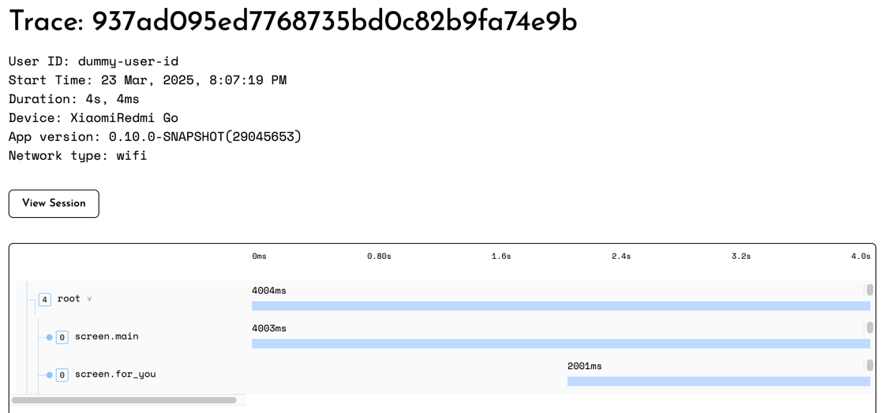

# Feature — Performance Tracing

* [**Introduction**](#introduction)
* [**Concepts**](#concepts)
* [**API Reference**](#api-reference)
    * [**Limits**](#limits)
    * [**Start a span**](#start-a-span)
    * [**End a span**](#end-a-span)
    * [**Set span parent**](#set-parent-span)
    * [**Set attributes**](#set-attributes)
    * [**Remove attribute**](#remove-attribute)
    * [**Add checkpoint**](#add-checkpoint)
    * [**Deferred span start**](#deferred-span-start)
* [**Distributed Tracing**](#distributed-tracing)

## Introduction

Use the performance tracing APIs to track performance of any part of your application - API calls, DB queries, any
function, a user journey, etc. The SDK supports nested spans to track hierarchical operations.

> [!NOTE]
>
> measure-sh can automatically track traces for screen load times in Android and iOS apps for _Activities_, _Fragments_
> and _UIViewControllers_. See [Screen Load Time](feature-screen-load-time.md) for more details.

Following is a simple example of how to use the performance tracing APIs:

<details>
    <summary>Android</summary>

```kotlin
val onboardingSpan = Measure.startSpan("onboarding-flow")
try {
    val signupSpan = Measure.startSpan("signup", parent = onboardingSpan)
    userSignup()
    signupSpan.end()

    val tutorialSpan = Measure.startSpan("tutorial", parent = onboardingSpan)
    showTutorial()
    tutorialSpan.end(SpanStatus.Ok)
} finally {
    onboardingSpan.end(SpanStatus.Error)
}
```

</details>

<details>
    <summary>iOS</summary>

```swift
let onboardingSpan: Span = Measure.shared.startSpan(name: "onboarding-flow")
do {
    let signupSpan = Measure.shared.startSpan("signup").setParent(parentSpan)
    userSignup()
    signupSpan.end()

    let tutorialSpan = Measure.shared.startSpan("tutorial").setParent(parentSpan)
    showTutorial()
    tutorialSpan.end(status: .ok)
} catch {
    onboardingSpan.end(status: .error)
}
```

</details>

This will result in a trace like the following:

```
onboarding-flow ━━━━━━━━━━━━━━━━━━━━━━━━━━━━━━━━━━━━ [2.4s] ✓
┃
┣━ signup ━━━━━━━━━ [800ms] ✓
┃
┗━ tutorial ━━━━━━━━━━━━━━━━ [1.6s] ✓
```

## Concepts

Tracing helps understand how long certain operations take to complete, from the moment they begin
until they finish, including all the intermediate steps, dependencies, and parallel activities that occur during
execution.

A **trace** represents the entire operation, which could be a complete user journey like onboarding,
further divided into multiple steps like login, create profile, etc. A trace is represented by a `trace_id`.

A **span** is the fundamental building block of a trace. A span represents a single unit of work.
This could be a HTTP request, a database query, a function call, etc. Each span contains information about the
operation — when it started, how long it took and whether it completed successfully or not. A span is identified using a
`span_id` and a user defined `name`.

To achieve this, spans in a trace are organized as a Directed Acyclic Graph (DAG). Which means spans
can have a parent span and each span can have multiple children. This is done by adding a **parent_id** to each span,
whose value is the `span_id` of its parent.



## API Reference

### Limits

The following limits apply to spans. Spans violating the limits will be either be discarded or have
their data truncated.

|                            | Limit |
|----------------------------|-------|
| Max span name length       | 64    |
| Max checkpoint name length | 64    |
| Max checkpoints per span   | 100   |

### Start a span

A span can be started using `startSpan` function.

<details>
  <summary>Android</summary>

```kotlin
val span: Span = Measure.startSpan("span-name")
```

</details>

<details>
  <summary>iOS</summary>

#### iOS

```swift
let span: Span = Measure.shared.startSpan(name: "span-name")
```

</details>

A span can also be started by providing the start time, this is useful in cases where a certain
operation has already started but there wasn't any way to access the Measure APIs in that part of the code.

> [!IMPORTANT]
> To set the start time use `Measure.getTimestamp`, which returns epoch time calculated using a
> monotonic clock.
> Passing in `System.currentTimeInMillis` can lead to issues with corrupted span timings due to
> clock skew issues.

```kotlin
val span: Span = Measure.startSpan("span-name", timestamp = Measure.getTimestamp())
```

### End a span

A span can be ended using `end` function. Status is mandatory to set when ending a span.

```kotlin
val span: Span = Measure.startSpan("span-name")
span.end(Status.Ok)
```

A span can also be ended by providing the end time, this is useful in cases where a certain
operation has already ended
but there wasn't any way to access the Measure APIs in that part of the code.

> [!IMPORTANT]
> To set the start time use `Measure.getTimestamp`, which returns epoch time calculated using a
> monotonic clock.
> Passing in `System.currentTimeInMillis` can lead to issues with corrupted span timings due to
> clock skew issues.

```kotlin
val span: Span = Measure.startSpan("span-name")
span.end(Status.Ok, timestamp = Measure.getTimestamp())
```

### Set parent span

```kotlin
val parentSpan: Span = Measure.startSpan("parent-span")
val childSpan: Span = Measure.startSpan("child-span").setParent(parentSpan)
```

### Set attributes

Attributes are key-value pairs that can be attached to a span. Attributes are used to add additional
context to a span.

To add attributes to a span use `setAttribute`.

```kotlin
val span: Span = Measure.startSpan("span-name")
span.setAttribute("key", "value")
```

To add multiple attributes at once use `setAttributes`.

```kotlin
val span: Span = Measure.startSpan("span-name")
val attributes = AttributesBuilder().put("key", "value").put("key2", "value2").build()
span.setAttributes(attributes)
```

### Remove attribute

To remove an attribute use `removeAttribute`.

```kotlin
val span: Span = Measure.startSpan("span-name")
span.removeAttribute("key")
```

### Update span name

To update the name of the span after it is started use `setName`.

```kotlin
val span: Span = Measure.startSpan("span-name")
span.setName("updated-name").end()
```

### Add checkpoint

```kotlin
val span: Span = Measure.startSpan("span-name").setCheckpoint("checkpoint-name")
```

### Deferred span start

The span builder API allows pre-configuring a span without starting it immediately.

```kotlin
val spanBuilder: SpanBuilder = Measure.createSpan("span-name")
val span: Span = spanBuilder.startSpan()
```

The span builder also allows setting parent using the builder:

```kotlin
val spanBuilder: SpanBuilder = Measure.createSpan("span-name")
    .setParent(parentSpan)
val span: Span = spanBuilder.startSpan()
```

## Distributed Tracing

Distributed tracing is a monitoring method that helps tracking requests as they travel through
different services in a distributed system (like microservices, serverless functions, and mobile
apps).

The `traceparent` header is a key component of distributed tracing that helps track requests as they
flow through
different services. It follows
the [W3C Trace Context specification](https://www.w3.org/TR/trace-context/#header-name)
and consists of four parts in a single string:

Example: `00-4bf92f3577b34da6a3ce929d0e0e4736-00f067aa0ba902b7-01`

Where:

* `00`: Version
* `4bf92f3577b34da6a3ce929d0e0e4736`: Globally unique trace ID
* `00f067aa0ba902b7`: Parent span ID (representing the current operation)
* `01`: Trace flags (like whether sampling is enabled)

When your mobile app makes API calls, including this header allows you to correlate the client-side
operations with
server-side processing, giving you end-to-end visibility of your request flow.

To get a trace parent header:

```kotlin
val span = Measure.startSpan("http")
val key = Measure.getTraceParentHeaderKey()
val value = Measure.getTraceParentHeaderValue(span)
```

#### Example with OkHttp interceptor

```kotlin
// First, create a interceptor to handle tracing
class TracingInterceptor : Interceptor {
    override fun intercept(chain: Interceptor.Chain): Response {
        val span = Measure.startSpan("http")
        try {
            // Add traceparent header to the request
            val originalRequest = chain.request()
            val tracedRequest = originalRequest.newBuilder()
                .header(
                    Measure.getTraceParentHeaderKey(),
                    Measure.getTraceParentHeaderValue(span)
                )
                .build()

            // Execute the request
            val response = chain.proceed(tracedRequest)

            // Set span status based on response
            if (response.isSuccessful) {
                span.setStatus(SpanStatus.Ok)
            } else {
                span.setStatus(SpanStatus.Error)
            }
            return response
        } finally {
            span.end()
        }
    }
}

// Set up OkHttp client with the interceptor
val okHttpClient = OkHttpClient.Builder()
    .addInterceptor(TracingInterceptor())
    .build()
```