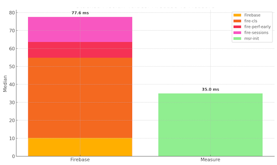
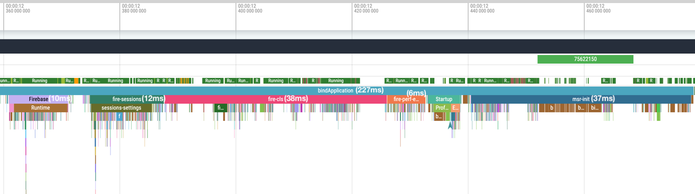

# Performance Impact

See the platform-specific sections below for details on the performance impact of the Measure SDK on your app.

* [**Android**](#android)
  * [Benchmarks](#benchmarks)
  * [Profiling](#profiling)
  * [Comparison to Firebase initialization](#comparison-to-firebase-initialization)

## Android

### Benchmarks

We benchmark the SDK's performance impact using a Pixel 4a running Android 13 (API 33). Each test runs 35 times using
macro-benchmark. For detailed methodology, see [android/benchmarks](../../android/benchmarks/README.md).

> [!IMPORTANT]
> Benchmark results are specific to the device and the app. It is recommended to run the benchmarks
> for your app to get results specific to your app. These numbers are published to provide
> a reference point and are used internally to detect any performance regressions.

Benchmarks results for v0.9.0:

* Adds 26.258ms-34.416ms to the app startup time (Time to Initial Display) for a simple app.
* Adds 0.57ms for view-based layouts, and 0.65ms for compose based layouts to every gesture.

### Profiling

To measure the SDK's impact on your app, we've added traces to key areas of the code. These traces help you track
performance
using [Macro Benchmark](https://developer.android.com/topic/performance/benchmarking/macrobenchmark-overview)
or by using [Perfetto](https://perfetto.dev/docs/quickstart/android-tracing) directly.

* `msr-init` — time spent on the main thread while initializing.
* `msr-start` — time spent on the main thread when `Measure.start` is called.
* `msr-stop` — — time spent on the main thread when `Measure.stop` is called.
* `msr-trackEvent` — time spent in storing an event to local storage. Almost all of this time is spent _off_ the main
  thread.
* `msr-trackGesture` — time spent on the main thread to track a gesture.
* `msr-generateSvgAttachment` — time spent on background thread to generate an SVG layout.
* `msr-captureScreenshot` — time spent on main thread to capture and compress a screenshot.
* `msr-loadImageFromFile` — time spent on main thread to load an image from a file.
* `msr-loadImageFromUri` — time spent on main thread to load an image from a Uri.

### Comparison to Firebase initialization

The following are the results from running a macro-benchmark test to compare initialization
time of Measure SDK vs Firebase. Tested with firebase BOM version `33.7.0` and
Measure Android SDK version `0.10.0` running on a Pixel 4a.

Firebase initializes in multiple phases. The total median time to initialize when running the
benchmark for an app with Firebase crashlytics, performance and analytics SDK
was observed as `77.6ms`. While Measure took `35.0ms` in the same macro-benchmark test.

Perfetto screenshot from one of the runs:

