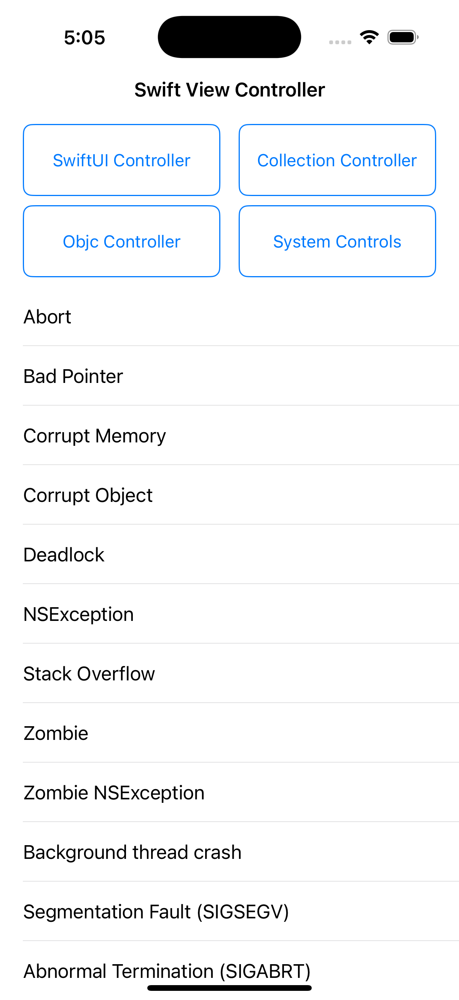
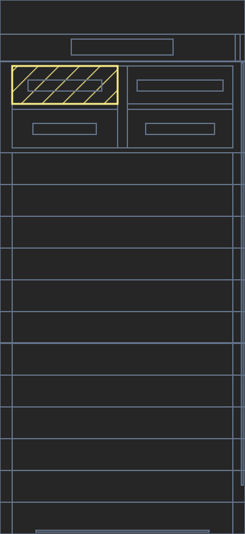

# Feature — Layout Snapshots

Layout snapshots provide a lightweight way to capture the structure of your UI at key user interactions.
They are automatically collected during click events (with throttling) and store the layout hierarchy as SVG rather than
full screenshots.
This approach gives valuable context about the UI state during user interactions while being significantly more
efficient to capture and store than traditional screenshots.

| Screenshot                                            | Layout snapshot                                  |
|-------------------------------------------------------|--------------------------------------------------|
|  |  |

## How it works

Once a [gesture is detected](feature_gesture_tracking.md), the layout is parsed by going over every element, recording dimensions and size information.
The result is then converted into an SVG and tracked as an [attachment](../../api/sdk/README.md#attachments).

## Impact on Performance

- Based on the results we capture on the sample application, layout snapshot generation adds 0.3ms for view-based layouts.
- You can find the benchmark tests in [BaseLayoutSnapshotGeneratorTests](../../../ios/Tests/MeasureSDKTests/LayoutInspector/LayoutSnapshotGeneratorTests.swift).