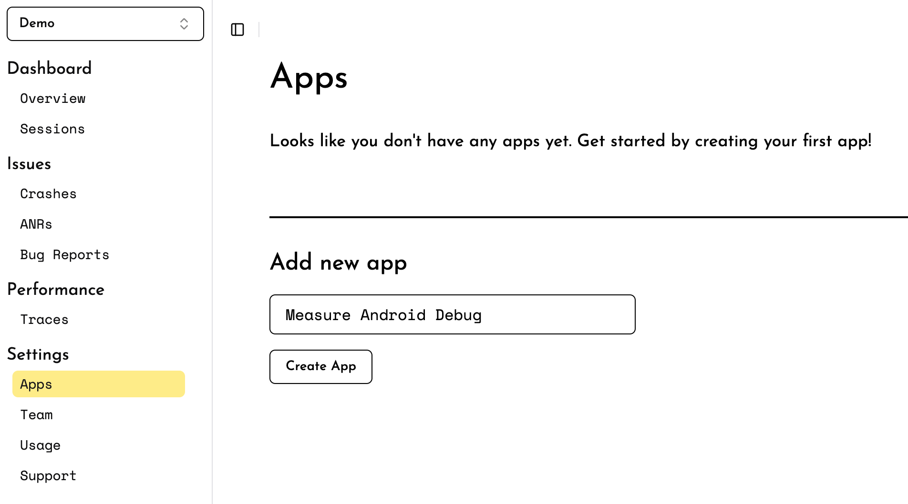
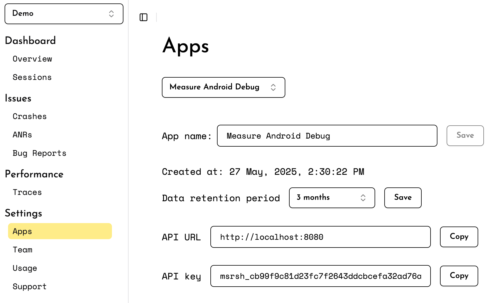

# Getting Started

* [1. Create an App](#1-create-an-app)
* [2. Set Up the SDK](#2-set-up-the-sdk)
    * [Android](#android)
    * [iOS](#ios)
* [3. Verify Installation](#3-verify-installation)
* [Troubleshoot](#troubleshoot)

> [!IMPORTANT]
>
> Make sure the measure-sh server is running. For setup instructions on your local machine or in the cloud, refer to the
> [hosting guide](hosting/README.md).

## 1. Create an App

Create a new app by visiting the _Apps_ section on the dashboard.



Once the app is created, note the `API URL` & `API Key` for your app. This will be used in the SDK configuration
in later steps.



## 2. Set Up the SDK

* [Android](#android)
* [iOS](#ios)

## Android

<details>
  <summary>Minimum Requirements</summary>

| Name                  | Version         |
|-----------------------|-----------------|
| Android Gradle Plugin | `7.4`           |
| Min SDK               | `21` (Lollipop) |
| Target SDK            | `31`            |

</details>

<details>
    <summary>Self-host Compatibility</summary>

| SDK Version       | Minimum Required Self-host Version |
|-------------------|------------------------------------|
| `0.10.0`          | `0.6.0`                            |
| `0.9.0`           | `0.5.0`                            |
| `0.1.0` - `0.8.2` | `0.1.1`                            |

</details>

### Add the API Key & API URL

There are two ways to set the API Key and API URL:

* [Using Android Manifest](#using-android-manifest)
* [During initialization](#during-initialization)

#### Using Android Manifest

Add the API URL & API Key to your application's `AndroidManifest.xml` file.

```xml

<application>
    <meta-data android:name="sh.measure.android.API_KEY" android:value="YOUR_API_KEY"/>
    <meta-data android:name="sh.measure.android.API_URL" android:value="YOUR_API_URL"/>
</application>
```

<details>
  <summary>Configure API Keys for Different Build Types</summary>

You can
use [manifestPlaceholders](https://developer.android.com/build/manage-manifests#inject_build_variables_into_the_manifest)
to configure different values for different build types or flavors.

In the `build.gradle.kts` file:

```kotlin
android {
    buildTypes {
        debug {
            manifestPlaceholders["measureApiKey"] = "YOUR_API_KEY"
            manifestPlaceholders["measureUrlKey"] = "YOUR_API_URL"
        }
        release {
            manifestPlaceholders["measureApiKey"] = "YOUR_API_KEY"
            manifestPlaceholders["measureUrlKey"] = "YOUR_API_URL"
        }
    }
}
```

or in the `build.gradle` file:

```groovy
android {
    buildTypes {
        debug {
            manifestPlaceholders = ["measureApiKey": "YOUR_API_KEY"]
            manifestPlaceholders = ["measureApiUrl": "YOUR_API_URL"]
        }
        release {
            manifestPlaceholders = ["measureApiKey": "YOUR_API_KEY"]
            manifestPlaceholders = ["measureApiUrl": "YOUR_API_URL"]
        }
    }
}
```

Then add the following in the `AndroidManifest.xml` file:

```xml

<application>
    <meta-data android:name="sh.measure.android.API_KEY" android:value="${measureApiKey}"/>
    <meta-data android:name="sh.measure.android.API_URL" android:value="${measureApiUrl}"/>
</application>
```

</details>

#### During initialization

To set the API URL and API Key in code during initialization, set `ClientInfo` during
initialization.

```kotlin
val clientInfo = ClientInfo(
    apiKey = "<apiKey>",
    apiUrl = "<apiUrl>"
)
Measure.init(context, clientInfoclientInfo)
```

### Add the Gradle Plugin

Add the following plugin to your project.

```kotlin
plugins {
    id("sh.measure.android.gradle") version "0.8.0"
}
```

or, use the following if you're using `build.gradle`.

```groovy
plugins {
    id 'sh.measure.android.gradle' version '0.8.0'
}
```

<details>
  <summary>Configure Variants</summary>

By default, the plugin is applied to all variants. To disable the plugin for specific variants, use the `measure` block
in your build file.

> [!IMPORTANT]
> Setting `enabled` to `false` will disable the plugin for that variant. This prevents the plugin from
> collecting `mapping.txt` file and other build information about the app. Features like tracking app size,
> de-obfuscating
> stack traces, etc. will not work.

For example, to disable the plugin for `debug` variants, add the following to your `build.gradle.kts` file:

```kotlin
measure {
    variantFilter {
        if (name.contains("debug")) {
            enabled = false
        }
    }
}
```

or in the `build.gradle` file:

```groovy
measure {
    variantFilter {
        if (name.contains("debug")) {
            enabled = false
        }
    }
}
```

</details>

### Add the SDK

Add the following to your app's `build.gradle.kts` file.

```kotlin
implementation("sh.measure:measure-android:0.10.0")
```

or, add the following to your app's `build.gradle` file.

```groovy
implementation 'sh.measure:measure-android:0.10.0'
```

### Initialize the SDK

Add the following to your app's Application class `onCreate` method.

> [!IMPORTANT]
> To be able to detect early crashes and accurate launch time metrics, initialize the SDK as soon as possible in
> Application `onCreate` method.

```kotlin
Measure.init(
    context, MeasureConfig(
        // Set to 1 to track all sessions
        // useful to verify the installation
        samplingRateForErrorFreeSessions = 1f,
    )
)
```

See the [troubleshooting](#troubleshoot) section if you face any issues.

## iOS

<details>
    <summary>Minimum Requirements</summary>

| Name                    | Version |
|-------------------------|---------|
| Xcode                   | 15.0+   |
| Minimum iOS Deployments | 12.0+   |
| Swift Version           | 5.10+   |

</details>

<details>
<summary>Self-host Compatibility</summary>

| SDK Version | Minimum Required Self-host Version |
|-------------|------------------------------------|
| >=0.1.0     | 0.6.0                              |

</details>

### Install the SDK

Measure SDK supports **CocoaPods** and **Swift Package Manager (SPM)** for installation.

#### Using CocoaPods

[CocoaPods](https://cocoapods.org) is a dependency manager for Cocoa projects. For usage and installation instructions,
visit their website. To integrate MeasureSDK into your Xcode project using CocoaPods, specify it in your `Podfile`:

```ruby
pod 'measure-sh'
```

#### Using Swift Package Manager

The [Swift Package Manager](https://swift.org/package-manager/) is a tool for automating the distribution of Swift code
and is integrated into the `swift` compiler.

Add Measure as a dependency by adding `dependencies` value to your `Package.swift` or the Package list in Xcode.

```swift
dependencies: [
    .package(url: "https://github.com/measure-sh/measure.git", branch: "ios-v0.5.0")
]
```

### Initialize the SDK

Add the following to your AppDelegate's `application(_:didFinishLaunchingWithOptions:)` to capture early crashes and
launch time metrics.

> [!IMPORTANT]
> To detect early crashes and ensure accurate launch time metrics, initialize the SDK as soon as possible
> in `application(_:didFinishLaunchingWithOptions:)`.

```swift
import Measure

func application(_ application: UIApplication,
                 didFinishLaunchingWithOptions launchOptions: [UIApplication.LaunchOptionsKey: Any]?) -> Bool {
    let config = BaseMeasureConfig(
        // Set to 1 to track all sessions
        // useful to verify the installation
        samplingRateForErrorFreeSessions: 1
    )
    let clientInfo = ClientInfo(apiKey: "<apiKey>", apiUrl: "<apiUrl>")
    Measure.initialize(with: clientInfo, config: config)
    return true
}
```

```objc

#import <Measure/Measure.h>

- (BOOL)application:(UIApplication *)application didFinishLaunchingWithOptions:(NSDictionary *)launchOptions {
    ClientInfo *clientInfo = [[ClientInfo alloc] initWithApiKey:@"<apiKey>" apiUrl:@"<apiUrl>"];
    BaseMeasureConfig *config = [[BaseMeasureConfig alloc] initWithEnableLogging:YES
                                                           samplingRateForErrorFreeSessions:1.0
                                                           traceSamplingRate:1.0
                                                           trackHttpHeaders:YES
                                                           trackHttpBody:YES
                                                           httpHeadersBlocklist:@[]
                                                           httpUrlBlocklist:@[]
                                                           httpUrlAllowlist:@[]
                                                           autoStart:true
                                                           trackViewControllerLoadTime:true
                                                           screenshotMaskLevel:ScreenshotMaskLevelObjcAllText
                                                           requestHeadersProvider:nil];
    [Measure initializeWith:clientInfo config:config];
    return YES;
  }

```

## 3. Verify Installation

Launch the app with the SDK integrated and navigate through a few screens. The data is sent to the server periodically,
so it may take a few seconds to appear. Checkout the `Usage` section in the dashboard or navigate to the `Sessions` tab
to see the sessions being tracked.

🎉 Congratulations! You have successfully integrated Measure into your app!
_______

## Troubleshoot

### Verify Sampling Rate

Try setting `samplingRateForErrorFreeSessions` to `1`, which would enforce all sessions to be sent to the server. It's
typically a good idea to set this to `1` for debug builds.

<details>
    <summary>Android</summary>

```kotlin
val config = MeasureConfig(
    samplingRateForErrorFreeSessions = 1f, // Set to 1 to track all sessions
)
Measure.init(context, config)
```

</details>

<details>
    <summary>iOS</summary>

```swift
let config = BaseMeasureConfig(
    // Set to 1 to track all sessions
    // useful to verify the installation
    samplingRateForErrorFreeSessions: 1
)
Measure.initialize(with: clientInfo, config: config)
```

</details>

### Verify API URL and API Key

If you are not seeing any data in the dashboard, verify that the API URL and API key are set correctly in your app.

<details>
    <summary>Android</summary>

If logs show any of the following errors, make sure you have added the API URL and API key in your `AndroidManifest.xml`
file.

```
sh.measure.android.API_URL is missing in the manifest
sh.measure.android.API_KEY is missing in the manifest
```

</details>

<details>
    <summary>iOS</summary>

Verify the API URL and API key are set correctly in the `ClientInfo` object when initializing the SDK.

```swift
let config = BaseMeasureConfig()
let clientInfo = ClientInfo(apiKey: "<apiKey>", apiUrl: "<apiUrl>")
Measure.initialize(with: clientInfo, config: config)
```

</details>

### Connecting to Locally-hosted Server

**iOS**

If you are running the measure-sh server on your machine, setting the API_URL to localhost:8080 will work on the
simulator because it can access localhost. However, a physical device cannot access your computer's localhost.

To resolve this, you can use [ngrok](https://ngrok.com/) or a similar service to provide a public URL to your local
server. This allows your physical device to connect to the server.

**Android**

For Android, if your device is on the same network as your computer, you can use your computer's local IP address (e.g.,
192.168.1.X:8080) as the API_URL. Alternatively, you can set up ADB port forwarding with the command `adb reverse tcp:
8080 tcp:8080` to allow the device to connect to the server.

When using an Android emulator, you can set the API_URL to http://10.0.2.2:8080 to access the server running on your
machine.

Alternatively, you can use [ngrok](https://ngrok.com/) or a similar service to provide a public URL to your local
server. This allows your Android emulator or physical device to connect to the server.

### Enable Logs

<details>
    <summary>Android</summary>

Enable logging during SDK initialization. All Measure SDK logs use the tag `Measure`.

```kotlin
val config = MeasureConfig(enableLogging = true)
Measure.init(context, config)
```

</details>

<details>
    <summary>iOS</summary>

Enable logging during SDK initialization.

```swift
let config = BaseMeasureConfig(enableLogging: true)
Measure.initialize(with: clientInfo, config: config)
```

</details>

### Connecting to a Self-hosted Server

If you are hosting the server in cloud. Make sure the API URL is set to the public URL of your server.
For example: set the API URL to `https://measure-api.<your-domain>.com`, replacing <your-domain> with your own domain.

### Contact Support

If none of the above steps resolve the issue, feel free to reach out to us on [Discord](https://discord.gg/f6zGkBCt42) for further
assistance.
