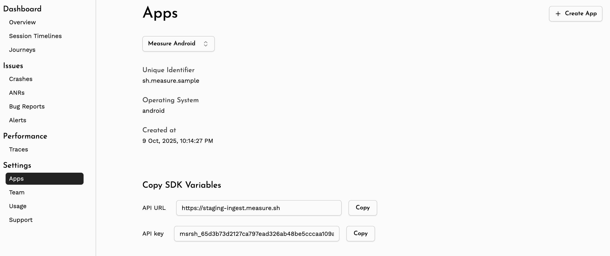

# Getting Started

- [1. Create an App](#1-create-an-app)
- [2. Set Up the SDK](#2-set-up-the-sdk)
  - [Android](#android)
  - [iOS](#ios)
  - [Flutter](#flutter)
  - [React Native](#react-native)
  - [Kotlin Multiplatform](#kotlin-multiplatform)
- [3. Verify Installation](#3-verify-installation)
- [4. Review Configuration Options](#4-review-configuration-options)
- [Troubleshoot](#troubleshoot)

## 1. Create an App

Create a new app by visiting the _Apps_ section on the dashboard.

Once the app is created, note the `API URL` & `API Key` for your app. This will be used in the SDK configuration
in later steps.



## 2. Set Up the SDK

- [Android](#android)
- [iOS](#ios)
- [Flutter](#flutter)
- [React Native](#react-native)
- [Kotlin Multiplatform](#kotlin-multiplatform)

## Android

<details>
  <summary>Minimum Requirements</summary>

| Name                  | Version         |
| --------------------- | --------------- |
| Android Gradle Plugin | `8.1.0`         |
| Min SDK               | `21` (Lollipop) |
| Target SDK            | `35`            |

</details>

<details>
    <summary>Self-host Compatibility</summary>

| SDK Version         | Minimum Required Self-host Version |
| ------------------- | ---------------------------------- |
| >= `0.16.0`         | `0.10.0`                           |
| `0.13.0` -`0.15.1`  | `0.9.0`                            |
| `0.10.0` - `0.12.0` | `0.6.0`                            |
| `0.9.0`             | `0.5.0`                            |

</details>

### Add the API Key & API URL

Add the API URL & API Key to your application's `AndroidManifest.xml` file.

```xml
<application>
    <meta-data android:name="sh.measure.android.API_KEY" android:value="YOUR_API_KEY"/>
    <meta-data android:name="sh.measure.android.API_URL" android:value="YOUR_API_URL"/>
</application>
```

<details>
  <summary>Configure API Keys for Different Build Types</summary>

You can
use [manifestPlaceholders](https://developer.android.com/build/manage-manifests#inject_build_variables_into_the_manifest)
to configure different values for different build types or flavors.

In the `build.gradle.kts` file:

```kotlin
android {
    buildTypes {
        debug {
            manifestPlaceholders["measureApiKey"] = "YOUR_API_KEY"
            manifestPlaceholders["measureApiUrl"] = "YOUR_API_URL"
        }
        release {
            manifestPlaceholders["measureApiKey"] = "YOUR_API_KEY"
            manifestPlaceholders["measureApiUrl"] = "YOUR_API_URL"
        }
    }
}
```

or in the `build.gradle` file:

```groovy
android {
    buildTypes {
        debug {
            manifestPlaceholders = ["measureApiKey": "YOUR_API_KEY"]
            manifestPlaceholders = ["measureApiUrl": "YOUR_API_URL"]
        }
        release {
            manifestPlaceholders = ["measureApiKey": "YOUR_API_KEY"]
            manifestPlaceholders = ["measureApiUrl": "YOUR_API_URL"]
        }
    }
}
```

Then add the following in the `AndroidManifest.xml` file:

```xml

<application>
    <meta-data android:name="sh.measure.android.API_KEY" android:value="${measureApiKey}"/>
    <meta-data android:name="sh.measure.android.API_URL" android:value="${measureApiUrl}"/>
</application>
```

</details>

### Add the Gradle Plugin

Add the following plugin to your project.

```kotlin
plugins {
    id("sh.measure.android.gradle") version "0.13.0"
}
```

or, use the following if you're using `build.gradle`.

```groovy
plugins {
    id 'sh.measure.android.gradle' version '0.13.0'
}
```

<details>
  <summary>Configure Variants</summary>

By default, the plugin is applied to all variants. To disable the plugin for specific variants, use the `measure` block
in your build file.

> [!IMPORTANT]
> Setting `enabled` to `false` will disable the plugin for that variant. This prevents the plugin from
> collecting `mapping.txt` file and other build information about the app. Features like tracking app size,
> de-obfuscating
> stack traces, etc. will not work.

For example, to disable the plugin for `debug` variants, add the following to your `build.gradle.kts` file:

```kotlin
measure {
    variantFilter {
        if (name.contains("debug")) {
            enabled = false
        }
    }
}
```

or in the `build.gradle` file:

```groovy
measure {
    variantFilter {
        if (name.contains("debug")) {
            enabled = false
        }
    }
}
```

</details>

### Add the SDK

Add the following to your app's `build.gradle.kts` file.

```kotlin
implementation("sh.measure:measure-android:0.18.0")
```

or, add the following to your app's `build.gradle` file.

```groovy
implementation 'sh.measure:measure-android:0.18.0'
```

### Initialize the SDK

Add the following to your app's Application class `onCreate` method.

> [!IMPORTANT]
> To be able to detect early crashes and accurate launch time metrics, initialize the SDK as soon as possible in
> Application `onCreate` method.

```kotlin
Measure.init(
    context, MeasureConfig()
)
```

See the [troubleshooting](#troubleshoot) section if you face any issues.

## iOS

<details>
    <summary>Minimum Requirements</summary>

| Name                    | Version |
| ----------------------- | ------- |
| Xcode                   | 15.0+   |
| Minimum iOS Deployments | 12.0+   |
| Swift Version           | 5.10+   |

</details>

<details>
<summary>Self-host Compatibility</summary>

| SDK Version | Minimum Required Self-host Version |
| ----------- | ---------------------------------- |
| >=0.1.0     | 0.6.0                              |
| >=0.7.0     | 0.9.0                              |

</details>

### Install the SDK

Measure SDK supports **CocoaPods** and **Swift Package Manager (SPM)** for installation.

#### Using CocoaPods

[CocoaPods](https://cocoapods.org) is a dependency manager for Cocoa projects. For usage and installation instructions,
visit their website. To integrate MeasureSDK into your Xcode project using CocoaPods, specify it in your `Podfile`:

```ruby
pod 'measure-sh'
```

> [!NOTE]  
> MeasureSDK must be linked statically. If you are using `use_frameworks!` in your Podfile, you will need to ensure `measure-sh` is linked statically, as dynamic linking is not supported.

CocoaPods does not natively support per-pod linkage overrides. You will need to install the [`cocoapods-pod-linkage`](https://github.com/microsoft/cocoapods-pod-linkage) plugin:

```sh
gem install cocoapods-pod-linkage
```

Then add the plugin and linkage option to your `Podfile`:

```ruby
plugin 'cocoapods-pod-linkage'

target 'YourApp' do
  use_frameworks!
  pod 'measure-sh', :linkage => :static
  # ... rest of your pods
end
```

Alternatively, if all your pods can be linked statically, you can use:

```ruby
use_frameworks! :linkage => :static
```

#### Using Swift Package Manager

The [Swift Package Manager](https://swift.org/package-manager/) is a tool for automating the distribution of Swift code
and is integrated into the `swift` compiler.

Add Measure as a dependency by adding `dependencies` value to your `Package.swift` or the Package list in Xcode.

```swift
dependencies: [
    .package(url: "https://github.com/measure-sh/measure.git", branch: "ios-v0.11.0")
]
```

### Initialize the SDK

Add the following to your AppDelegate's `application(_:didFinishLaunchingWithOptions:)` to capture early crashes and
launch time metrics.

> [!IMPORTANT]
> To detect early crashes and ensure accurate launch time metrics, initialize the SDK as soon as possible
> in `application(_:didFinishLaunchingWithOptions:)`.

```swift
import Measure

func application(_ application: UIApplication,
                 didFinishLaunchingWithOptions launchOptions: [UIApplication.LaunchOptionsKey: Any]?) -> Bool {
    let config = BaseMeasureConfig()
    let clientInfo = ClientInfo(apiKey: "<apiKey>", apiUrl: "<apiUrl>")
    Measure.initialize(with: clientInfo, config: config)
    return true
}
```

```objc

#import <Measure/Measure.h>

- (BOOL)application:(UIApplication *)application didFinishLaunchingWithOptions:(NSDictionary *)launchOptions {
    ClientInfo *clientInfo = [[ClientInfo alloc] initWithApiKey:@"<apiKey>" apiUrl:@"<apiUrl>"];
    BaseMeasureConfig *config = [[BaseMeasureConfig alloc] initWithEnableLogging:YES
                                                           autoStart:YES
                                                           requestHeadersProvider:NULL
                                                           maxDiskUsageInMb:50
                                                           enableFullCollectionMode:NO
                                                           enableDiagnosticMode:NO
                                                           enableDiagnosticModeGesture:NO];
    [Measure initializeWith:clientInfo config:config];
    return YES;
  }

```

## Flutter

The Flutter SDK currently supports only Android and iOS targets and is not available for web or desktop. The
SDK depends on the native Android and iOS SDKs, so all the minimum requirements for Android and iOS apply to the
Flutter SDK as well.

<details>
  <summary>Minimum Requirements</summary>

| Name    | Version |
| ------- | ------- |
| Flutter | `3.24`  |

</details>

<details>
    <summary>Self-host Compatibility</summary>

| SDK Version | Minimum Required Self-host Version |
| ----------- | ---------------------------------- |
| >= `0.4.0`  | `0.10.0` (releasing soon)          |
| >= `0.3.0`  | `0.9.0`                            |
| >= `0.1.0`  | `0.8.0`                            |

</details>

### Install the SDK

Add the following dependency to your `pubspec.yaml` file:

```yaml
dependencies:
  measure_flutter: ^0.6.0
```

### Initialize the SDK

To initialize the SDK, you need to call the `Measure.instance.init` method in your `main` function.

- Run app inside the callback passed to the `init` method. This ensures that the Measure SDK can set up error handlers
  to track uncaught exceptions.
- Wrap your app with the `MeasureWidget`, this is required for gesture tracking and screenshots.

> [!IMPORTANT]
> To detect early native crashes and to ensure accurate launch time metrics, initialize the Android SDK in
> `Application` class as described in the [Android](#initialize-the-sdk) section and the iOS SDK in `AppDelegate` as
> described in
> the [iOS](#initialize-the-sdk-1) section. It is highly recommended to initialize both native SDKs even when using the
> Flutter SDK.

```dart
Future<void> main() async {
  await Measure.instance.init(
            () =>
            runApp(
              // wrap your app with MeasureWidget
              MeasureWidget(child: MyApp()),
            ),
    // SDK configuration
    config: const MeasureConfig(
      enableLogging: true,
    ),
  );
}
```

This does the following:

- Initializes the Measure SDK with the provided `config`.
- Wraps your app with the `MeasureWidget` for gesture detection and layout snapshots.
- Sets up the error handlers to track uncaught exceptions.

### Flutter Android Setup

Measure Flutter SDK depends on the native Android SDK, so you need to follow all the steps mentioned in the
[Android](#android) section to set up the Android SDK properly.

1. [Add API Key & API URL to Android Manifest](#add-the-api-key--api-url)
2. [Add Android Gradle Plugin](#add-the-gradle-plugin)
3. [Initialize the SDK](#initialize-the-sdk)

### Flutter iOS Setup

Measure Flutter SDK depends on the native iOS SDK, so you need to follow all the steps mentioned in the
[iOS](#ios) section to set up the iOS SDK properly.

1. [Install the SDK using CocoaPods or SPM](#install-the-sdk)
2. [Initialize the SDK](#initialize-the-sdk-1)

### Track navigation

See [Navigation Monitoring](features/feature-navigation-lifecycle-tracking.md) for instructions on how to track
navigation events.

### Track http requests

See [Network Monitoring](features/feature-network-monitoring.md) for instructions on how to track HTTP requests.

### Gesture tracking & Layout Snapshots

The Flutter SDK automatically captures gestures like clicks, long clicks and scrolls. It also captures layout snapshots
on every click to help visualize user interactions. To enable these features, simply wrap your app with the
`MeasureWidget` as shown in the initialization step above.

Read more about adding custom widget names in the layout snapshots
in [Gesture Tracking & Layout Snapshots](features/feature-gesture-tracking.md#flutter).

## React Native

The React Native SDK supports both **Expo** and **Vanilla React Native** projects on Android and iOS.

<details>
  <summary>Minimum Requirements</summary>

| Name         | Version  |
| ------------ | -------- |
| React Native | `0.72.0` |
| React        | `18.2.0` |

</details>

### Install the SDK

```sh
npm install @measuresh/react-native@0.1.1
```

or with yarn:

```sh
yarn add @measuresh/react-native@0.1.1
```

---

### Expo

The recommended setup for Expo projects uses the Measure config plugin, which automates the native configuration for both Android and iOS.

#### 1. Add the plugin to `app.json`

```json
{
  "expo": {
    "plugins": [
      [
        "@measuresh/react-native",
        {
          "androidApiKey": "<android-api-key>",
          "androidApiUrl": "<android-api-url>",
          "iosApiKey": "<ios-api-key>",
          "iosApiUrl": "<ios-api-url>"
        }
      ]
    ]
  }
}
```

The plugin automatically handles:

**Android**

- Injects `sh.measure.android.API_KEY` and `sh.measure.android.API_URL` into `AndroidManifest.xml`
- Adds the Measure Gradle plugin to the project build files
- Adds the `measure-android` dependency to `app/build.gradle`

**iOS**

- Adds the `MeasureReactNative` pod to `Podfile`
- Adds `export SOURCEMAP_FILE="$(pwd)/main.jsbundle.map"` to the "Bundle React Native code and images" build phase so a sourcemap is generated on every Release build
- Adds an "Upload Measure Symbol Files" build phase that automatically uploads dSYM files and the JavaScript sourcemap after each Release build

#### 2. Run prebuild

```sh
npx expo prebuild
```

#### 3. Initialize the SDK

Call `Measure.init` as early as possible in your app entry point:

```typescript
import { Measure, MeasureConfig } from "@measuresh/react-native";
import { useEffect } from "react";

export default function App() {
  useEffect(() => {
    Measure.init({
      config: new MeasureConfig({ autoStart: true }),
    });
  }, []);

  // ...
}
```

#### 4. Build and run

```sh
# Android
npx expo run:android

# iOS
npx expo run:ios
```

---

### Vanilla React Native

#### Android setup

Step 1 — Add API credentials to `AndroidManifest.xml`

```xml
<manifest>
  <application>
    <meta-data
      android:name="sh.measure.android.API_KEY"
      android:value="<android-api-key>" />
    <meta-data
      android:name="sh.measure.android.API_URL"
      android:value="<android-api-url>" />
  </application>
</manifest>
```

**Step 2 — Add the Gradle plugin**

In your project-level `build.gradle`:

```groovy
buildscript {
  dependencies {
    classpath("sh.measure.android.gradle:sh.measure.android.gradle.gradle.plugin:0.13.0")
  }
}
```

In your app-level `build.gradle` (after all other plugins):

```groovy
apply plugin: "sh.measure.android.gradle"
```

The Gradle plugin automatically uploads ProGuard/R8 mapping files and JavaScript sourcemaps after every `assembleRelease` or `bundleRelease` build — no manual upload step is needed.

#### iOS setup

**Step 1 — Add the pod**

In your `Podfile`:

```ruby
pod 'MeasureReactNative', :path => '../node_modules/@measuresh/react-native'
```

Then run:

```sh
pod install
```

**Step 2 — Enable sourcemap generation**

In Xcode, open your target → Build Phases → **"Bundle React Native code and images"** and add this line at the top of the script:

```sh
export SOURCEMAP_FILE="$(pwd)/main.jsbundle.map"
```

**Step 3 — Add the upload build phase**

Add a new Run Script build phase **after** the bundle phase:

```sh
"$SRCROOT/../node_modules/@measuresh/react-native/scripts/upload_build_phase.sh" \
  "<ios-api-url>" \
  "<ios-api-key>"
```

This script automatically uploads dSYM files and the JavaScript sourcemap after each Release build. See the caution note below about when to run it.

> [!CAUTION]
> The upload script runs on every build in the configuration you add it to. To restrict it to Archive builds only, wrap the script content in:
>
> ```sh
> if [ "$ACTION" = "archive" ]; then
>   # script content here
> fi
> ```

#### Initialize the SDK

Call `Measure.init` as early as possible in your app entry point:

```typescript
import { Measure, MeasureConfig } from "@measuresh/react-native";
import { useEffect } from "react";

export default function App() {
  useEffect(() => {
    Measure.init({
      config: new MeasureConfig({ autoStart: true }),
    });
  }, []);

  // ...
}
```

#### Build and run

```sh
# Android
npx react-native run-android

# iOS
npx react-native run-ios
```

---

### Track navigation

See [Navigation Monitoring](features/feature-navigation-lifecycle-tracking.md#react-native) for instructions on how to track navigation events.

### Track http requests

See [Network Monitoring](features/feature-network-monitoring.md#react-native) for instructions on how to track HTTP requests.

## Kotlin Multiplatform

The KMP SDK provides access to Measure API from shared Kotlin code (`commonMain`) on Android and iOS.
It is a thin wrapper over the native Android and iOS SDKs, so all the minimum requirements for Android
and iOS apply to the KMP SDK as well.

### Minimum Requirements

| Name                  | Version             |
| --------------------- | ------------------- |
| Kotlin                | `2.x`               |
| Measure Android SDK   | `0.18.0`            |
| Measure iOS SDK       | `0.11.0`            |

The SDK is built with Kotlin `2.3.20`. Use a compatible Kotlin `2.x` toolchain in your project.

</details>

### Add the Native SDKs

The KMP SDK does not have its own initialization API. You initialize each native SDK in its own platform
target (as described in the [Android](#android) and [iOS](#ios) sections), and then use
`sh.measure.kmp.Measure` from shared code.

### Add KMP SDK

Add the dependency to the `commonMain` source set of your shared module's `build.gradle.kts` file:

```kotlin
kotlin {
    sourceSets {
        commonMain.dependencies {
            implementation("sh.measure:measure-kmp:0.1.0")
        }
    }
}
```

### Use the SDK from shared code

Once both native SDKs are initialized, you can call any API from `sh.measure.kmp.Measure` in `commonMain`:

```kotlin
import sh.measure.kmp.Measure
import sh.measure.kmp.attributes.StringAttr

Measure.trackScreenView("CheckoutScreen")
Measure.trackEvent(
    name = "checkout_completed",
    attributes = mapOf("source" to StringAttr("kmp")),
)
```

### Crashes from shared Kotlin code on iOS

Crashes from unhandled exceptions in shared Kotlin code are captured automatically on iOS, no extra
setup is required. The SDK installs a Kotlin exception hook on load and forwards the crash, with its
Kotlin stack frames preserved.

## 3. Verify Installation

Launch the app with the SDK integrated and navigate through a few screens. The data is sent to the server periodically,
so it may take a few seconds to appear. Checkout the `Usage` section in the dashboard or navigate to the
`Session Timelines` tab to see the data.

🎉 Congratulations! You have successfully integrated Measure into your app!

---

## 4. Review Configuration Options

There are several configuration options available to customize the SDK behavior. Some options can be set during SDK
initialization, while others can be configured remotely from the dashboard. Review the [Configuration Options](features/configuration-options.md)
section to learn more about these options and how to use them effectively.

By default, all data is collected without sampling, so you can verify your installation right away. In release
builds, you can adjust the sampling rates and other settings as needed to balance signal vs noise and optimize
costs.

## Troubleshoot

### Verify API URL and API Key

If you are not seeing any data in the dashboard, verify that the API URL and API key are set correctly in your app.

<details>
    <summary>Android</summary>

If logs show any of the following errors, make sure you have added the API URL and API key in your `AndroidManifest.xml`
file.

```
sh.measure.android.API_URL is missing in the manifest
sh.measure.android.API_KEY is missing in the manifest
```

</details>

<details>
    <summary>iOS</summary>

Verify the API URL and API key are set correctly in the `ClientInfo` object when initializing the SDK.

```swift
let config = BaseMeasureConfig()
let clientInfo = ClientInfo(apiKey: "<apiKey>", apiUrl: "<apiUrl>")
Measure.initialize(with: clientInfo, config: config)
```

</details>

<details>
    <summary>Flutter</summary>

Flutter SDK depends on the native SDKs, so verify that the API URL and API key are set correctly in both
Android and iOS native SDK initializations.

</details>

<details>
    <summary>React Native</summary>

**Expo:** Verify that `androidApiKey`, `androidApiUrl`, `iosApiKey`, and `iosApiUrl` are all set in the plugin options in `app.json` and that `npx expo prebuild` has been run.

**Vanilla React Native:** Verify the API key and URL are present in `AndroidManifest.xml` (Android) and that the upload build phase script has the correct API key and URL (iOS).

</details>

### Flutter iOS — MeasureSDK must be linked statically

Flutter adds `use_frameworks!` to the iOS `Podfile` by default, which causes CocoaPods to link all pods dynamically. MeasureSDK must be linked statically and will not work correctly with dynamic linking.

To fix this, follow the [CocoaPods static linking instructions](#using-cocoapods) in the iOS setup section.

### Connecting to Locally-hosted Server (for self-host customers)

**iOS**

If you are running the measure-sh server on your machine, setting the API_URL to localhost:8080 will work on the
simulator because it can access localhost. However, a physical device cannot access your computer's localhost.

To resolve this, you can use [ngrok](https://ngrok.com/) or a similar service to provide a public URL to your local
server. This allows your physical device to connect to the server.

**Android**

For Android, if your device is on the same network as your computer, you can use your computer's local IP address (e.g.,
192.168.1.X:8080) as the API_URL. Alternatively, you can set up ADB port forwarding with the command `adb reverse tcp:
8080 tcp:8080` to allow the device to connect to the server.

When using an Android emulator, you can set the API_URL to http://10.0.2.2:8080 to access the server running on your
machine.

Alternatively, you can use [ngrok](https://ngrok.com/) or a similar service to provide a public URL to your local
server. This allows your Android emulator or physical device to connect to the server.

### Enable Logs

<details>
    <summary>Android</summary>

Enable logging during SDK initialization. All Measure SDK logs use the tag `Measure`.

```kotlin
val config = MeasureConfig(enableLogging = true)
Measure.init(context, config)
```

</details>

<details>
    <summary>iOS</summary>

Enable logging during SDK initialization.

```swift
let config = BaseMeasureConfig(enableLogging: true)
Measure.initialize(with: clientInfo, config: config)
```

</details>

<details>
    <summary>Flutter</summary>

Enable logging during SDK initialization.

```dart
await Measure.instance.init(() => runApp(MeasureWidget(child: MyApp())),
config: const MeasureConfig(enableLogging:true));
```

</details>

<details>
    <summary>React Native</summary>

Enable logging during SDK initialization.

```typescript
const config = new MeasureConfig({ enableLogging: true });
await Measure.init({ config });
```

</details>

### Connecting to a Self-hosted Server

If you are hosting the server in cloud. Make sure the API URL is set to the public URL of your server.
For example: set the API URL to `https://measure-api.<your-domain>.com`, replacing <your-domain> with your own domain.

### Contact Support

If none of the above steps resolve the issue, feel free to reach out to us on [Discord](https://discord.gg/f6zGkBCt42)
for further
assistance.

### Enable Diagnostic Mode

If you're experiencing issues with the SDK and need to share detailed logs with us, enable diagnostic mode.
This writes all internal SDK logs to files on disk which can then be pulled from the device and shared
when reporting a bug.

> [!NOTE]
> These files only contain Measure SDK logs, not your app's logs.

#### Step 1: Enable diagnostic mode

<details>
    <summary>Android</summary>

Enable diagnostic mode during SDK initialization.

```kotlin
val config = MeasureConfig(enableDiagnosticMode = true)
Measure.init(context, config)
```

</details>

<details>
    <summary>iOS</summary>

Enable diagnostic mode during SDK initialization. iOS provides an additional option called `enableDiagnosticModeGesture`. When this flag is enabled, you can use double finger double tap gesture to open share sheet and send logs immediately.

```swift
let config = BaseMeasureConfig(enableDiagnosticMode: true, enableDiagnosticModeGesture: true)
Measure.initialize(with: clientInfo, config: config)
```

</details>

<details>
    <summary>Flutter</summary>

Enable diagnostic mode during SDK initialization.

```dart
await Measure.instance.init(
  () => runApp(MeasureWidget(child: MyApp())),
  config: const MeasureConfig(enableDiagnosticMode: true),
);
```

On iOS, the `enableDiagnosticModeGesture` flag is set on the native `BaseMeasureConfig` in your `AppDelegate` (see the iOS section above), not on the Dart `MeasureConfig`.

</details>

<details>
    <summary>React Native</summary>

Enable diagnostic mode during SDK initialization.

```typescript
const config = new MeasureConfig({ enableDiagnosticMode: true });
await Measure.init({ config });
```

On iOS, the `enableDiagnosticModeGesture` flag is set on the native `BaseMeasureConfig` in your `AppDelegate` (see the iOS section above), not on the Dart `MeasureConfig`.

</details>

#### Step 2: Reproduce the issue

Run the app and reproduce the issue you're facing. The SDK will write logs to files in the
app's internal storage.

#### Step 3: Pull the log files

<details>
    <summary>Android</summary>

Use `adb` to retrieve the log files from the device:

```shell
# List all diagnostic log files
adb shell run-as <your.package.name> ls files/measure/sdk_debug_logs/

# Pull all log files as a tar.gz archive
adb shell "run-as <your.package.name> tar czf - files/measure/sdk_debug_logs/" > /tmp/sdk_debug_logs.tar.gz
```

</details>

<details>
    <summary>iOS</summary>

iOS provides an option called `enableDiagnosticModeGesture`. When this flag is enabled, you can use double finger double tap gesture to open share sheet and send logs immediately.

```swift
let config = BaseMeasureConfig(enableDiagnosticMode: true, enableDiagnosticModeGesture: true)
Measure.initialize(with: clientInfo, config: config)
```

</details>

#### Step 4: Share the files

Share the pulled log files on [Discord](https://discord.gg/f6zGkBCt42) or send them to us via email
for us to investigate.

#### Step 5: Disable diagnostic mode

Once you've collected the logs, disable diagnostic mode by removing the `enableDiagnosticMode` flag
or setting it to `false`. You can also delete the log files from the device:

<details>
    <summary>Android</summary>

```shell
adb shell run-as <your.package.name> rm -rf files/measure/sdk_debug_logs/
```

</details>
