# Nightly E2E Flow

High-level flow of the e2e suite when run from the nightly job. Each step is
named and every branch point is called out.

Sources:
- `nightly/run-nightly.sh` — launchd entry point (reset checkout, config, log, invoke runner, prune logs)
- `runner/main.ts` — suite orchestrator (stack, account/apps, per-device loop, report/notify)
- `runner/environment.ts` — docker + emulator/simulator bring-up and teardown

```mermaid
flowchart TD
    Start([launchd fires nightly job]) --> SetPath[Set PATH and ANDROID_SDK_ROOT]
    SetPath --> PullCheck{NIGHTLY_NO_PULL set?}

    PullCheck -- No --> DirtyCheck{Checkout has<br/>uncommitted changes?}
    DirtyCheck -- Yes --> Refuse[Refuse reset, exit 1]
    DirtyCheck -- No --> Reset[Fetch + hard-reset to origin/main]
    Reset --> ReExec[Re-exec script with NIGHTLY_NO_PULL=1]
    ReExec --> LoadConfig

    PullCheck -- Yes --> LoadConfig[Load config: Slack webhook,<br/>log-retention days, daily schedule<br/>config.sh + config.local.sh overrides]
    LoadConfig --> Log[Start timestamped log via tee]
    Log --> NpmStart[Invoke runner:<br/>npm start -- --seed-gallery --notify --verbose]

    NpmStart --> Discover[Load .env, discover specs, parse flags]
    Discover --> Docker{Docker daemon running?}
    Docker -- No --> StartDocker[Start Docker, wait for ready]
    Docker -- Yes --> Stack
    StartDocker --> Stack[Bring up self-host stack:<br/>compose down then up --wait]

    Stack --> Account[Create fresh user + team]
    Account --> Apps[Create apps via dashboard UI]
    Apps --> Secrets[Write Frank .env secrets, fetch app IDs]
    Secrets --> Hint[Print dashboard watch hint]

    Hint --> DeviceLoop{For each device:<br/>android then ios, serially}

    DeviceLoop --> Boot[Boot device]
    Boot --> BootBranch{Device already<br/>attached / booted?}
    BootBranch -- No, and no AVD/SIM configured --> BootFail[Throw: device unavailable]
    BootBranch -- No --> BootIt[Launch emulator/simulator,<br/>wait for boot then settle 15s<br/>Android boot poll times out after 2 min]
    BootBranch -- Yes --> Uninstall
    BootIt --> Uninstall[Uninstall previous app]

    Uninstall --> Build[Build + install Frank app]
    Build --> Seed[Seed gallery image]
    Seed --> SpecLoop{For each spec}

    SpecLoop --> Maestro{Maestro flow<br/>exists for device?}
    Maestro -- No --> Web
    Maestro -- Yes --> RunMaestro[Run Maestro UI flow]
    RunMaestro --> MaestroResult{Flow passed?}
    MaestroResult -- No --> RecordM[Record failure]
    MaestroResult -- Yes --> Web
    RecordM --> Web[Run Playwright web/dashboard assertions]

    Web --> WebResult{Web tests passed?}
    WebResult -- No --> RecordW[Record failure]
    WebResult -- Yes --> NextSpec
    RecordW --> NextSpec{More specs?}
    NextSpec -- Yes --> SpecLoop
    NextSpec -- No --> StopDevice[Stop device<br/>finally: runs even if build/specs threw]

    StopDevice --> NextDevice{More devices?}
    NextDevice -- Yes --> DeviceLoop
    NextDevice -- No --> Report[Summarize per-device results]

    Report --> Verdict{Any platform failed?}
    Verdict -- No --> NotifyPass[Notify Slack: PASSED]
    Verdict -- Yes --> NotifyFail[Notify Slack: FAILED + failing platforms]

    BootFail -.throws.-> Catch
    BuildErr([Any unexpected error]) -.-> Catch[Catch: notify Slack FAILED, mark failed]

    NotifyPass --> Teardown
    NotifyFail --> Teardown
    Catch --> Teardown[Finally: stop self-host stack,<br/>close Postgres connection pool]

    Teardown --> ExitCode{Run failed?}
    ExitCode -- Yes --> Exit1[Runner exits 1]
    ExitCode -- No --> Exit0[Runner exits 0]

    Exit1 --> Prune
    Exit0 --> Prune[Prune logs older than KEEP_LOGS_DAYS]
    Refuse --> EndRefuse([End])
    Prune --> End([Exit with runner status])
```

## Branch points

- **Checkout reset** — skipped when `NIGHTLY_NO_PULL=1`; refuses on a dirty tree so local work is never discarded.
- **Docker** — started only if the daemon is down.
- **Device boot** — skipped if one is already attached/booted; throws if none is and no AVD/simulator is configured.
- **Per-spec Maestro** — skipped when no flow file exists for that device.
- **Failures accumulate** — Maestro and Playwright failures are recorded but the loop continues; they decide the final verdict.
- **Device teardown** — `stopDevice` runs in each platform's own `finally`, so a device is stopped after its specs and also when the build or specs throw. The only case with nothing to stop is a boot failure (the device never came up). The top-level `finally` does not stop devices; it only stops the self-host stack and closes the Postgres connection pool.
- **Error path** — any thrown error is caught, notified as FAILED, and the stack is still torn down in `finally`.
- **Serial devices** — Android then iOS, never concurrent, to avoid clashing over shared KMP build artifacts.
