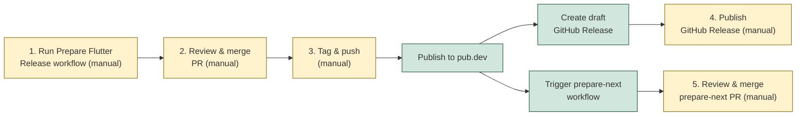

# Release



## Pre-release Checklist

- Ensure Measure Android SDK has been released and is available in Maven Central.
- Ensure Measure iOS SDK has been released and is available in CocoaPods.

## Releasing a package

All Flutter packages are released using the same **Prepare Flutter Release** workflow. Select the package from the dropdown and fill in the required inputs.

### measure_flutter

1. Go to GitHub Actions and run the **Prepare Flutter Release** workflow with:
   - `package`: `measure_flutter`
   - `version`: the release version (e.g., `0.5.0`)
   - `next_version`: the next development version (e.g., `0.6.0`)
   - `android_sdk_version`: the Measure Android SDK version (e.g., `0.17.0`)
   - `ios_sdk_version`: the Measure iOS SDK version (e.g., `0.10.0`)
2. Review and merge the automatically created PR.
3. Tag the merge commit and push:
   ```bash
   git tag measure_flutter-vX.Y.Z
   git push origin measure_flutter-vX.Y.Z
   ```
4. The tag push triggers the release workflow which:
   - Publishes to pub.dev
   - Creates a draft GitHub Release with auto-generated changelog
   - Triggers the prepare-next workflow automatically
5. Go to Releases, review the draft, and publish it.
6. Review and merge the prepare-next PR.

### measure_dio

> **Note:** Ensure `measure_flutter` is released and available on pub.dev first.

1. Go to GitHub Actions and run the **Prepare Flutter Release** workflow with:
   - `package`: `measure_dio`
   - `version`: the release version (e.g., `0.5.0`)
   - `next_version`: the next development version (e.g., `0.6.0`)
   - `measure_flutter_version`: the measure_flutter version to depend on (e.g., `0.5.0`)
2. Review and merge the automatically created PR.
3. Tag the merge commit and push:
   ```bash
   git tag measure_dio-vX.Y.Z
   git push origin measure_dio-vX.Y.Z
   ```
4. The tag push triggers the release workflow which:
   - Publishes to pub.dev
   - Creates a draft GitHub Release with auto-generated changelog
   - Triggers the prepare-next workflow automatically
5. Go to Releases, review the draft, and publish it.
6. Review and merge the prepare-next PR.

### measure_build

1. Go to GitHub Actions and run the **Prepare Flutter Release** workflow with:
   - `package`: `measure_build`
   - `version`: the release version (e.g., `0.2.0`)
   - `next_version`: the next development version (e.g., `0.3.0`)
2. Review and merge the automatically created PR.
3. Tag the merge commit and push:
   ```bash
   git tag measure_build-vX.Y.Z
   git push origin measure_build-vX.Y.Z
   ```
4. The tag push triggers the release workflow which:
   - Publishes to pub.dev
   - Creates a draft GitHub Release with auto-generated changelog
   - Triggers the prepare-next workflow automatically
5. Go to Releases, review the draft, and publish it.
6. Review and merge the prepare-next PR.

## pub.dev Credentials Setup

The release workflow requires a `PUB_DEV_CREDENTIALS` secret in GitHub Actions.

To set it up:
1. Run `dart pub login` locally
2. Copy the contents of `~/.config/dart/pub-credentials.json`
3. Add as a GitHub Actions secret named `PUB_DEV_CREDENTIALS`
