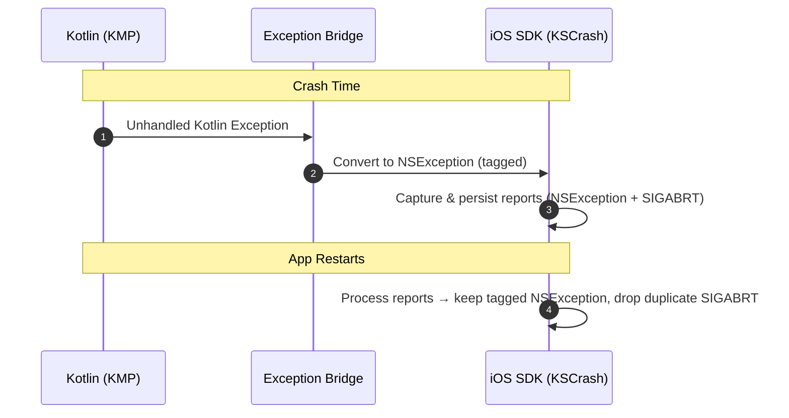

# Measure KMP SDK

Kotlin Multiplatform support for measure.sh.

## KMP iOS Crash Collection Flow

## Key design decisions

#### 1.Deduplicating crash reports

When a Kotlin exception crashes the app, two things happen in sequence:
1. We send NSException directly to KSCrash handler which writes a crash report.
2. After KSCrash's handler returns, Kotlin's runtime calls `terminateWithUnhandledException`,
   which sends a SIGABRT signal. KSCrash catches this too and writes a second report.

The first one contains the correct Kotlin frames while the second does not. To ensure the correct
report is sent to the server. The Kotlin-created `NSException` includes `"msr_kmp_kotlin_crash"` 
in its `userInfo` dictionary. KSCrash stores this as a string in the crash report 
under `crash.error.nsexception.userInfo`.

On next app launch after the crash, `CrashReportingManager` iterates all reports looking for one 
whose `nsexception.userInfo` contains `"msr_kmp_kotlin_crash"`. If found, only the `NSException`
report is processed, discarding the SIGABRT report.

If no Kotlin crash report is found, it's a native iOS crash, and  the first available report is
processed normally.

#### 2. Stack trace address filtering 

When Kotlin creates an exception object, the stack trace
includes constructor frames (`kfun:Class#<init>`) that point to the exception's own
initialization, not the code that caused the crash. These are filtered out before forwarding to
KSCrash. For exceptions with a cause chain (e.g. `IOException` caused by `SocketException`), each
cause's stack addresses are appended, but common tail frames shared between the exception and its
cause are deduplicated.
