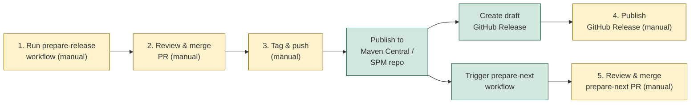

# Release Checklist



## Measure KMP SDK

1. Go to GitHub Actions and run the **Prepare KMP Release** workflow with the desired version and next SNAPSHOT version.
2. Review and merge the automatically created PR.
3. Tag the merge commit and push:
   ```bash
   git tag kmp-vX.Y.Z
   git push origin kmp-vX.Y.Z
   ```
4. The tag push triggers the release workflow which:
   - Publishes the Android and Kotlin Multiplatform artifacts to Maven Central
   - Publishes the iOS xcframework via KMMBridge and pushes the SPM `Package.swift` to `measure-sh/measure-kmp-spm`
   - Creates a draft GitHub Release with auto-generated changelog
   - Triggers the prepare-next workflow automatically
5. Go to Releases, review the draft, and publish it.
6. Review and merge the prepare-next PR.

> The release job runs on `macos-latest` because the iOS xcframework build requires `xcodebuild`. The prepare-release and prepare-next jobs run on `ubuntu-latest`.
