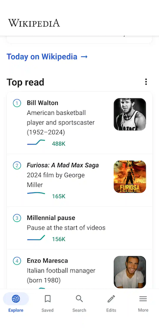

# Feature - Screenshot

Measure captures a screenshot of the app as soon as it crashes due to an unhandled exception or an
ANR. This screenshot is sent to the server as an [attachment](../../../docs/api/sdk/README.md#attachments) along with
the crash report.

This feature is enabled by default and does not require any additional configuration.

## How it works

Screenshots are captured using [PixelCopy](https://developer.android.com/reference/android/view/PixelCopy) for Android
versions 8.0 and above. For devices running on Android versions below 8.0, the screenshot is captured by drawing the
root view of the app on a canvas and then converting it to a bitmap.

All screenshots are compressed
using [WebP](https://developer.android.com/reference/android/graphics/Bitmap.CompressFormat) format for
Android versions 11 and above. For devices running on Android versions below 11, the screenshots are compressed using
[JPEG](https://developer.android.com/reference/android/graphics/Bitmap.CompressFormat) format.

## Masking PII and Sensitive Data

Note that screenshots can leak sensitive information. To prevent this, Measure masks all text and media from screenshots
by default. Masking levels can be configured to suit your requirements as described below.

### Configuring Masking Level

The following levels of masking can be applied to the screenshots:

* [Mask All Text And Media](#maskalltextandmedia)
* [Mask All Text](#maskalltext)
* [Mask Text Except Clickable](#masktextexceptclickable)
* [Mask Sensitive Input Fields](#masksensitiveinputfields)

#### maskAllTextAndMedia

Masks all text, buttons, input fields, image views and video.

For View based UI, video masking is performed on VideoView and Exoplayer's `androidx.media3.ui.PlayerView`
and image masking is performed on `ImageView`. Image and video masking is currently not supported for Compose based UI.

Example:

#### maskAllText

Masks all text, buttons & input fields.

Example:

#### maskTextExceptClickable

Masks all text & input fields except clickable views like buttons.

Example:

#### maskSensitiveInputFields

Masks sensitive input fields like password, email & phone fields.

For View based UI, all input fields
with [inputType](https://developer.android.com/reference/android/text/InputType)
set to `textPassword`, `textVisiblePassword`, `textWebPassword`, `numberPassword`, `textEmailAddress`, `textEmail`
and `phone` are masked in the screenshot.

For compose based UI, all input fields with KeyboardOptions set
to `KeyboardOptions(keyboardType = KeyboardType.Password)`
are masked in the screenshot by default.

Example:

|                                                                      |                                                                      |
|----------------------------------------------------------------------|----------------------------------------------------------------------|
|  |  |

### Mask entire screen from screenshots

If these options do not satisfy your requirements, consider
using [FLAG_SECURE](https://developer.android.com/reference/android/view/WindowManager.LayoutParams#FLAG_SECURE) to hide
an entire screen with potential sensitive information from screenshots.
