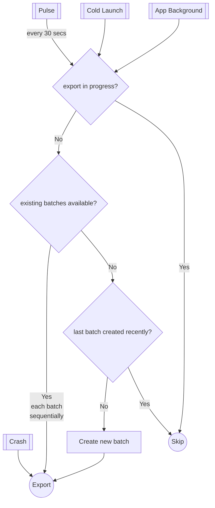

# Architecture

* [Thread management](#thread-management)
* [Storage](#storage)
* [Batching & export](#batching--export)
  * [Periodic batching and export](#periodic-batching-and-export)
  * [Exceptions and ANRs export](#exceptions-and-anrs-export)

# Thread management

Coming soon...

# Storage

Measure primarily uses **SQLite database** to store events. However, it also uses the file system to
store parts of large events, like exceptions, attachments, etc. Deciding which events are directly
stored in the database and which are stored in the file system is based on the size of the event.
Even though SQLite can store large blobs, due to the cursor window size limit on Android, it can
lead to
a [TransactionTooLargeException](https://developer.android.com/reference/android/os/TransactionTooLargeException)
if a query exceeds the limit and it makes working with large blobs cumbersome.

Sqlite database is configured with the following settings:

* [journal_mode](https://sqlite.org/pragma.html#pragma_journal_mode): WAL
* [foreign_keys](https://sqlite.org/pragma.html#pragma_foreign_keys): ON

Events are written to the database & file storage (if needed) as soon as they are received by
the `Event Processor`. This can be improved in future by adding a queue which batches the inserts.

# Batching & export

* [Periodic batching and export](#periodic-batching-and-export)
* [Exceptions and ANRs export](#exceptions-and-anrs-export)

## Periodic batching and export

Measure creates and sends one batch at a time to the server at a regular interval of 30 seconds.
Batching is done to reduce the number of network calls and to reduce the battery consumption while
also ensuring that the events are sent to the server without too much delay.

The following algorithm is used to periodically batch and send events to the server:

Following considerations were in mind when designing the algorithm:

**In best case scenario** events (or batches of events) must be sent to server as soon as they are
created (within a few seconds). Best case scenario is possible when:

* Server is responding quickly.
* The client has a healthy network connection.

In such cases, batches should be created periodically and sent to the server as soon as a batch
is created.

In worse case scenarios the following must be ensured:

* No data is lost due to flaky network.
* Allow `/events` API to be idempotent using a batch ID. An event must always be part of the
  same batch during retries.
* Do not overwhelm the server with too many requests when there are lots of un-synced batches (eg.
  when network comes back).
* Maintain low memory footprint when exporting (do not enqueue many requests in parallel as the
  memory isn't fully cleared until the request is complete).
* Each batch must have a maximum of 50 events (configurable) and the maximum total attachments size
  for the batch must not exceed 3MB (configurable).

## Exceptions and ANRs export

All events except for exceptions and ANRs are sent to the server in batches. Exceptions and ANRs however, are sent to
the server immediately as soon as they are received. This is done to ensure that clients can be notified of issues
as soon as possible.